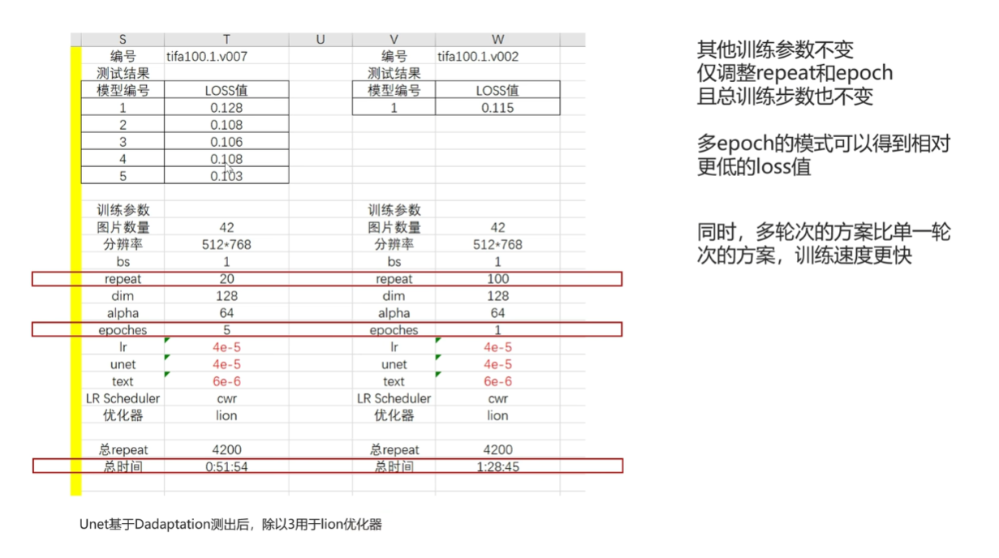
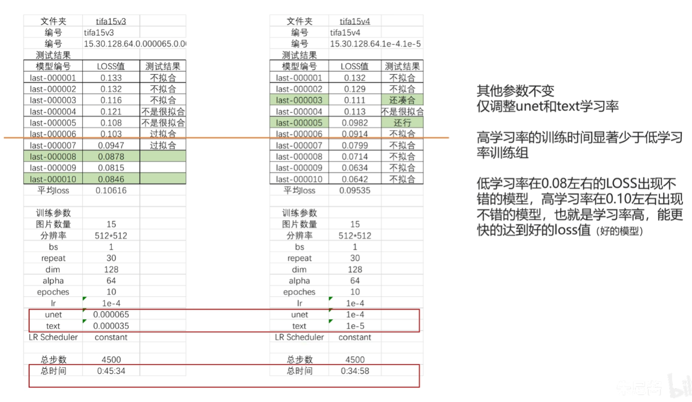
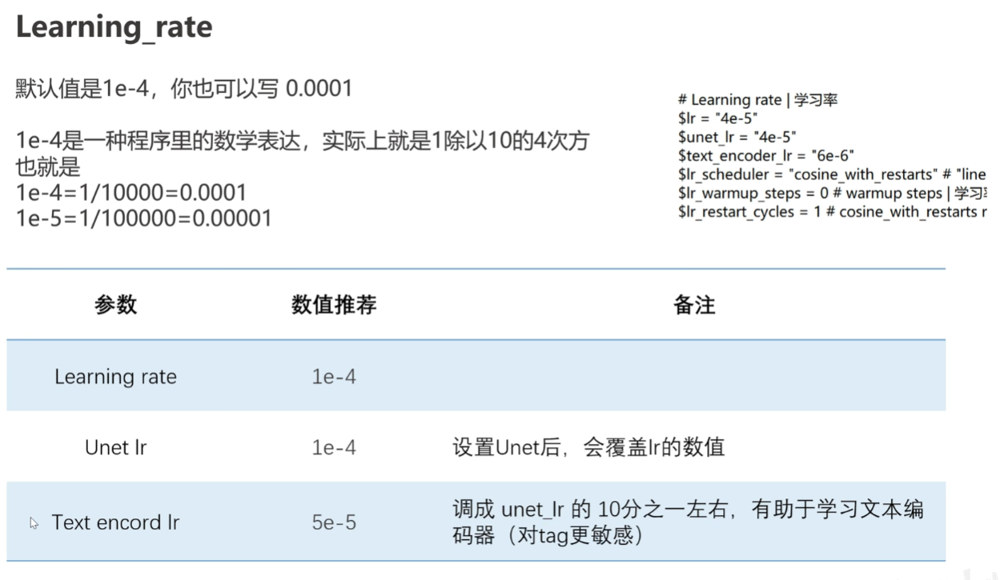
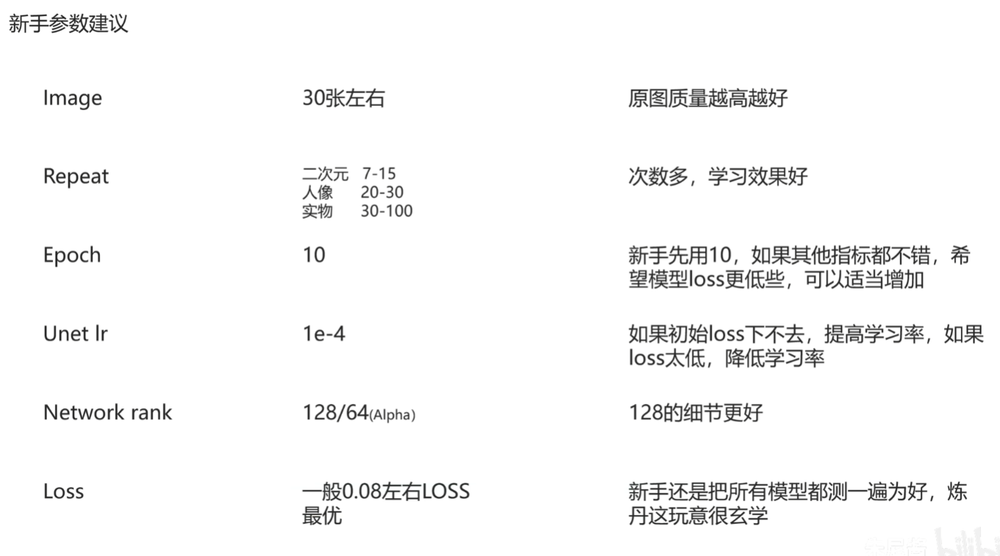
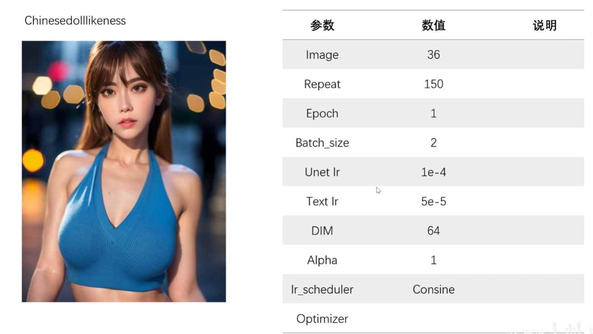
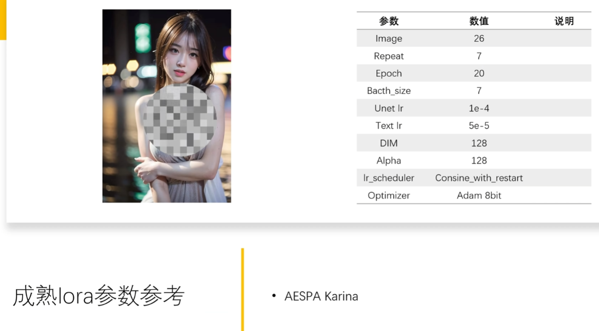
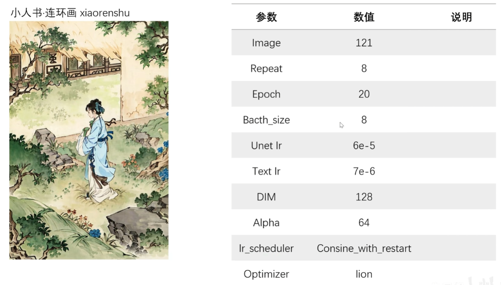

## 资料

https://space.bilibili.com/1640056/video

https://space.bilibili.com/250989068/video

https://space.bilibili.com/435304165/video

## 后缀

1. ckpt
2. pt
3. pth
4. safetensors
5. webui 特殊模型保存方法：PNG、WEBP 图片格式

### 大模型

常见格式为 **ckpt**，一个字，大。

大小在 GB 级别，常见有 2G、4G、7G 模型。

在 models/stable-diffsuion/

### 小模型

#### embedding 模型

常见格式为 **pt**、png 图片、webp 图片。大小一般在 KB 级别。

在 embeddings/

可训练：画风 √ 人物 √ | 推荐训练：**人物**

配置要求：显存 6GB 以上。

训练速度：中等 | 训练难度：中等

综合评价：☆☆☆

评价：比较基础的一种，局限性较大，但是可以用

#### hypernetwork

常见格式为 **pt**。大小一般在几十兆到几百兆不等。由于这种模型可以自定义的参数非常之多，一些离谱的 Hypernetwork 模型可以达到 GB 级别。

在 hypernetworks/

可训练：画风 √ 人物 √ | 推荐训练：**画风**

配置要求：显存 6GB 以上。

训练速度：中等 | 训练难度：难

综合评价：☆☆

评价：非常强大的一种模型，但是想训练好很难，不推荐训练。

#### LoRA

常见格式为 **pt**、**ckpt**。大小一般在 8mb~144mb 不等。

在 models/lora/

可训练：画风? 人物 √ 概念 √ | 推荐训练：**人物**

配置要求：显存 8GB 以上。

训练速度：快 | 训练难度：简单

综合评价：☆☆☆☆

评价：非常好训练 好出效果的人物训练，配置要求低，图要求少。

备注：LoRA 本身也应该归类到 Dreambooth，但是这里还是分开讲。

#### VAE 模型

常见格式为 **pt**

在 models/VAE/

#### Dreambooth / Native Train

可训练：画风 √ 人物 √ 概念 √ | 推荐训练：Dreambooth 推荐人物，Native Train 推荐画风

配置要求：显存 12GB 以上。

训练速度：慢 | 训练难度：可以简单可以很难

综合评价：☆☆☆☆☆

评价：微调大模型，非常强大的训练方式，但是使用上会不那么灵活，推荐训练画风用，人物使用 LoRA 训练。

## 训练

image _ repeat _ epoch / batch_size = total steps

10 张图 _ 20 次 _ 10 个循环 / 2 并行 = 1000 总训练步数

batch_size 和显存大小有关

两者乘积固定的时候，repeat 比 epoch 会更加化时间

20 \* 5 = 100，花费 51min

100 \* 1 = 100，花费 90min

多 epoch 方案的拟合性更好

### 学习率

### DIM

表示神经网络的维度，维度越大，模型的表达能力越强，模型的体积也会越大。

network_dimension

- 128，140MB+（现实世界实物，风景，人物 >128）
- 64，70MB+（人物 32-128）
- 32，40MB+（二次元）

### Optimizer

AdamW8bit

Dadptation

Lion

## 参数建议

### 案例

### tag

期望固化的模型特征，不要打 tag，这样使用中就生存固定特征了，而不会被改变
