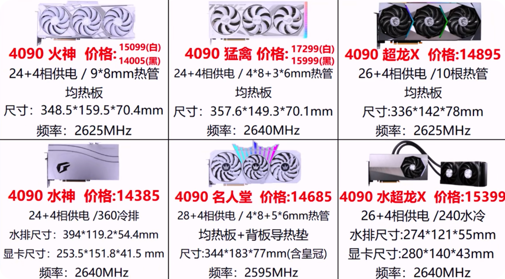
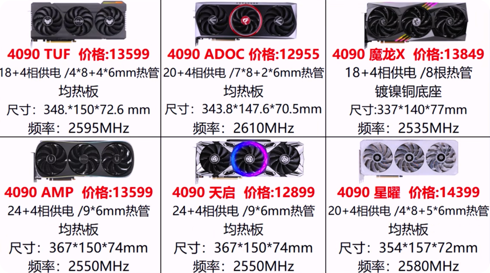

nvidia 有八大合作厂商：微星，华硕，技嘉，七彩虹，影驰，耕升，蓝宝石，铭瑄

| 品牌/定位    | 信仰             | 旗舰       | 次旗舰      | 高端         | 低端      | 丐中丐 |
| ------------ | ---------------- | ---------- | ----------- | ------------ | --------- | ------ |
| 微星         | 闪电             | 超龙       | 魔龙 3X     | 魔龙 2X      | 万图师    | -      |
| 技嘉         | 水雕             | 大雕       | 小雕/超级雕 | 雪鹰/魔鹰    | 猎鹰      | -      |
| 华硕         | 骇客             | ROG 猛禽   | 猛禽        | TUF 电竞特工 | 巨齿鲨    | -      |
| 七彩虹       | 九段             | 火神 X OC  | 水神        | AD OC /ultra | 战斧      | 网驰   |
| 影弛         | HOF 名人堂限量版 | HOF 名人堂 | -           | 星耀         | 积木/大将 | 将系列 |
| 索泰         | 极光             | PGF        | AMP         | 天启         | GAMING    | 毁灭者 |
| 耕升         | -                | 炫光       | -           | 星极         | -         | 追风   |
| 铭瑄         | -                | MGG(new)   | 电竞        | 终结者       | 巨无霸    | -      |
| 映众         | -                | 冰龙寒霜   | 超级冰龙    | 黑金         | 电竞至尊  | -      |
| 蓝宝石(A 卡) | 毒药             | 超白金     | 白金        | -            | -         | -      |

4090 显卡各家价格

## 丐版

华硕 DUAL 雪豹

微星万图师

技嘉猎鹰

影驰将系列（大将，黑将，骁将等）

七彩虹战斧

## 中低端

华硕巨齿鲨

微星魔龙 X

技嘉魔鹰

技嘉雪鹰

影驰金属大师

七彩虹 ULTRA W OC

## 中高端

华硕 TUF GAMING 电竞特工

微星魔龙 Z

技嘉小雕

技嘉超级雕

影驰星耀（白色）

影驰 GAMER（属于乐高系列，40 系列当前没出）

七彩虹 ADOC Advanced OC

## 旗舰

华硕猛禽战枭 ROG STRIX

微星超龙

技嘉大雕

影驰名人堂 HOF PRO（3070Ti 及以下）

影驰名人堂 HOF EXTREME（3080 及以上，号称真名人堂，还没做 40 系列）

影驰名人堂 HOF OC LAB（4090 超频实验室，售后需要其他体系）

七彩虹火神（小屏幕）

七彩虹水神

## 超旗舰信仰

华硕骇客，一体化水冷

七彩虹九段，风冷水冷集合

微星闪电

微星风扇有专利，静音效果好

技嘉水雕

御三家：华硕，微星，技嘉

## 跑分价格

23-4-19

| 型号        | 3D Mark 跑分 | 价格  | 性价比 |
| ----------- | ------------ | ----- | ------ |
| 3050        | 6179         | 1850  | 3.34   |
| 3060 8G     | 7348         | 2300  | 3.19   |
| 3060 12G    | 8697         | 2499  | 3.48   |
| 3060 TI old | 11582        | 2900  | 3.99   |
| 3060 TI new | 12241        | 2900  | `4.22` |
| 3070        | 13503        | 3550  | `3.80` |
| 6750 XT     | 13599        | 2850  | `4.61` |
| 3070 TI     | 14833        | 4100  | 3.62   |
| 3080        | 18480        | 5250  | 3.56   |
| 4070        | 18852        | 4799  | `3.93` |
| 4070 TI     | 22733        | 6499  | 3.50   |
| 7900XT      | 26031        | 7500  | `3.94` |
| 4080        | 28109        | 9000  | 3.12   |
| 7900XTX     | 29769        | 8000  | 3.72   |
| 4090        | 36067        | 14000 | 2.58   |
