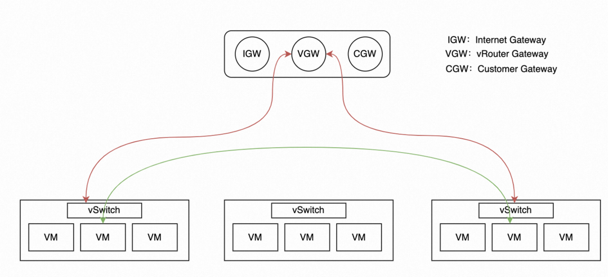
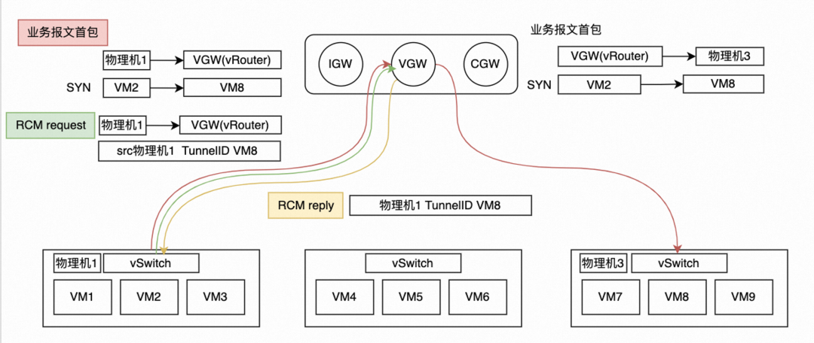
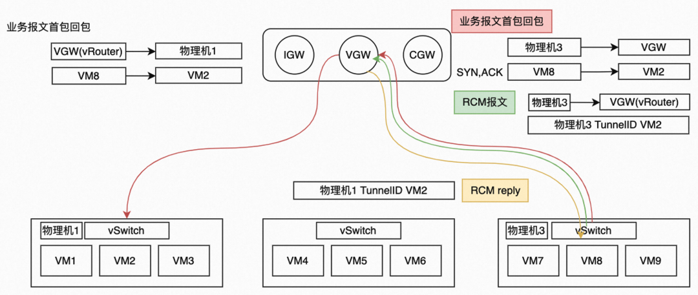
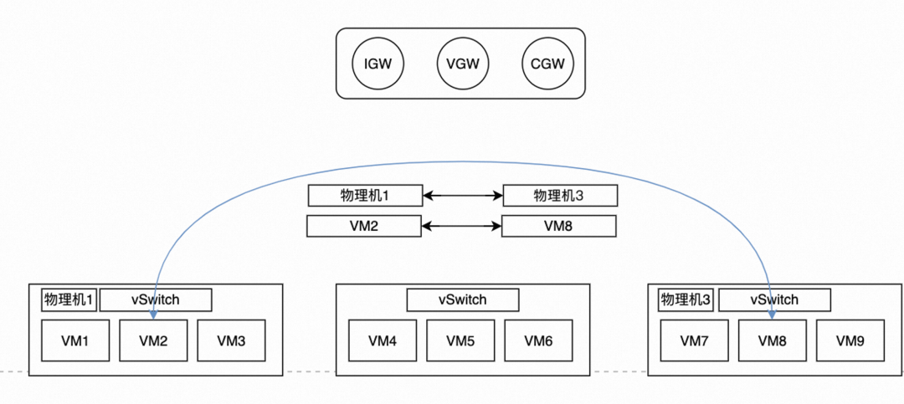

## 经典网络到专有网络

早起阿里云主要的需求是能自主规划，安全隔离，转换成云网络的功能简化为大规模、多租户网络隔离的网络（VPC）

从经典网络设备架构的**大二层网络**升级为**租户自主规划**的专有**VPC网络**

#### 大二层经典网络

- 所谓的大二层指的是经典网络在二层是完全互通的，整个经典网络通过邻居表来转发报文，虚拟网络和物理网络之间强耦合
- 服务器之间网络完全可达，需要自己配置好安全规则
- 抽象点比喻在经典网络内的服务器就好比在住在一栋房子里面的不同房间住户，IP地址就相当于门牌号，在租房间的时候就已经分配好了，安全组就相当于门锁，住户需要设置好门锁来防止串门

#### 新的VPC网络

- 基于VXLAN等技术构造的隔离的Overlay网络环境，专有网络之间的逻辑上彻底隔离，并实现了与物理网络之间的解耦
- 抽象点比喻在专有网络中，每住户都独立的购买了一个独栋的别墅，在购买的时候只需要选好地基（专有网络的网段），然后住户可以自定义对每个房间进行装修，划分不同的房间（VSW虚拟交换机），每栋别墅之间都是完全独立的互不影响

## 网络底层演进

专有网络的底层组成主要由VPC控制器（Controller）、虚拟网络网关(Gateway)、虚拟交换机（vswitch）

### VPC控制器

在超大规模的云网络中，虚拟网络控制面主要有三个挑战

- 更大的表项
  - 云网络的控制面流表信息已经远远大于基础的物理网络
  - 一个虚拟网络VPC中会持续增长虚拟机数，甚至超过5000台VM
- 更广的流表
- 更快的生效

### 内部服务去网关

在数据中心物理网络中，通常将网络流量分为两种类型，一种是数据中心外部用户和内部服务器之间交互的流量，这样的流量称作南北向流量或者纵向流量；另外一种就是数据中心内部服务器之间交互的流量，也叫东西向流量或者横向流量。

伴随着打通不同VPC之间对等连接(VPCPeering)需求，VPC间的互访也需要经过虚拟路由器所载的中心化的网关，VGW成为了云网络扩展的瓶颈

针对中心化的瓶颈，最优的方案就是去中心化，将VPC间VM互访的流量、VPC内VM互访的流量从图中的红线部分，下沉到绿线的部分，让这部分需要去网关交互的南北向流量下沉到东西向，从而旁路掉中心化网关的瓶颈，进一步扩展云网络的横向能力

首包->首包回包->后续业务报文

## 网关硬件化

云网关本身主要是处理网络中南北向相关的流量，主要指的是公网流量、VPC间互通流量、跨数据中心的专线的流量

初期阿里云网关由IGW（Internet gateway，处理公网相关流量）、VGW（vrouter Gateway，处理私网相关流量）、CGW（Customer Gateway，处理专线相关流量）三部分组成

将IGW、VGW、CGW合并为XGW，X代表Any

阿里云线上的业务流量进行分析，可以看到20%的客户业务占据了云上80%的流量

对于硬件化网关，需要用仅5%的表项，承载95%的流量

软件化的网关负载95%的表项，承载5%的业务流量

## 智能网卡

什么是智能网卡？网卡（network interface card，NIC）是连接网络和服务器的网络硬件设备，用于网络数据传输和通信，智能网卡是一种灵活可编程的网卡，在网卡的基础上增加板载CPU，与服务器配合使用

## reference

https://mp.weixin.qq.com/s/Wx7OsucFKQlla4fxpVKGaw
