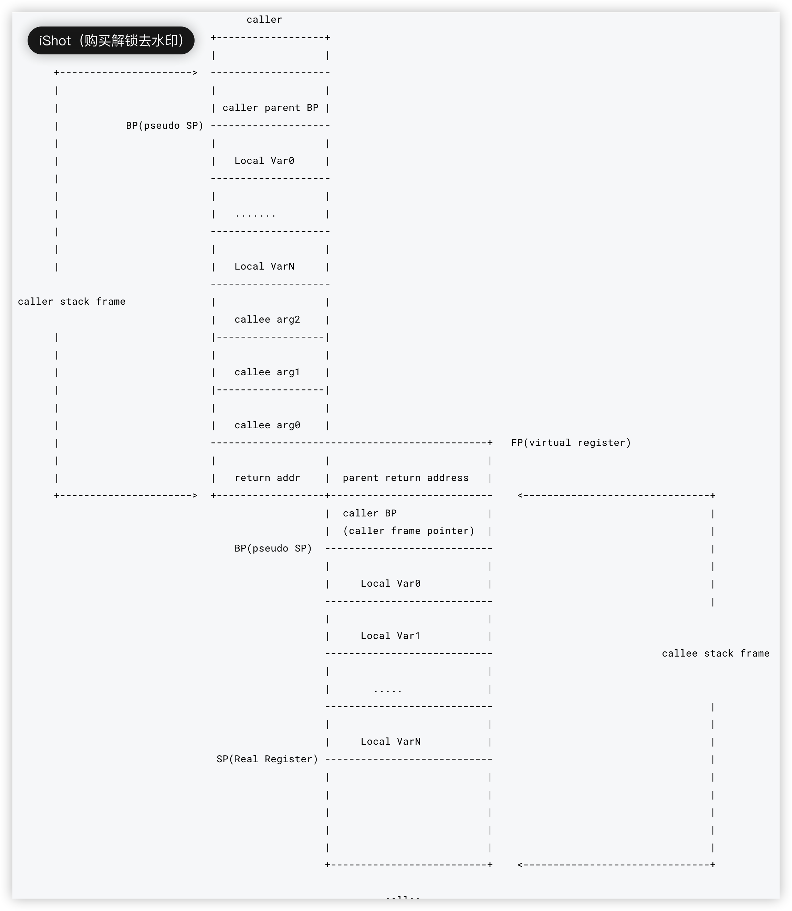

## 基本指令

https://go.xargin.com/docs/assembly/assembly/

- MOV 数据搬运，赋值
- LEA 取址 &
- TEST
- CMP 比较
- JLS （ jump less ）小于时跳转
- JMP（ jump ）无条件跳转
- JEQ（ jump equal ）等于时跳转
- SUB 相减，结果保存到目标操作数
- ADD 相加，结果保存到目标操作数
- RET 返回
- NOP 空指令
- CALL 调用函数
- SHL（ shift logical left ） 逻辑左移指令 `<<`
- SHR（ shift logical right ） 逻辑右移指令 `>>`，右移时不保留操作数的符号，用 0 代替
- SAL（ shift arithmetic left ）算术左移指令
- SAR（ shift arithmetic right ）算术右移指令，右移时保留操作数的符号
- XADD：交换并相加
- NEG：求补指令，就是取相反数
- XORPS：源操作数（第二个操作数）与目标操作数（第一个操作数）进行异或。结果保存到目标操作数
- MOVUPS：与 MOV 一样，操作对象的类型不一样，这里是包含四个压缩单精度浮点值的双四字
- XCHG: 交换两个操作数内容，自带 LOCK 总线锁属性

> MOV 指令有有好几种后缀 MOVB MOVW MOVL MOVQ 分别对应的是 1 字节 、2 字节 、4 字节、8 字节

### 栈调整

intel 或 AT&T 汇编提供了 push 和 pop 指令族，~~plan9 中没有 push 和 pop~~，plan9 中虽然有 push 和 pop 指令，但一般生成的代码中是没有的，我们看到的栈的调整大多是通过对硬件 SP 寄存器进行运算来实现的，例如:

```asm
SUBQ $0x18, SP // 对 SP 做减法，为函数分配函数栈帧
...               // 省略无用代码
ADDQ $0x18, SP // 对 SP 做加法，清除函数栈帧
```

通用的指令和 X64 平台差不多，下面分节详述。

常数在 plan9 汇编用 \$num 表示，可以为负数，默认情况下为十进制。可以用 \$0x123 的形式来表示十六进制数。

### 数据计算

data moves from left to right

```asm
ADD R1, R2 // R2 += R1
SUB R3, R4, R5 // R5 = R4 - R3
MUL $7, R6 // R6 *= 7
```

### 内存操作

memory oprands: offset + reg1 + reg2\*scale

`(AX)`表示 `*AX`，取地址对应的值

```asm
MOV (R1), R2 // R2 = *R1  取R1的地址对应的值
MOV 8(R3), R4 // R4 = *(8 + R3)
MOV 16(R5)(R6*1), R7 // R7 = *(16 + R5 + R6*1)
MOV ·MYVAR(SB), R8 // R8 = *MYVAR

MOV $8(R1)(R2*1), R3 // R3 = 8
MOV $·MYVAR(SB), R4 // R4 = &MYVAR 地址赋值给R4
```

### 条件调转

```asm
// 跳转
JMP addr
JMP label
JMP 2(PC)
JMP -2(PC)

JZ target
```

## 寄存器

### 通用寄存器

应用层代码使用的通用寄存器主要是

rax,rbx,rcx,rdx

rdi,rsi

r8,r9,...r14,r15

rbp,rsp，虽然 rbp 和 rsp 也可以用，不过 bp 和 sp 会被用来管理栈顶和栈底，最好不要拿来进行运算

rip 其实就是 pc(program count)

plan9 不需要 r 或者 e 的前缀，x64 平台寄存器在 plan9 的标识

| X64   | rax | rbx | rcx | rdx | rdi | rsi | rbp | rsp | r8  | r9  | r10 | r11 | r12 | r13 | r14 | r15 | rip |
| :---- | --- | --- | --- | --- | --- | --- | --- | --- | --- | --- | --- | --- | --- | --- | --- | --- | --- |
| Plan9 | AX  | BX  | CX  | DX  | DI  | SI  | BP  | SP  | R8  | R9  | R10 | R11 | R12 | R13 | R14 | R15 | PC  |

### 伪寄存器

Go 的汇编还引入了 4 个伪寄存器，援引官方文档的描述:

> - `FP`: Frame pointer: arguments and locals.
> - `PC`: Program counter: jumps and branches.
> - `SB`: Static base pointer: global symbols.
> - `SP`: Stack pointer: `the highest address` within the local stack frame.

- FP: 使用形如 `symbol+offset(FP)` 的方式，引用`函数的输入参数`。例如 `arg0+0(FP)`，`arg1+8(FP)`，使用 FP 不加 symbol 时，无法通过编译，在汇编层面来讲，symbol 并没有什么用，加 symbol 主要是为了提升代码可读性。另外，官方文档虽然将伪寄存器 FP 称之为 frame pointer，`实际上它根本不是 frame pointer`，按照传统的 x86 的习惯来讲，frame pointer 是指向整个 stack frame 底部的 BP 寄存器。假如当前的 callee 函数是 add，在 add 的代码中引用 FP，该 FP 指向的位置不在 callee 的 stack frame 之内，而是在 caller 的 stack frame 上。FP 和 Go 的官方源代码里的 framepointer 不是一回事，源代码里的 framepointer 指的是 caller BP 寄存器的值，在这里和 caller 的伪 SP 是值是相等的。

- PC: 实际上就是在体系结构的知识中常见的 `pc 寄存器`，在 x86 平台下对应 ip 寄存器，amd64 上则是 rip。除了个别跳转之外，手写 plan9 代码与 PC 寄存器打交道的情况较少。
- SB: 全局静态基指针，一般用来`声明函数或全局变量`。
- SP: plan9 的这个 SP 寄存器`指向当前栈帧的局部变量的开始位置`，使用形如 `symbol+offset(SP)` 的方式，引用函数的局部变量。offset 的合法取值是 [-framesize, 0)，注意是个左闭右开的区间。假如局部变量都是 8 字节，那么第一个局部变量就可以用 `localvar0-8(SP)` 来表示。这也是一个词不表意的寄存器。与硬件寄存器 SP 是两个不同的东西，在栈帧 size 为 0 的情况下，伪寄存器 SP 和硬件寄存器 SP 指向同一位置。手写汇编代码时，如果是 `symbol+offset(SP)` 形式，则表示伪寄存器 SP。如果是 `offset(SP)` 则表示硬件寄存器 SP。务必注意。对于编译输出(go tool compile -S / go tool objdump)的代码来讲，目前所有的 SP 都是硬件寄存器 SP，无论是否带 symbol。
- 在 go tool objdump/go tool compile -S 输出的代码中，是没有伪 SP 和 FP 寄存器的，我们上面说的区分伪 SP 和硬件 SP 寄存器的方法，对于上述两个命令的输出结果是没法使用的。在编译和反汇编的结果中，只有真实的 SP 寄存器。
- FP 和 Go 的官方源代码里的 framepointer 不是一回事，源代码里的 framepointer 指的是 caller BP 寄存器的值，在这里和 caller 的伪 SP 是值是相等的。

```asm
MOVQ BP,48(SP) // offset(SP)
```

### 变量声明

使用 DATA 结合 GLOBL 来定义一个变量。DATA 的用法为:

```asm
DATA symbol+offset(SB)/width, value
定义一个变量 offset一般为0(定义数组，第二个元素开始就不是0)，是相对于symbol的偏移，width是大小，value是值
```

使用 GLOBL 指令将变量声明为 global，额外接收两个参数，一个是 flag，另一个是变量的总大小。

GLOBL 必须跟在 DATA 指令之后

```asm
DATA age+0x00(SB)/4, $18  // 定义一个age的变量，4个字节，值是18
GLOBL age(SB), RODATA, $4 // 跟在DATA命令的后面一行，将age变量定义成global全局变量，flag是只读，大小也就是前面DATA定义的width，4个字节；第一个参数offset省略，直接 varname(SB)

// 定义个pi变量，大小是8个字节，值3.14...，并且设置为全局变量，只读
DATA pi+0(SB)/8, $3.1415926
GLOBL pi(SB), RODATA, $8

// offset 不为0的情况，<>标识表示只在当前文件中生效
DATA bio<>+0(SB)/8, $"xiao ming"
DATA bio<>+8(SB)/8, $"xiao hong"
GLOBOL bio<>(SB), RODATA, $16
```

flag 还可以是

```go
// Don't profile the marked routine. This flag is deprecated.过期了，给TEXT用的
NOPROF	1

// It is ok for the linker to get multiple of these symbols. It will
// pick one of the duplicates to use.
DUPOK	2

// Don't insert stack check preamble.给TEXT用的
NOSPLIT	4

// Put this data in a read-only section.给DATA和GLOBOL用的
#define RODATA	8

// This data contains no pointers.给DATA和GLOBOL用的
#define NOPTR	16

// This is a wrapper function and should not count as disabling 'recover'.给TEXT用的
#define WRAPPER 32

// This function uses its incoming context register.给TEXT用的
#define NEEDCTXT 64

// Allocate a word of thread local storage and store the offset from the
// thread local base to the thread local storage in this variable.给DATA和GLOBOL用的
#define TLSBSS	256

// Do not insert instructions to allocate a stack frame for this function.
// Only valid on functions that declare a frame size of 0.
// TODO(mwhudson): only implemented for ppc64x at present.给TEXT用的
#define NOFRAME 512

// Function can call reflect.Type.Method or reflect.Type.MethodByName.
#define REFLECTMETHOD 1024

// Function is the top of the call stack. Call stack unwinders should stop
// at this function.给TEXT用的
#define TOPFRAME 2048
```

当使用这些 flag 的字面量时，需要在汇编文件中 `#include "textflag.h"`。

.s 文件可以读取.go 文件中的变量，以及.go 定义一个 func，.s 来实现这个 func，必须在一个包文件目录下，go build，go test 都是可以的

## 函数声明

```asm
// func add(a, b int) int
//   => 该声明定义在同一个 package 下的任意 .go 文件中
//   => 只有函数头，没有实现
TEXT pkgname·add(SB), NOSPLIT, $0-8
    MOVQ a+0(FP), AX
    MOVQ a+8(FP), BX
    ADDQ AX, BX
    MOVQ BX, ret+16(FP)
    RET
// · mac下输入方法是 option+shift+9

                              参数及返回值大小
                                  |
 TEXT pkgname·add(SB),NOSPLIT,$32-32
       |        |               |
      包名     函数名         栈帧大小(局部变量+可能需要的额外调用函数的参数空间的总大小，但不包括调用其它函数时的 ret address 的大小)

```

## 栈结构

下面是一个典型的函数的栈结构图:

```
                       -----------------
                       current func arg0
                       ----------------- <----------- FP(pseudo FP)
                        caller ret addr  ---不算在当前栈帧内
                       +---------------+
                       | caller BP(*)  |
                       ----------------- <----------- SP(pseudo SP，实际上是当前栈帧的 BP 位置)
                       |   Local Var0  |
                       -----------------
                       |   Local Var1  |
                       -----------------
                       |   Local Var2  |
                       -----------------
                       |   ........    |
                       -----------------
                       |   Local VarN  |
                       -----------------
                       |               |
                       |               |
                       |  temporarily  |
                       |  unused space |
                       |               |
                       |               |
                       -----------------
                       |  call retn    |
                       -----------------
                       |  call ret(n-1)|
                       -----------------
                       |  ..........   |
                       -----------------
                       |  call ret1    |
                       -----------------
                       |  call argn    |
                       -----------------
                       |   .....       |
                       -----------------
                       |  call arg3    |
                       -----------------
                       |  call arg2    |
                       |---------------|
                       |  call arg1    |
                       -----------------   <------------  hardware SP 位置
                         return addr
                       +---------------+

```

从原理上来讲，如果当前函数调用了其它函数，那么 return addr 也是在 caller 的栈上的，不过往栈上插 return addr 的过程是由 CALL 指令完成的，在 RET 时，SP 又会恢复到图上位置。我们在计算 SP 和参数相对位置时，可以认为硬件 SP 指向的就是图上的位置。

图上的 caller BP，指的是 caller 的 BP 寄存器值，有些人把 caller BP 叫作 caller 的 frame pointer，实际上这个习惯是从 x86 架构沿袭来的。Go 的 asm 文档中把伪寄存器 FP 也称为 frame pointer，但是这两个 frame pointer 根本不是一回事。

是否插入 BP(源代码中的 fram pointer)条件 1： 函数栈帧大小大于 0，2：Framepointer_enabled 返回 true
没有插入 caller BP，伪 SP 和伪 FP 相差 caller ret addr 的 8 个字节，插入的话就多出 8 字节，一共 16 字节

stack 从高地址向低地址增长，FP 参数是 argN 在高地址，arg1 在低地址，以参数和变量都占用 8 个字节为例子，用 `symname+0(FP)访问第一个参数`，`symname+8(FP)访问第二个参数`，以此类推。

用伪 SP 来引用局部变量，原理上来讲差不多，不过因为伪 SP 指向的是局部变量的底部，所以 `symname-8(SP) 表示的是第一个局部变量`，`symname-16(SP)表示第二个`，以此类推



### argsize 和 framsize

#### argsize

```asm
TEXT pkgname·add(SB),NOSPLIT,$16-32 // $framesize-argsize
```

一般大小求和+返回值大小求和，如 4 个 int64 参数，2 个 int64 返回值，就是 48 个字节

如果不确定自己的函数签名需要多大的 argsize，可以通过简单实现一个相同签名的空函数，然后 go tool objdump 来逆向查找应该分配多少空间。

#### framesize

函数的 framesize 就稍微复杂一些了，手写代码的 framesize 不需要考虑由编译器插入的 caller BP，要考虑：

1. 局部变量，及其每个变量的 size。
2. 在函数中是否有对其它函数调用时，如果有的话，调用时需要将 callee 的参数、返回值考虑在内。虽然 return address(rip)的值也是存储在 caller 的 stack frame 上的，但是这个过程是由 CALL 指令和 RET 指令完成 PC 寄存器的保存和恢复的，在手写汇编时，同样也是不需要考虑这个 PC 寄存器在栈上所需占用的 8 个字节的。
3. 原则上来说，调用函数时只要不把局部变量覆盖掉就可以了。稍微多分配几个字节的 framesize 也不会死。
4. 在确保逻辑没有问题的前提下，你愿意覆盖局部变量也没有问题。只要保证进入和退出汇编函数时的 caller 和 callee 能正确拿到返回值就可以。

#### 地址运算

`lea`指令，load effective address，amd64 平台地址都是 8 个字节，所以直接就用 LEAQ

```asm
LEAQ (BX)(AX*8), CX
// 上面代码中的 8 代表 scale
// scale 只能是 0、2、4、8
// 如果写成其它值:
// LEAQ (BX)(AX*3), CX
// ./a.s:6: bad scale: 3

// 用 LEAQ 的话，即使是两个寄存器值直接相加，也必须提供 scale
// 下面这样是不行的
// LEAQ (BX)(AX), CX
// asm: asmidx: bad address 0/2064/2067
// 正确的写法是
LEAQ (BX)(AX*1), CX


// 在寄存器运算的基础上，可以加上额外的 offset
LEAQ 16(BX)(AX*1), CX

// 三个寄存器做运算，还是别想了
// LEAQ DX(BX)(AX*8), CX
// ./a.s:13: expected end of operand, found (
```

实例

go

```go
package main

import "fmt"

func add(a, b int) int // 汇编函数声明

func sub(a, b int) int // 汇编函数声明

func mul(a, b int) int // 汇编函数声明

func main() {
    fmt.Println(add(10, 11))
    fmt.Println(sub(99, 15))
    fmt.Println(mul(11, 12))
}
```

asm

```asm
#include "textflag.h" // 因为我们声明函数用到了 NOSPLIT 这样的 flag，所以需要将 textflag.h 包含进来

// func add(a, b int) int
TEXT ·add(SB), NOSPLIT, $0-24
    MOVQ a+0(FP), AX // 参数 a
    MOVQ b+8(FP), BX // 参数 b
    ADDQ BX, AX    // AX += BX
    MOVQ AX, ret+16(FP) // 返回
    RET

// func sub(a, b int) int
TEXT ·sub(SB), NOSPLIT, $0-24
    MOVQ a+0(FP), AX
    MOVQ b+8(FP), BX
    SUBQ BX, AX    // AX -= BX
    MOVQ AX, ret+16(FP)
    RET

// func mul(a, b int) int
TEXT ·mul(SB), NOSPLIT, $0-24
    MOVQ  a+0(FP), AX
    MOVQ  b+8(FP), BX
    IMULQ BX, AX    // AX *= BX
    MOVQ  AX, ret+16(FP)
    RET
    // 最后一行的空行是必须的，否则可能报 unexpected EOF
```

### 伪寄存器 SP 、伪寄存器 FP 和硬件寄存器 SP

todo

### 其他

go

```
type address struct {
    lng int
    lat int
}
type person struct {
    age    int
    height int
    addr   address
}
func readStruct(p person) (int, int, int, int)
func main() {
    var p = person{
        age:    99,
        height: 88,
        addr: address{
            lng: 77,
            lat: 66,
        },
    }
    a, b, c, d := readStruct(p)
    println(a, b, c, d)
}
```

asm

```asm
#include "textflag.h"

TEXT ·readStruct(SB), NOSPLIT, $0-64
    MOVQ arg0+0(FP), AX
    MOVQ AX, ret0+32(FP)
    MOVQ arg1+8(FP), AX
    MOVQ AX, ret1+40(FP)
    MOVQ arg2+16(FP), AX
    MOVQ AX, ret2+48(FP)
    MOVQ arg3+24(FP), AX
    MOVQ AX, ret3+56(FP)
    RET
```

go

```go
package main

func main() {
    var m = map[int]int{}
    m[43] = 1
    var n = map[string]int{}
    n["abc"] = 1
    println(m, n)
}

// func mapassign_fast64(t *maptype, h *hmap, key uint64) unsafe.Pointer
```

asm

为`mapassign_fast64`的参数准备

```asm
// t *maptype
LEAQ    type.map[int]int(SB), AX
MOVQ    AX, (SP) // 0(SP) 第一个参数
// h *hmap
LEAQ    ""..autotmp_2+232(SP), AX
MOVQ    AX, 8(SP) // 8(SP) 第二个参数
// key uint64
MOVQ    $43, 16(SP) // 16(SP) 第三个参数写入43
CALL    runtime.mapassign_fast64(SB) // 返回参数就是key对应可以写值的内存地址，写入 24(SP)
MOVQ    24(SP), AX // 24(SP)是返回值的地址，写入到AX
MOVQ    $1, (AX) // 将值1写入这个返回值的地址
```

获取 goroutine id

go

```go
package goroutineid

import (
	"runtime"
	"strings"
)

var offsetDict = map[string]int64{
	"go1.4":  128,
	"go1.5":  184,
	"go1.6":  192,
	"go1.7":  192,
	"go1.8":  192,
	"go1.9":  152,
	"go1.10": 152,
	"go1.11": 152,
	"go1.12": 152,
	"go1.13": 152,
	"go1.14": 152,
}

var offset = func() int64 {
	ver := strings.Join(strings.Split(runtime.Version(), ".")[:2], ".")
	return offsetDict[ver]
}()

// GetGoID returns the goroutine id
func GetGoID() int64
```

go_tls.h

```asm
#ifdef GOARCH_arm
#define LR R14
#endif

#ifdef GOARCH_amd64
#define    get_tls(r)    MOVQ TLS, r
#define    g(r)    0(r)(TLS*1)
#endif

#ifdef GOARCH_amd64p32
#define    get_tls(r)    MOVL TLS, r
#define    g(r)    0(r)(TLS*1)
#endif

#ifdef GOARCH_386
#define    get_tls(r)    MOVL TLS, r
#define    g(r)    0(r)(TLS*1)
#endif
```

asm

```asm
#include "textflag.h"
#include "go_tls.h"

// func GetGoID() int64
TEXT ·GetGoID(SB), NOSPLIT, $0-8
	get_tls(CX)
	MOVQ g(CX), AX //
	MOVQ ·offset(SB), BX //
	LEAQ 0(AX)(BX*1), DX //
	MOVQ (DX), AX //
	MOVQ AX, ret+0(FP) //
	RET
```

### SIMD

[SIMD](https://cch123.gitbooks.io/duplicate/content/part3/performance/simd-instruction-class.html) 是 Single Instruction, Multiple Data 的缩写，在 Intel 平台上的 SIMD 指令集先后为 SSE，AVX，AVX2，AVX512，这些指令集引入了标准以外的指令，和宽度更大的寄存器，例如:

- 128 位的 XMM0~XMM31 寄存器。
- 256 位的 YMM0~YMM31 寄存器。
- 512 位的 ZMM0~ZMM31 寄存器。

这些寄存器的关系，类似 RAX，EAX，AX 之间的关系。指令方面可以同时对多组数据进行移动或者计算，例如:

- movups : 把 4 个不对准的单精度值传送到 xmm 寄存器或者内存
- movaps : 把 4 个对准的单精度值传送到 xmm 寄存器或者内存

上述指令，当我们将数组作为函数的入参时有很大概率会看到

go

```go
package main

import "fmt"

func pr(input [3]int) {
    fmt.Println(input)
}

func main() {
    pr([3]int{1, 2, 3})
}
```

asm

```asm
0x001d 00029 (arr_par.go:10)    MOVQ    "".statictmp_0(SB), AX
0x0024 00036 (arr_par.go:10)    MOVQ    AX, (SP)
0x0028 00040 (arr_par.go:10)    MOVUPS  "".statictmp_0+8(SB), X0
0x002f 00047 (arr_par.go:10)    MOVUPS  X0, 8(SP)
0x0034 00052 (arr_par.go:10)    CALL    "".pr(SB)
```

编译器在某些情况下已经考虑到了性能问题，帮助我们使用 SIMD 指令集来对数据搬运进行了优化。

### demo

main.go

```go
package main

import (
	// "asm/pkg"
	"fmt"
)

type Data struct {
	Int    int
	String string
	Float  float64
}

func addInt(a, b int) *Data {
	return &Data{Int: a + b}
}

func main() {
	data := addInt(1, 2)
	fmt.Println(data)
}

```

```shell
go tool compile -N -l -S main.go > main.tool.compile
```

main.tool.compile

```asm
"".addInt STEXT size=177 args=0x18 locals=0x20 funcid=0x0
	;; 0x0000 00000 均为当前指令相对于当前函数的偏移量，第一个是 16 进制，第二个是 10 进制
	;; TEXT 函数申明
  ;; TEXT	位于内存的 .text 段
  ;; "".addInt(SB)	""为包名，链接时会填充；函数名 addInt；SB （static base）虚拟寄存器，基于静态地址，可认为是程序内存起始位置，所有用户定义的符号(如 main.addInt) 都作为偏移量写入伪寄存器 FP 和 SB
  ;; addInt 之所以使用 SB 是否是相对于 so 的函数而言，因为对于动态链接库的函数，函数的地址 = so 文件在进程内存空间的映射地址 + 函数偏移量，而静态链接的函数在编译器就可以确定地址
  ;; ABIInternal		编译器 flag，含义 application binary interface
  ;; 其他常见的编译器 flag 有 NOSPLIT
  ;; NOSPLIT 使编译器不要插入栈帧大小检查扩充代码，防止cpu做无用功
  ;; $32-24	函数栈帧大小为 32 字节，其中参数+返回值占用 24 字节
	0x0000 00000 (main.go:14)	TEXT	"".addInt(SB), ABIInternal, $32-24
	;; MOV 数据搬运
	;; MOVB 	// 1 byte   B(Byte)
	;; MOVW 	// 2 bytes  W(Word)
	;; MOVL 	// 4 bytes  L(Long)
	;; MOVQ 	// 8 bytes  Q(Quadword)
	;; MOVSD    //
	;; MOVUPS   // 16 bytes 4个不对准的单精度值
	;; MOVAPS   // 16 bytes 4个对准的单精度值
	;; TLS 是一个由 runtime 维护的虚拟寄存器，保存了指向当前 g 的指针
	;; g 前 24 位数据结构如下：
	;; 0(TLS) uintptr g.stack.lo;
	;; 8(TLS) uintptr g.stack.hi; stack describes the actual stack memory: [stack.lo，stack.hi)
  ;; 16(TLS) uintptr g.stackguard0; stackguard0 is the stack pointer compared in the Go stack growth prologue.
	0x0000 00000 (main.go:14)	MOVQ	(TLS), CX
	;; CMP 比较大小
	;; 与 MOV 类似，CMPL，CMPQ ... 中的 L，Q 为 size 大小
	;; CMPQ	SP，16(CX) 表示将以 8bytes 的大小比较 SP，*(CX + 16) 即 g.stackguard0 的大小
	0x0009 00009 (main.go:14)	CMPQ	SP, 16(CX)
	;; PCDATA GC 相关
	;; PC表格: 针对每个函数和函数的每个指令生成一个地址表格，记录代码所在的文件路径、行号和函数的信息
	;; PCDATA tableid，tableoffset 第一个参数为表格的类型，第二个是表格的地址
	0x000d 00013 (main.go:14)	PCDATA	$0, $-2
	;; JLS jump less 小于时跳转
	;; CMPQ	SP，16(CX); JLS	167 表示若 SP < *(CX + 16) 跳转到 00167
	;; 当 g 的 satck 不足时, 跳转到 00167 执行扩容函数
	0x000d 00013 (main.go:14)	JLS	167
	0x0013 00019 (main.go:14)	PCDATA	$0, $-1
	;; 栈调整
	;; SUBQ	$32，SP 对 SP 做减法，为函数分配函数栈帧
	0x0013 00019 (main.go:14)	SUBQ	$32, SP
	;; MOV 数据搬运
	;; 使用 MOV，CMP 的时候会有看到带括号和不带括号的区别
	;; MOVQ 16(AX)，BX	// => BX = *(AX + 16)
	;; MOVQ AX，BX		// => BX = AX 将AX中存储的内容赋值给BX，注意区别
	;; CMPB	(AX)，$48	// 以 byte 的 size 比较 *(AX) 48
	;; MOVQ	BP，24(SP) 表示将 BP 赋值给 *(SP + 24)，作用为保存调用者的 BP
	0x0017 00023 (main.go:14)	MOVQ	BP, 24(SP)
	;; LEA Load Effective Address 地址运算，类似 &
	;; LEAQ	24(SP)，BP 表示将 (SP + 24) 赋值给 BP，作用为设置新的 BP
	0x001c 00028 (main.go:14)	LEAQ	24(SP), BP
	;; FUNCDATA GC相关
	;; FUNC 表格用于记录函数的参数、局部变量的指针信息
	0x0021 00033 (main.go:14)	FUNCDATA	$0, gclocals·54241e171da8af6ae173d69da0236748(SB)
	0x0021 00033 (main.go:14)	FUNCDATA	$1, gclocals·2a5305abe05176240e61b8620e19a815(SB)
	;; MOVQ	$0，"".~r2+56(SP)表示将 0 赋值给 *(56 + SP)
	;; .r2 是分配给引用地址的任意别名；尽管没有任何语义上的含义，但在使用虚拟寄存器和相对地址时，这种别名是需要强制使用的。
	;; "".~r2+56(SP) 格式 $pkg_name.~$var_name+size(reg)
	0x0021 00033 (main.go:14)	MOVQ	$0, "".~r2+56(SP)
	0x002a 00042 (main.go:15)	LEAQ	type."".Data(SB), AX
	0x0031 00049 (main.go:15)	MOVQ	AX, (SP)
	0x0035 00053 (main.go:15)	PCDATA	$1, $0
	;; CALL 调用函数，函数定义：func newobject(typ *_type) unsafe.Pointer
	;; 调用函数 runtime.newobject，依据上下文（SP）为参数，8（SP）为返回值
	;; 内存逃逸：runtime.newobject 会导致对象分配到堆上
	0x0035 00053 (main.go:15)	CALL	runtime.newobject(SB)
	0x003a 00058 (main.go:15)	MOVQ	8(SP), AX
	0x003f 00063 (main.go:15)	MOVQ	AX, ""..autotmp_3+16(SP)
	0x0044 00068 (main.go:15)	MOVQ	$0, (AX)
	0x004b 00075 (main.go:15)	MOVQ	$0, 16(AX)
	;; XORPS 源操作数（第二个操作数）与目标操作数（第一个操作数）进行异或。结果保存到目标操作数
	;; XORPS	X0，X0 初始化寄存器 X0
	0x0053 00083 (main.go:15)	XORPS	X0, X0
	0x0056 00086 (main.go:15)	MOVSD	X0, 24(AX)
	0x005b 00091 (main.go:15)	LEAQ	8(AX), DI
	0x005f 00095 (main.go:15)	PCDATA	$0, $-2
	;; GC相关，是否需要写屏障
	0x005f 00095 (main.go:15)	CMPL	runtime.writeBarrier(SB), $0
	;; JEQ jump equal 等于时跳转
	0x0066 00102 (main.go:15)	JEQ	106
	;; JMP 无条件跳转
	;; JMP addr   // 跳转到地址，地址可为代码中的地址
	;; JMP label  // 跳转到标签，可以跳转到同一函数内的标签位置
	;; JMP 2(PC)  // 以当前指令为基础，向后跳转 2 行
	0x0068 00104 (main.go:15)	JMP	156
	0x006a 00106 (main.go:15)	MOVQ	$0, 8(AX)
	0x0072 00114 (main.go:15)	JMP	116
	0x0074 00116 (main.go:15)	PCDATA	$0, $-1
	0x0074 00116 (main.go:15)	MOVQ	""..autotmp_3+16(SP), AX
	0x0079 00121 (main.go:15)	TESTB	AL, (AX)
	0x007b 00123 (main.go:15)	MOVQ	"".a+40(SP), CX
	0x0080 00128 (main.go:15)	ADDQ	"".b+48(SP), CX
	0x0085 00133 (main.go:15)	MOVQ	CX, (AX)
	0x0088 00136 (main.go:15)	MOVQ	""..autotmp_3+16(SP), AX
	0x008d 00141 (main.go:15)	MOVQ	AX, "".~r2+56(SP)
	;; 栈调整
	;; ADDQ	$32，SP  对 SP 做加法，清除函数栈帧
	0x0092 00146 (main.go:15)	MOVQ	24(SP), BP
	0x0097 00151 (main.go:15)	ADDQ	$32, SP
	;; RET 返回
	0x009b 00155 (main.go:15)	RET
	0x009c 00156 (main.go:15)	PCDATA	$0, $-2
	0x009c 00156 (main.go:15)	XORL	AX, AX
	0x009e 00158 (main.go:15)	NOP
	0x00a0 00160 (main.go:15)	CALL	runtime.gcWriteBarrier(SB)
	0x00a5 00165 (main.go:15)	JMP	116
	;; NOP 空操作，占用一个时钟周期，用于延时或者程序指令的对齐
	0x00a7 00167 (main.go:15)	NOP
	0x00a7 00167 (main.go:14)	PCDATA	$1, $-1
	0x00a7 00167 (main.go:14)	PCDATA	$0, $-2
	;; CALL runtime.morestack satck 扩容
	0x00a7 00167 (main.go:14)	CALL	runtime.morestack_noctxt(SB)
	0x00ac 00172 (main.go:14)	PCDATA	$0, $-1
	0x00ac 00172 (main.go:14)	JMP	0
	0x0000 64 48 8b 0c 25 00 00 00 00 48 3b 61 10 0f 86 94  dH..%....H;a....
	0x0010 00 00 00 48 83 ec 20 48 89 6c 24 18 48 8d 6c 24  ...H.. H.l$.H.l$
	0x0020 18 48 c7 44 24 38 00 00 00 00 48 8d 05 00 00 00  .H.D$8....H.....
	0x0030 00 48 89 04 24 e8 00 00 00 00 48 8b 44 24 08 48  .H..$.....H.D$.H
	0x0040 89 44 24 10 48 c7 00 00 00 00 00 48 c7 40 10 00  .D$.H......H.@..
	0x0050 00 00 00 0f 57 c0 f2 0f 11 40 18 48 8d 78 08 83  ....W....@.H.x..
	0x0060 3d 00 00 00 00 00 74 02 eb 32 48 c7 40 08 00 00  =.....t..2H.@...
	0x0070 00 00 eb 00 48 8b 44 24 10 84 00 48 8b 4c 24 28  ....H.D$...H.L$(
	0x0080 48 03 4c 24 30 48 89 08 48 8b 44 24 10 48 89 44  H.L$0H..H.D$.H.D
	0x0090 24 38 48 8b 6c 24 18 48 83 c4 20 c3 31 c0 66 90  $8H.l$.H.. .1.f.
	0x00a0 e8 00 00 00 00 eb cd e8 00 00 00 00 e9 4f ff ff  .............O..
	0x00b0 ff                                               .
	rel 5+4 t=17 TLS+0
	rel 45+4 t=16 type."".Data+0
	rel 54+4 t=8 runtime.newobject+0
	rel 97+4 t=16 runtime.writeBarrier+-1
	rel 161+4 t=8 runtime.gcWriteBarrier+0
	rel 168+4 t=8 runtime.morestack_noctxt+0
"".main STEXT size=186 args=0x0 locals=0x78 funcid=0x0
	0x0000 00000 (main.go:18)	TEXT	"".main(SB), ABIInternal, $120-0
	0x0000 00000 (main.go:18)	MOVQ	(TLS), CX
	0x0009 00009 (main.go:18)	CMPQ	SP, 16(CX)
	0x000d 00013 (main.go:18)	PCDATA	$0, $-2
	0x000d 00013 (main.go:18)	JLS	176
	0x0013 00019 (main.go:18)	PCDATA	$0, $-1
	0x0013 00019 (main.go:18)	SUBQ	$120, SP
	0x0017 00023 (main.go:18)	MOVQ	BP, 112(SP)
	0x001c 00028 (main.go:18)	LEAQ	112(SP), BP
	0x0021 00033 (main.go:18)	FUNCDATA	$0, gclocals·33cdeccccebe80329f1fdbee7f5874cb(SB)
	0x0021 00033 (main.go:18)	FUNCDATA	$1, gclocals·1d0ed49f611d7e40a62328b5976a2ede(SB)
	0x0021 00033 (main.go:18)	FUNCDATA	$2, "".main.stkobj(SB)
	;; CALL 参数:（SP），8（SP）
	0x0021 00033 (main.go:19)	MOVQ	$1, (SP)
	0x0029 00041 (main.go:19)	MOVQ	$2, 8(SP)
	0x0032 00050 (main.go:19)	PCDATA	$1, $0
	;; CALL
	0x0032 00050 (main.go:19)	CALL	"".addInt(SB)
	;; CALL 返回值 16（SP）
	0x0037 00055 (main.go:19)	MOVQ	16(SP), AX
	0x003c 00060 (main.go:19)	MOVQ	AX, "".data+48(SP)
	0x0041 00065 (main.go:20)	MOVQ	AX, ""..autotmp_1+64(SP)
	0x0046 00070 (main.go:20)	XORPS	X0, X0
	0x0049 00073 (main.go:20)	MOVUPS	X0, ""..autotmp_2+72(SP)
	0x004e 00078 (main.go:20)	LEAQ	""..autotmp_2+72(SP), AX
	0x0053 00083 (main.go:20)	MOVQ	AX, ""..autotmp_4+56(SP)
	0x0058 00088 (main.go:20)	TESTB	AL, (AX)
	0x005a 00090 (main.go:20)	MOVQ	""..autotmp_1+64(SP), CX
	0x005f 00095 (main.go:20)	LEAQ	type.*"".Data(SB), DX
	0x0066 00102 (main.go:20)	MOVQ	DX, ""..autotmp_2+72(SP)
	0x006b 00107 (main.go:20)	MOVQ	CX, ""..autotmp_2+80(SP)
	0x0070 00112 (main.go:20)	TESTB	AL, (AX)
	0x0072 00114 (main.go:20)	JMP	116
	0x0074 00116 (main.go:20)	MOVQ	AX, ""..autotmp_3+88(SP)
	0x0079 00121 (main.go:20)	MOVQ	$1, ""..autotmp_3+96(SP)
	0x0082 00130 (main.go:20)	MOVQ	$1, ""..autotmp_3+104(SP)
	0x008b 00139 (main.go:20)	MOVQ	AX, (SP)
	0x008f 00143 (main.go:20)	MOVQ	$1, 8(SP)
	0x0098 00152 (main.go:20)	MOVQ	$1, 16(SP)
	0x00a1 00161 (main.go:20)	CALL	fmt.Println(SB)
	0x00a6 00166 (main.go:21)	MOVQ	112(SP), BP
	0x00ab 00171 (main.go:21)	ADDQ	$120, SP
	0x00af 00175 (main.go:21)	RET
	0x00b0 00176 (main.go:21)	NOP
	0x00b0 00176 (main.go:18)	PCDATA	$1, $-1
	0x00b0 00176 (main.go:18)	PCDATA	$0, $-2
	0x00b0 00176 (main.go:18)	CALL	runtime.morestack_noctxt(SB)
	0x00b5 00181 (main.go:18)	PCDATA	$0, $-1
	0x00b5 00181 (main.go:18)	JMP	0
```
