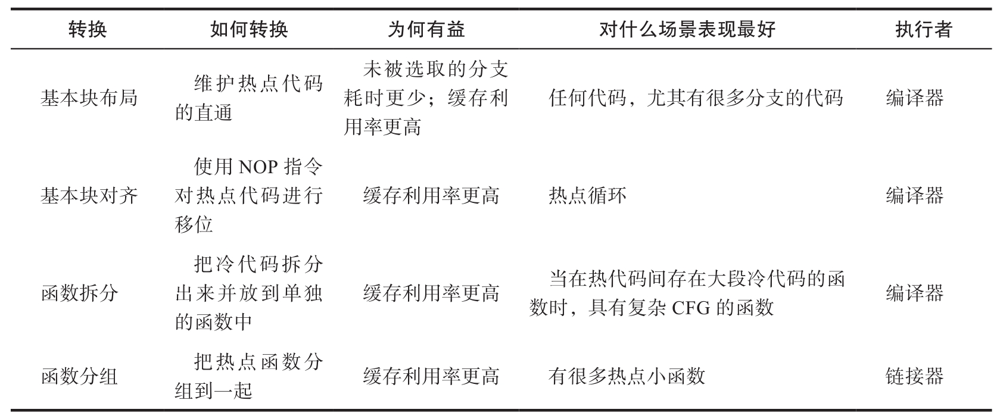

## 现代cpu性能分析

### cpu微架构

#### 流水线

- 取址-IF
- 译码-ID
- 执行-EXE
- 访存-MEM
- 回写-WB

#### 指令集并行

- 程序中的大多数指令是独立的，所以都适合流水线化和并行执行
- ILP-instruction level parallelism
- 指令在最终执行时称为退休
- 乱序执行OOO-out of order
- 大多数CPU可以一个时钟周期发射多个指令
- 投机执行
  - 预测分支执行
  - 投机执行的结果必须被制止和丢弃。这被称为分支预测错误惩罚
- 线程并行
  - 也就是常见的多线程或者多进程，通过切换上下文来跟踪线程或者进程的状态

#### 存储

- 主存-位于高速缓存的下游，支持大容量且成本合适的DRAM（动态RAM）
  - 主存三属性
    - 延迟
    - 带宽
    - 容量
  - 大多数CPU都支持的主流DRAM技术是DDR（Double Data Rate，双倍数据速率）DRAM技术

#### cpu前端

- 将准备好的指令送入CPU后端

#### cpu后端

- CPU后端采用乱序(Out-Of-Order)引擎来执行指令并存储结果

#### 性能监控单元

- PMU-performance monitoring unit

### 性能分析专业术语

- 退休指令与执行指令
  - PMC-性能监控计数器
    - perf stat -e instructions ./bin
- CPI-每指令周期数
  - 1/IPC
- IPC-每周期指令数
- 微操作
  - x86架构微处理器把复杂类CISC指令转化为简单类RISC微操作（microoperation，简称μop或uop）
- 缓存未命中
  - 指令缓存未命中被归类为前端停滞
  - 数据缓存未命中被归类为后端停滞
- 分支预测错误
  - perf stat -e branches,branch-misses -- bin

### 性能分析方法

#### 代码插桩

- 手动插桩
- 自动插桩
  - 最广为人知的用例是代码覆盖度分析和基于剖析文件的编译优化
- 二进制插桩
  - 静态插桩（提前完成）
  - 动态插桩（在程序执行时按需插入插桩代码）
  - Intel Pin是非常流行的二进制插桩工具之一

#### 跟踪

- 跟踪依赖于程序外部依赖项的现有插桩
  - strace工具可以跟踪系统调用，可以被认为是Linux内核的插桩

#### 采样

- linux perf收集调用栈
  - 帧指针
  - DWARF
  - 最后分支特性 lbr
- 火焰图

#### 屋顶线性能模型

- 硬件有两个主要限制
  - 计算速度（峰值计算性能，FLOPS）
  - 数据搬移速度（峰值内存带宽，GB/s）
- 应用程序的最大性能受峰值计算性能（水平线）和平台带宽与算术强度乘积（对角线）之间的最小值的限制
- 在屋顶线图上，我们可以绘制标量单核、SIMD单核和SIMD多核性能的理论最大值，这可以让我们了解应用程序性能的提高空间
  - 如果发现应用程序是计算密集型的（即具有较高的算术强度）并且性能低于峰值标量单核性能，则应该考虑强制向量化（见8.2.3节）并利用多个线程分配工作
  - 如果应用程序的算术强度较低，则应该寻找改善内存访问的方法
- 使用屋顶线模型优化性能的最终目标是将点向上移动
  - 向量化和线程化将点向上移动
  - 通过增加算术强度优化内存访问将点向右移动同时还可能提高性能
- 静态性能分析

#### 性能分析相关cpu特性

##### TMA

- 前端绑定 front bound
  - 读取延迟 fe latency
  - 读取带宽 fe bandwidth
- 后端绑定 backend bound
  - 核绑定 core bound
  - 内存绑定 memory bound
    - L1 bound
    - L2 bound
    - L3 bound
    - DRAM bound
    - stroe bound
- 退休 retiring
  - 轻量微操作 base
  - 微码序列器 microcode sequencer
- 错误投机 bad speculation

  - 分支预测错误 brach mispred
  - 机器清理 machine clears

- linux perf中TMA，获取TMA第1层指标

  - perf stat --topdown -a -- taskset -c 0 ./exec b
    - --topdown可以查看TMA指标
    - taskset -c 0可以绑定core 0

- toplev可以获取TMA的第2，3层指标

  - python实现，通过封装和调用linux perf工具实现

  - ```
    toplev.py --core S0-C0 -l1 -v --no-desc -c 0 ./exec
    ```

    - 后端绑定53.43%

  - ```
    toplev.py --core S0-C0 -l2 -v --no-desc -c 0 ./exec
    ```

    - 内存绑定44.59%

  - ```
    toplev.py --core S0-C0 -l3 -v --no-desc -c 0 ./exec
    ```

    - DRAM绑定47.11%
    - Skylake CPU架构，DRAM_Bound指标是通过CYCLE_ACTIVITY.STALLS_L3_MISS性能事件计算的

  - ```
    perf stat -e cycles,cycle_activity.stalls_l3_miss -- ./exec
    ```

    - 统计了当L3缓存未命中未完成预期加载而导致执行阻塞的CPU周期数

  - ```
    perf record -e cpu/event=0xd1,umask=0x20,name=MEM_LOAD_RETIRED.L3_MISS/PPP ./exec
    ```

#### 最后分支记录

- 利用该特性可以持续地记录大量已经执行的分支跳转指令

  - ```
    perf record -b -e cycles ./exec
    ```

- 分析分支预测错误率

## 基于源代码的cpu调优

### cpu前端优化

前端不能给执行单元提供指令的原因有很多，不过通常被归结为`缓存利用率`和`无法从内存中获取指令`两类



- 基本块布局
- 基本块对齐
- 函数拆分
- 函数分组

### cpu后端优化

内存绑定，几种策略优化

- 缓存友好的数据结构
- 按顺序访问数据

### 优化错误投机

当经常发生分支预测错误时，会导致显著的性能劣化

通常，现代CPU发生分支预测错误时会有15～20个时钟周期的开销

对于常规应用程序，有5%～10%的“错误投机”率是正常的

可以直接解决分支预测错误问题的方法就是消除分支本身

- 用查表替换分支
- 用断言替换分支

当CPU分支预测器难以预测分支输出模式时，应用程序的性能可能会受到影响。在这种场景下，无分支版本的算法会更好。

### 其他调优

- 编译时计算
- 编译器内建函数
- 缓存预热
- 减少慢速浮点运算
  - 对于有浮点值运算的应用程序，当浮点数值非规范时，可能会遇到异常场景。对非规范的数值进行运算，很容易就会变得非常慢。当CPU处理尝试对非规范浮点值运算的指令时，需要对这个场景进行特殊处理。因为是异常场景，CPU需要请求微码协助[插图]。微码序列器只读存储器将会为流水线提供大量微操作。

### 优化多线程应用程序

#### 性能扩展和开销

阿姆达尔定律

该定律表明并行程序的加速效果被它的串行组件所限制


进一步给系统添加计算单元可能会产生负加速效果。Neil Gunther将这种效应解释为通用可伸缩性定律(Universal Scalability Law，USL)，它是阿姆达尔定律的扩展。通用可伸缩性定律将计算单元（线程）之间的通信描述为影响性能的另一个门控因素。随着系统规模的扩大，开销将阻碍性能。超过某个临界点，系统性能开始下降。通用可伸缩性定律被广泛地应用于系统容量和扩展性的建模。


#### 并行效率指标

有效CPU利用率

#### 使用Linux perf进行分析

#### 使用Coz进行分析

Coz是一个新型的剖析工具，它可以解决这类问题并填补传统软件剖析工具的短板。它使用了一种名为“因果剖析”的新技术，该技术在应用程序运行时进行实验，通过模拟加快代码段的速度来预测某些优化的总体效果。它通过对其他同步运行的代码插入暂停动作，以实现“模拟加速”(Curtsinger&Berger，2015)。

#### 使用eBPF和GAPP进行分析

eBPF是基于运行在内核中的沙箱虚拟机的，这使得在内核中安全、高效地执行用户自定义程序成为可能。用C语言开发用户自定义的程序，然后用准备好的BCC编译器[插图]将其编译成BPF字节码，以便在内核虚拟机中进行加载。这些BPF程序可以设计为在某个内核事件执行时启动，然后通过不同方式把原始或处理过的数据返回用户空间。

开源社区提供了很多通用的eBPF程序，其中一个叫通用自动并行剖析工具(Generic Automatic Parallel Profiler，GAPP)，它有助于跟踪多线程竞争问题。GAPP通过eBPF对已识别的序列化瓶颈的紧急程度进行排序并收集被阻塞的线程和导致阻塞的线程的堆栈，来跟踪多线程应用程序的竞争开销。GAPP的好处是它不需要进行代码更改、代码插桩，也不需要重新编译。

#### 检测一致性问题

缓存一致性协议

最著名的一个缓存一致性协议是MESI（Modified Exclusive Shared Invalid，修改、独有、共享、无效），它支持如现代CPU中使用的缓存回写。

- 修改(Modified)—缓存行只在当前缓存出现，其值相对内存中的值已经发生变化
- 独有(Exclusive)—缓存行只在当前缓存出现，其值与内存中的值一致
- 共享(Shared)—缓存行出现在当前缓存和其他缓存，并且值都与内存中的值一致
- 无效(Invalid)—缓存行没有被使用（例如，不包含任何内存地址的内容）

实际上，CPU厂商通常会实现稍加改进的MESI变体。例如，Intel使用MESIF，它增添加了一个转发(Forwarding，F)状态；而AMD使用MOESI，它增加了一个持有(Owning，O)状态。


##### 真共享

当处理器访问相同变量时，称为“真共享”

##### 伪共享

当两个不同的处理器修改恰巧位于同一缓存行的不同变量时，称为“伪共享”

伪共享是多线程应用程序性能问题的主要来源，因此现代分析工具都支持这种场景的检测。TMA把有真共享和伪共享问题的应用程序表征为内存绑定类型。在这种场景下，通常可以看到比较高的竞争访问(Contested Access)指标。
