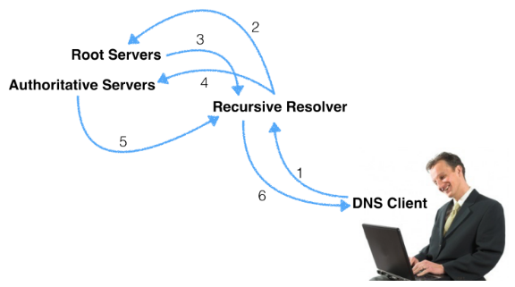

Using dig +trace to Understand DNS Resolution from Start to Finish

```bash
➜  ~ dig www.ruizhou.cf

; <<>> DiG 9.10.6 <<>> www.ruizhou.cf
;; global options: +cmd
;; Got answer:
;; ->>HEADER<<- opcode: QUERY, status: NOERROR, id: 12288
;; flags: qr rd ra; QUERY: 1, ANSWER: 2, AUTHORITY: 0, ADDITIONAL: 1

;; OPT PSEUDOSECTION:
; EDNS: version: 0, flags:; udp: 4096
;; QUESTION SECTION:
;www.ruizhou.cf.			IN	A

;; ANSWER SECTION:
www.ruizhou.cf.		33	IN	A	104.21.92.218
www.ruizhou.cf.		33	IN	A	172.67.198.221

;; Query time: 0 msec
;; SERVER: 10.23.193.249#53(10.23.193.249)
;; WHEN: Mon Jul 24 13:24:22 CST 2023
;; MSG SIZE  rcvd: 75
```

查看flags标志位， 如果说flags有标志位是**aa (authority answer)**， 说明是权威dns返回的最新解析出来的无缓存ip地址 （类似于查询db返回了最新的）



```bash
// step1
➜  ~ dig +trace www.ruizhou.cf
// step2
; <<>> DiG 9.10.6 <<>> +trace www.ruizhou.cf
;; global options: +cmd
.			73	IN	NS	k.root-servers.net.// 13个根服务器
.			73	IN	NS	b.root-servers.net.
.			73	IN	NS	f.root-servers.net.
.			73	IN	NS	i.root-servers.net.
.			73	IN	NS	e.root-servers.net.
.			73	IN	NS	a.root-servers.net.
.			73	IN	NS	m.root-servers.net.
.			73	IN	NS	j.root-servers.net.
.			73	IN	NS	d.root-servers.net.
.			73	IN	NS	c.root-servers.net.
.			73	IN	NS	h.root-servers.net.
.			73	IN	NS	g.root-servers.net.
.			73	IN	NS	l.root-servers.net.
;; Received 239 bytes from 10.23.193.249#53(10.23.193.249) in 8 ms
// step3
cf.			172800	IN	NS	a.ns.cf.
cf.			172800	IN	NS	b.ns.cf.
cf.			172800	IN	NS	c.ns.cf.
cf.			172800	IN	NS	d.ns.cf.
cf.			86400	IN	NSEC	cfa. NS RRSIG NSEC
cf.			86400	IN	RRSIG	NSEC 8 1 86400 20230805170000 20230723160000 11019 . Uychi9UlDouSm6blHZlRUAeMVzad/673OTnln96SVUwRRTaKNcUl+sU7 KAPnupkvdVYjlTHZBU0/7cDhPUpU4mXzOnr10Jhzsp/GVphVGiFZi6JI y1JYVfFlnuecPcLrw5ymAF7MDFmUNTKXYm8AcwQyZncq2lO3I4O900tJ xydD1KHKKReg1EUf9aZ48tLFzAGv0o3LVZOLsRU8+alKpIdREDKGeqpv Cs1YdK4BmLt3MTsEbNWxMPR49ZYSgMir9Sk5D29+5O47AtibREvdarz4 ItD49puEVE2VODgVhPHlY71c8JDH7U3W23+G7owll1lkabDl0PNB9EK5 Lu11Ig==
;; Received 598 bytes from 199.9.14.201#53(b.root-servers.net) in 238 ms
// step4
ruizhou.cf.		300	IN	NS	bob.ns.cloudflare.com.// cf的权威dns
ruizhou.cf.		300	IN	NS	paislee.ns.cloudflare.com.// cf的权威dns
;; Received 100 bytes from 185.21.171.17#53(d.ns.cf) in 58 ms
// step5
www.ruizhou.cf.		300	IN	A	104.21.92.218// cf权威dns解析的A记录，由于这个域名开了cf的cdn代理，所以不是源站的ip，而是cf的cdn的ip
www.ruizhou.cf.		300	IN	A	172.67.198.221
;; Received 75 bytes from 108.162.194.183#53(paislee.ns.cloudflare.com) in 28 ms
```

## Reference

https://ns1.com/blog/using-dig-trace
