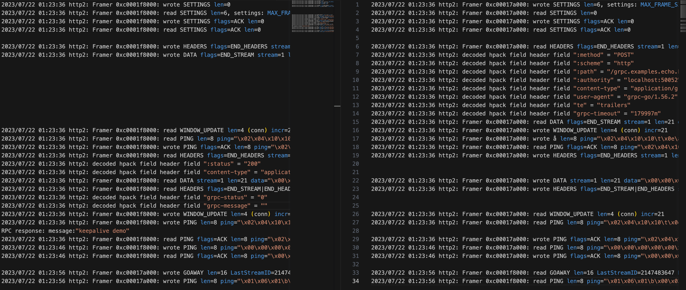

## 服用发现

```go
type Builder interface {
	Build(target Target, cc ClientConn, opts BuildOptions) (Resolver, error)
	Scheme() string
}

type Resolver interface {
	ResolveNow(ResolveNowOptions)
	Close()
}

type ClientConn interface {
	UpdateState(State) error
	ReportError(error)
	// Deprecated: Use UpdateState instead.
	NewAddress(addresses []Address)
	// Deprecated: Use UpdateState instead.
	NewServiceConfig(serviceConfig string)
	// ParseServiceConfig parses the provided service config and returns an
	// object that provides the parsed config.
	ParseServiceConfig(serviceConfigJSON string) *serviceconfig.ParseResult
}
```

下面依次分析这三个接口的作用：

- `Builder`用于 gRPC 内部创建`Resolver`接口的实现，但注意声明的`Build`方法将接口`ClientConn`作为参数传入了
- `ClientConn`接口有两个废弃方法不用管，看`UpdateState`方法需要传入`State`结构，看代码可以发现其中包含了`Addresses []Address // Resolved addresses for the target`，可以看出是需要将服务发现得到的`Address`对象列表告诉`ClientConn`的对象
- `Resolver`提供了`ResolveNow`用于被 gRPC 尝试重新进行服务发现

看完这三个接口就可以明白 gRPC 的服务发现实现逻辑，通过`Builder`进行`Reslover`的创建，在`Build`的过程中将服务发现的地址信息丢给`ClientConn`用于内部连接创建等逻辑。主要逻辑可以按下面顺序来看源码理解：

- 当`client`在`Dial`时会根据`target`解析的`scheme`获取对应的`Builder`，[官方代码位置](https://github.com/grpc/grpc-go/blob/master/clientconn.go#L242)
- 当`Dial`成功会创建出结构体`ClientConn`的对象[官方代码位置](https://github.com/grpc/grpc-go/blob/master/clientconn.go#L447)(注意不是上面的`ClientConn`接口)，可以看到结构体`ClientConn`内的成员`resolverWrapper`又实现了接口`ClientConn`的方法[官方代码位置](https://github.com/grpc/grpc-go/blob/master/resolver_conn_wrapper.go)
- 当`resolverWrapper`被初始化时就会调用`Build`方法[官方代码位置](https://github.com/grpc/grpc-go/blob/master/resolver_conn_wrapper.go#L89)，其中参数为接口`ClientConn`传入的是`ccResolverWrapper`
- 当用户基于`Builder`的实现进行`UpdateState`调用时，则会触发结构体`ClientConn`的`updateResolverState`方法[官方代码位置](https://github.com/grpc/grpc-go/blob/master/resolver_conn_wrapper.go#L109)，`updateResolverState`则会对传入的`Address`进行初始化等逻辑[官方代码位置](https://github.com/grpc/grpc-go/blob/master/clientconn.go#L553)

如此整个服务发现过程就结束了。从中也可以看出 gRPC 官方提供的三个接口还是很灵活的，但也正因为灵活要实现稍微麻烦一些，而`Address`[官方代码位置](https://github.com/grpc/grpc-go/blob/master/resolver/resolver.go#L79)如果直接被业务拿来用于服务节点信息的描述结构则显得有些过于简单。

所以`warden`包装了 gRPC 的整个服务发现实现逻辑，代码分别位于`library/naming/naming.go`和`warden/resolver/resolver.go`，其中：

`resolver.go`内实现了 gRPC官方的`resolver.Builder`和`resolver.Resolver`接口，但也暴露了`naming.go`内的`naming.Builder`和`naming.Resolver`接口

- Resolver实现了gRPC官方`resolver.Resolver`接口，并且包含了naming包下新的Resolver interface
- Builder实现了gRPC官方`resolver.Builder`接口，并且new可以传入naming包下新的Builder interface

```go
// warden/resolver/resolver.go

_  resolver.Resolver = &Resolver{}// Resolver实现了gRPC官方resolver.Resolver接口
_  resolver.Builder  = &Builder{}// Builder实现了gRPC官方resolver.Builder接口

type Resolver struct {
	nr   naming.Resolver// naming包下Resolver interface
	cc   resolver.ClientConn
	quit chan struct{}

	zone string
}

// Close is a noop for Resolver.
func (r *Resolver) Close() {
...
}

// ResolveNow is a noop for Resolver.
func (r *Resolver) ResolveNow(o resolver.ResolveNowOptions) {
  // 空函数
}

func (r *Resolver) updateproc(forceZone bool) {
...
}

func (r *Resolver) newAddress(instances []*naming.Instance) {
...
}


type Builder struct {
	naming.Builder// naming包下Builder interface,其中就有grpc.Resolver.Scheme的定义，所以实现了grpc的resolver.Builder接口
}

func (b *Builder) Build(target resolver.Target, cc resolver.ClientConn, opts resolver.BuildOptions) (resolver.Resolver, error) {
...
  // 内部会调用naming.Builder的简化Build方法
}

```

`naming.go`内定义了用于描述业务实例的`Instance`结构、用于服务注册的`Registry`接口、用于服务发现的`Resolver`接口。

可以看到封装方式与 gRPC 官方的方法一样，通过`Builder`进行`Resolver`的初始化。不同的是通过封装将参数进行了简化：

- `Build`只需要传对应的服务`id`即可：`warden/resolver/resolver.go`在 gRPC 进行调用后，会根据`Scheme`方法查询对应的`naming.Builder`实现并调用`Build`将`id`传入，而`naming.Resolver`的实现即可通过`id`去对应的服务发现中间件进行实例信息的查询
- 而`Resolver`则对方法进行了扩展，除了简单进行`Fetch`操作外还多了`Watch`方法，用于监听服务发现中间件的节点变化情况，从而能够实时的进行服务实例信息的更新

```go
// library/naming/naming.go
type Builder interface {
	Build(id string, options ...BuildOpt) Resolver// 这是naming下的Resolver interface
	Scheme() string
}

type Resolver interface {
	Fetch(context.Context) (map[string][]*Instance, bool)
	Watch() <-chan struct{}
	Close() error
}
```

discovery是naming.go中Builder和Resolver的具体的一种实现，有其他实现

- Discovery实现了naming下的Builder和Registry接口
- Resolver实现了naming下的Resolver接口

```go
// library/naming/discovery/discovery.go

_ naming.Builder  = &Discovery{}
_ naming.Registry = &Discovery{}
_ naming.Resolver = &Resolver{}


```

## 负载均衡

## keepalive

### 客户端配置

```go
type ClientParameters struct {
	// After a duration of this time if the client doesn't see any activity it
	// pings the server to see if the transport is still alive.
	// If set below 10s, a minimum value of 10s will be used instead.
	Time time.Duration // The current default value is infinity.
	// After having pinged for keepalive check, the client waits for a duration
	// of Timeout and if no activity is seen even after that the connection is
	// closed.
	Timeout time.Duration // The current default value is 20 seconds.
	// If true, client sends keepalive pings even with no active RPCs. If false,
	// when there are no active RPCs, Time and Timeout will be ignored and no
	// keepalive pings will be sent.
	PermitWithoutStream bool // false by default.
}
```

Time：**没有活动后的保活时间**，超过这个时间就会发ping给server；`默认无穷大，最小10s`，默认连接一直认为有效

Timeout：**ping后等待时间**，超过就断开连接；默认`20s`

PermitWithoutStream：true，**连接在没活动时会定期发ping**，结合上面👆两个参数；默认为`false`

### 服务端配置

```go
type ServerParameters struct {
	// MaxConnectionIdle is a duration for the amount of time after which an
	// idle connection would be closed by sending a GoAway. Idleness duration is
	// defined since the most recent time the number of outstanding RPCs became
	// zero or the connection establishment.
	MaxConnectionIdle time.Duration // The current default value is infinity.
	// MaxConnectionAge is a duration for the maximum amount of time a
	// connection may exist before it will be closed by sending a GoAway. A
	// random jitter of +/-10% will be added to MaxConnectionAge to spread out
	// connection storms.
	MaxConnectionAge time.Duration // The current default value is infinity.
	// MaxConnectionAgeGrace is an additive period after MaxConnectionAge after
	// which the connection will be forcibly closed.
	MaxConnectionAgeGrace time.Duration // The current default value is infinity.
	// After a duration of this time if the server doesn't see any activity it
	// pings the client to see if the transport is still alive.
	// If set below 1s, a minimum value of 1s will be used instead.
	Time time.Duration // The current default value is 2 hours.
	// After having pinged for keepalive check, the server waits for a duration
	// of Timeout and if no activity is seen even after that the connection is
	// closed.
	Timeout time.Duration // The current default value is 20 seconds.
}
```

MaxConnectionIdle：**idle空闲连接的存活时间**，超过就发送GoAway帧（空闲连接的定义就是最近一次rpc调用之后的时间，或者连接刚刚建立作为起点计算没有rpc调用的维持时间）；默认`无限大`，默认连接无线存活

MaxConnectionAge：**连接的最大存活时间**，包括活跃连接和空闲连接，比上面👆应该要长点，超了要发送GoAway帧，并且防止同时关闭过多连接，加了随机扰动上下10%的时间；默认`无限大`，默认连接无线存活

MaxConnectionAgeGrace：服务上面，到了时间但是会等待一段时间，来优雅关闭，主要为了有rpc的情况，让其顺利结束；默认无限大

Time：**没有活动后的保活时间**，超过这个时间就会发ping给client；默认2小时，最小1s，默认只认为和客户端保活`2小时`

Timeout：**ping后等待时间**，超过就断开连接；默认`20s`

#### 服务端自我保护策略

为了保护server端，限制客户端的ping的频率（等客户端4次ping来统计比较）

MinTime：**客户端可以发送ping的最小间隔**；默认是`5min`；需要`等客户端4次ping`，来比较MinTime，不符合就发送GoAway帧

PermitWithoutStream：true，允许没有rpc调用时client发送ping；默认`false`不允许，如果空间时间客户端发ping，那么server会发送GoAway帧来关闭连接；false状态下，需要`等客户端4次ping`，才会发送GoAway帧

```sh
2023/07/22 12:41:43 http2: Framer 0x14000198000: wrote SETTINGS len=0
2023/07/22 12:41:43 http2: Framer 0x14000198000: read SETTINGS len=6, settings: MAX_FRAME_SIZE=16384
2023/07/22 12:41:43 http2: Framer 0x14000198000: wrote SETTINGS flags=ACK len=0
2023/07/22 12:41:43 http2: Framer 0x14000198000: read SETTINGS flags=ACK len=0
2023/07/22 12:42:16 http2: Framer 0x14000198000: wrote PING len=8 ping="\x00\x00\x00\x00\x00\x00\x00\x00"
2023/07/22 12:42:16 http2: Framer 0x14000198000: read PING flags=ACK len=8 ping="\x00\x00\x00\x00\x00\x00\x00\x00"
2023/07/22 12:42:49 http2: Framer 0x14000198000: wrote PING len=8 ping="\x00\x00\x00\x00\x00\x00\x00\x00"
2023/07/22 12:42:49 http2: Framer 0x14000198000: read PING flags=ACK len=8 ping="\x00\x00\x00\x00\x00\x00\x00\x00"
2023/07/22 12:43:22 http2: Framer 0x14000198000: wrote PING len=8 ping="\x00\x00\x00\x00\x00\x00\x00\x00"
2023/07/22 12:43:22 http2: Framer 0x14000198000: read PING flags=ACK len=8 ping="\x00\x00\x00\x00\x00\x00\x00\x00"
2023/07/22 12:43:55 http2: Framer 0x14000198000: wrote PING len=8 ping="\x00\x00\x00\x00\x00\x00\x00\x00"
2023/07/22 12:43:55 http2: Framer 0x14000198000: read PING flags=ACK len=8 ping="\x00\x00\x00\x00\x00\x00\x00\x00"
2023/07/22 12:43:55 http2: Framer 0x14000198000: read GOAWAY len=22 LastStreamID=0 ErrCode=ENHANCE_YOUR_CALM Debug="too_many_pings"
2023/07/22 12:43:55 ERROR: [transport] Client received GoAway with error code ENHANCE_YOUR_CALM and debug data equal to ASCII "too_many_pings".
```

43秒开始，16第一次ping，49第二次ping，22第三次ping，55第四次ping，同时发送GoAway帧

```go
// EnforcementPolicy is used to set keepalive enforcement policy on the
// server-side. Server will close connection with a client that violates this
// policy.
type EnforcementPolicy struct {
	// MinTime is the minimum amount of time a client should wait before sending
	// a keepalive ping.
	MinTime time.Duration // The current default value is 5 minutes.
	// If true, server allows keepalive pings even when there are no active
	// streams(RPCs). If false, and client sends ping when there are no active
	// streams, server will send GOAWAY and close the connection.
	PermitWithoutStream bool // false by default.
}
```

demo代码演示：https://github.com/xyz3282836/grpcdemo/tree/master/libtest

可以开启GODEBUG

```sh
export GODEBUG=http2client=0  # disable HTTP/2 client support
export GODEBUG=http2server=0  # disable HTTP/2 server support
export GODEBUG=http2debug=1   # enable verbose HTTP/2 debug logs
export GODEBUG=http2debug=2   # ... even more verbose, with frame dumps
```

一次普通请求

左边client，右边server



## reference

https://zhuanlan.zhihu.com/p/530266840

https://go.dev/src/net/http/doc.go

https://pandaychen.github.io/2020/09/01/GRPC-CLIENT-CONN-LASTING/
