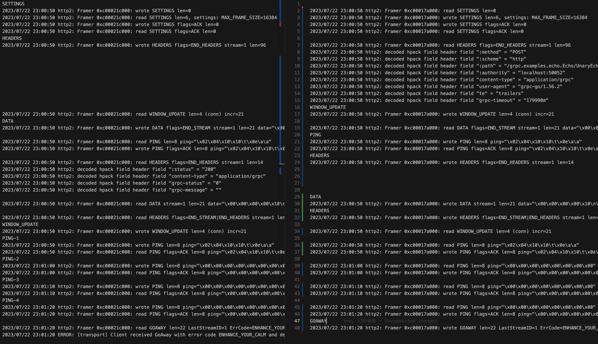

### 客户端配置

```go
type ClientParameters struct {
	// After a duration of this time if the client doesn't see any activity it
	// pings the server to see if the transport is still alive.
	// If set below 10s, a minimum value of 10s will be used instead.
	Time time.Duration // The current default value is infinity.
	// After having pinged for keepalive check, the client waits for a duration
	// of Timeout and if no activity is seen even after that the connection is
	// closed.
	Timeout time.Duration // The current default value is 20 seconds.
	// If true, client sends keepalive pings even with no active RPCs. If false,
	// when there are no active RPCs, Time and Timeout will be ignored and no
	// keepalive pings will be sent.
	PermitWithoutStream bool // false by default.
}
```

Time：**没有活动后的保活时间**，超过这个时间就会发ping给server；`默认无穷大，最小10s`，默认连接一直认为有效（B站设置60s）

Timeout：**ping后等待时间**，超过就断开连接；默认`20s`（B站设置20s）

PermitWithoutStream：true，**连接在没活动时会定期发ping**，结合上面👆两个参数；默认为`false`（B站没有设置，默认false）

### 服务端配置

```go
type ServerParameters struct {
	// MaxConnectionIdle is a duration for the amount of time after which an
	// idle connection would be closed by sending a GoAway. Idleness duration is
	// defined since the most recent time the number of outstanding RPCs became
	// zero or the connection establishment.
	MaxConnectionIdle time.Duration // The current default value is infinity.
	// MaxConnectionAge is a duration for the maximum amount of time a
	// connection may exist before it will be closed by sending a GoAway. A
	// random jitter of +/-10% will be added to MaxConnectionAge to spread out
	// connection storms.
	MaxConnectionAge time.Duration // The current default value is infinity.
	// MaxConnectionAgeGrace is an additive period after MaxConnectionAge after
	// which the connection will be forcibly closed.
	MaxConnectionAgeGrace time.Duration // The current default value is infinity.
	// After a duration of this time if the server doesn't see any activity it
	// pings the client to see if the transport is still alive.
	// If set below 1s, a minimum value of 1s will be used instead.
	Time time.Duration // The current default value is 2 hours.
	// After having pinged for keepalive check, the server waits for a duration
	// of Timeout and if no activity is seen even after that the connection is
	// closed.
	Timeout time.Duration // The current default value is 20 seconds.
}
```

MaxConnectionIdle：**idle空闲连接的存活时间**，超过就发送GoAway帧（空闲连接的定义就是最近一次rpc调用之后的时间，或者连接刚刚建立作为起点计算没有rpc调用的维持时间）；默认`无限大`，默认连接无线存活（B站设置60s）

MaxConnectionAge：**连接的最大存活时间**，包括活跃连接和空闲连接，比上面👆应该要长点，超了要发送GoAway帧，并且防止同时关闭过多连接，加了随机扰动上下10%的时间；默认`无限大`，默认连接无线存活（B站设置2小时）

MaxConnectionAgeGrace：服务上面，到了时间但是会等待一段时间，来优雅关闭，主要为了有rpc的情况，让其顺利结束；默认无限大（B站设置20s）

Time：**没有活动后的保活时间**，超过这个时间就会发ping给client；默认2小时，最小1s，默认只认为和客户端保活`2小时`（B站设置60s）（B站设置60s）

Timeout：**ping后等待时间**，超过就断开连接；默认`20s`（B站设置20s）

#### 服务端自我保护策略

B站没有设置

为了保护server端，限制客户端的ping的频率（**等客户端4次ping来统计比较**）

MinTime：**客户端可以发送ping的最小间隔**；默认是`5min`；需要`等客户端4次ping`，来比较MinTime，不符合就发送GoAway帧

PermitWithoutStream：true，允许没有rpc调用时client发送ping；默认`false`不允许，如果空间时间客户端发ping，那么server会发送GoAway帧来关闭连接；false状态下，需要`等客户端4次ping`，才会发送GoAway帧

```sh
SETTINGS
2023/07/22 12:41:43 http2: Framer 0x14000198000: wrote SETTINGS len=0
2023/07/22 12:41:43 http2: Framer 0x14000198000: read SETTINGS len=6, settings: MAX_FRAME_SIZE=16384
2023/07/22 12:41:43 http2: Framer 0x14000198000: wrote SETTINGS flags=ACK len=0
2023/07/22 12:41:43 http2: Framer 0x14000198000: read SETTINGS flags=ACK len=0
PING-1
2023/07/22 12:42:16 http2: Framer 0x14000198000: wrote PING len=8 ping="\x00\x00\x00\x00\x00\x00\x00\x00"
2023/07/22 12:42:16 http2: Framer 0x14000198000: read PING flags=ACK len=8 ping="\x00\x00\x00\x00\x00\x00\x00\x00"
PING-2
2023/07/22 12:42:49 http2: Framer 0x14000198000: wrote PING len=8 ping="\x00\x00\x00\x00\x00\x00\x00\x00"
2023/07/22 12:42:49 http2: Framer 0x14000198000: read PING flags=ACK len=8 ping="\x00\x00\x00\x00\x00\x00\x00\x00"
PING-3
2023/07/22 12:43:22 http2: Framer 0x14000198000: wrote PING len=8 ping="\x00\x00\x00\x00\x00\x00\x00\x00"
2023/07/22 12:43:22 http2: Framer 0x14000198000: read PING flags=ACK len=8 ping="\x00\x00\x00\x00\x00\x00\x00\x00"
PING-4
2023/07/22 12:43:55 http2: Framer 0x14000198000: wrote PING len=8 ping="\x00\x00\x00\x00\x00\x00\x00\x00"
2023/07/22 12:43:55 http2: Framer 0x14000198000: read PING flags=ACK len=8 ping="\x00\x00\x00\x00\x00\x00\x00\x00"
服务侧发来GOAWAY
2023/07/22 12:43:55 http2: Framer 0x14000198000: read GOAWAY len=22 LastStreamID=0 ErrCode=ENHANCE_YOUR_CALM Debug="too_many_pings"
2023/07/22 12:43:55 ERROR: [transport] Client received GoAway with error code ENHANCE_YOUR_CALM and debug data equal to ASCII "too_many_pings".
```

43秒开始，16第一次ping，49第二次ping，22第三次ping，55第四次ping，同时发送GoAway帧

```go
// EnforcementPolicy is used to set keepalive enforcement policy on the
// server-side. Server will close connection with a client that violates this
// policy.
type EnforcementPolicy struct {
	// MinTime is the minimum amount of time a client should wait before sending
	// a keepalive ping.
	MinTime time.Duration // The current default value is 5 minutes.
	// If true, server allows keepalive pings even when there are no active
	// streams(RPCs). If false, and client sends ping when there are no active
	// streams, server will send GOAWAY and close the connection.
	PermitWithoutStream bool // false by default.
}
```

demo代码演示：https://github.com/xyz3282836/grpcdemo/tree/master/libtest

可以开启GODEBUG

```sh
export GODEBUG=http2client=0  # disable HTTP/2 client support
export GODEBUG=http2server=0  # disable HTTP/2 server support
export GODEBUG=http2debug=1   # enable verbose HTTP/2 debug logs
export GODEBUG=http2debug=2   # ... even more verbose, with frame dumps
```

一次普通请求，收发包的帧日志

服务端配置，第一个EnforcementPolicy.PermitWithoutStream为false，其实就是默认配置，此配置等价于没有配置，直接看第二个配置就好

```go
var kaep = keepalive.EnforcementPolicy{
	MinTime:             10 * time.Second, // If a client pings more than once every 5 seconds, terminate the connection
	PermitWithoutStream: false,             // Allow pings even when there are no active streams
}

var kasp = keepalive.ServerParameters{
	MaxConnectionIdle:     5000 * time.Second, // If a client is idle for 15 seconds, send a GOAWAY
	MaxConnectionAge:      6000 * time.Second, // If any connection is alive for more than 30 seconds, send a GOAWAY
	MaxConnectionAgeGrace: 5 * time.Second,    // Allow 5 seconds for pending RPCs to complete before forcibly closing connections
	Time:                  15 * time.Second,    // Ping the client if it is idle for 5 seconds to ensure the connection is still active
	Timeout:               1 * time.Second,    // Wait 1 second for the ping ack before assuming the connection is dead
}
```

客户端配置，Time超过服务侧，所以客户端发起ping

```go
var kacp = keepalive.ClientParameters{
	Time:                10 * time.Second, // send pings every 10 seconds if there is no activity
	Timeout:             time.Second,      // wait 1 second for ping ack before considering the connection dead
	PermitWithoutStream: true,             // send pings even without active streams
}
```

左边client，右边server



## reference

https://zhuanlan.zhihu.com/p/530266840

https://go.dev/src/net/http/doc.go

https://pandaychen.github.io/2020/09/01/GRPC-CLIENT-CONN-LASTING/
