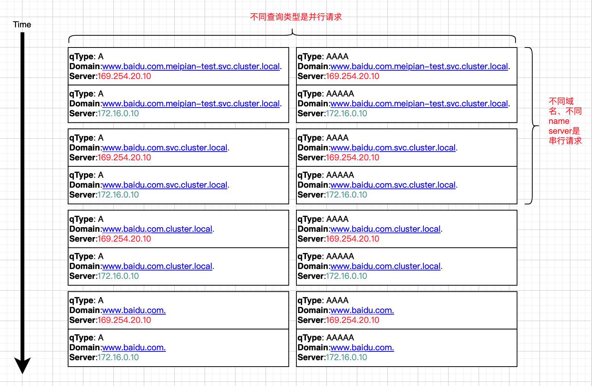
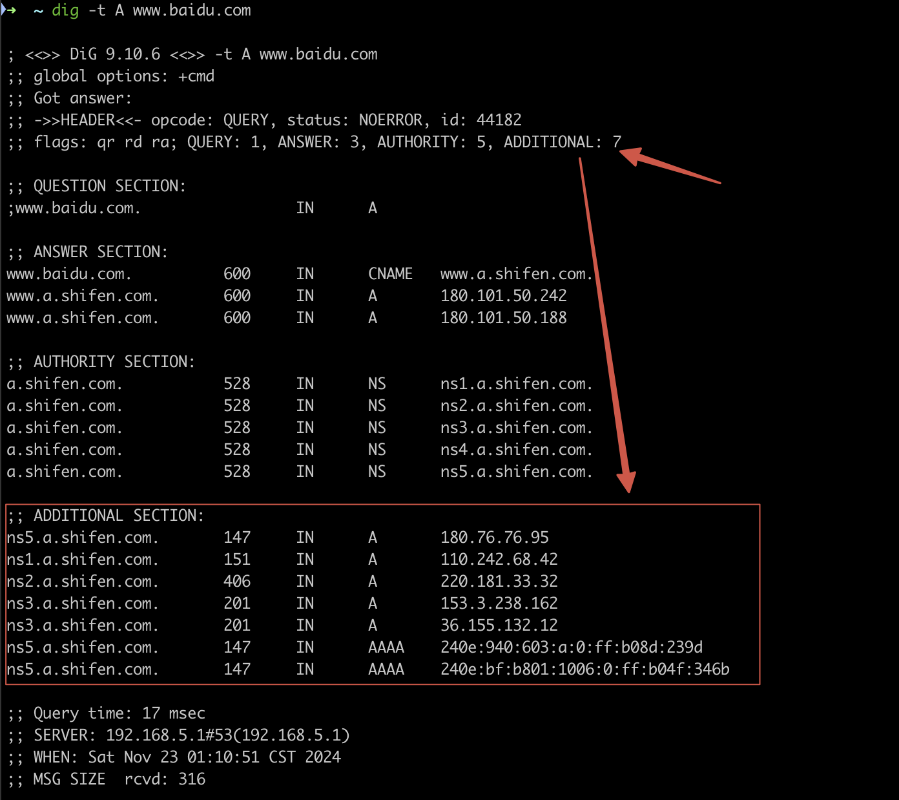

## dns解析器

golang有两种，一种就是std lib内置的dns解析器，还有就给予cgo的系统解析器

### 策略

默认使用内置解析器，通过环境变量GODEBUG来配置可以指定

```shell
export GODEBUG=netdns=go
export GODEBUG=netdns=cgo
```

或者go build 指定tags

```
go build -tags="netcgo"
```

如果无法读取`resolv.conf`，则使用cgo

```go
	if canUseCgo && dnsConf.err != nil && !errors.Is(dnsConf.err, fs.ErrNotExist) && !errors.Is(dnsConf.err, fs.ErrPermission) {
		// We can't read the resolv.conf file, so use cgo if we can.
		return hostLookupCgo, dnsConf
	}
```

内置go解析器，分了四种

```go
const (
	// hostLookupCgo means defer to cgo.
	hostLookupCgo      hostLookupOrder = iota
	hostLookupFilesDNS                 // files first
	hostLookupDNSFiles                 // dns first
	hostLookupFiles                    // only files
	hostLookupDNS                      // only DNS
)

var lookupOrderName = map[hostLookupOrder]string{
	hostLookupCgo:      "cgo",
	hostLookupFilesDNS: "files,dns",
	hostLookupDNSFiles: "dns,files",
	hostLookupFiles:    "files",
	hostLookupDNS:      "dns",
}
```

通过 `nsswitch.conf` 可以指定解析顺序，比如`ubuntu`：

```
# /etc/nsswitch.conf
#
# Example configuration of GNU Name Service Switch functionality.
# If you have the `glibc-doc-reference' and `info' packages installed, try:
# `info libc "Name Service Switch"' for information about this file.

passwd:         files systemd
group:          files systemd
shadow:         files systemd
gshadow:        files systemd

hosts:          files dns
networks:       files

protocols:      db files
services:       db files
ethers:         db files
rpc:            db files

netgroup:       nis
```

- files 表示先检查 `/etc/hosts`
- dns 表示再使用 `/etc/resolv.conf` 中定义的`DNS`服务器进行解析

当 `/etc/nsswitch.conf` 文件不存在或者文件存在但是没有指定 `hosts` 字段时，`solaris`系统使用cgo，其他系统下使用的是 `hostLookupFilesDNS` ，也就是说，hosts解析优先dns解析

```go
	nss := getSystemNSS()
	srcs := nss.sources["hosts"]
	// If /etc/nsswitch.conf doesn't exist or doesn't specify any
	// sources for "hosts", assume Go's DNS will work fine.
	if errors.Is(nss.err, fs.ErrNotExist) || (nss.err == nil && len(srcs) == 0) {
		if canUseCgo && c.goos == "solaris" {
			// illumos defaults to
			// "nis [NOTFOUND=return] files",
			// which the go resolver doesn't support.
			return hostLookupCgo, dnsConf
		}

		return hostLookupFilesDNS, dnsConf
	}
	if nss.err != nil {
		// We failed to parse or open nsswitch.conf, so
		// we have nothing to base an order on.
		return fallbackOrder, dnsConf
	}
```

## 内置dns解析器的流程

[https://man7.org/linux/man-pages/man5/resolv.conf.5.html](https://man7.org/linux/man-pages/man5/resolv.conf.5.html)中有`resolv.conf`的定义

```go
				case s == "single-request" || s == "single-request-reopen":
					// Linux option:
					// http://man7.org/linux/man-pages/man5/resolv.conf.5.html
					// "By default, glibc performs IPv4 and IPv6 lookups in parallel [...]
					//  This option disables the behavior and makes glibc
					//  perform the IPv6 and IPv4 requests sequentially."
					conf.singleRequest = true
```

如果设置了`single request`选项，`dns`解析的时候是串行的，并行是指同一个域名的A记录和AAAA记录查询是并行的，而不同的域名之间还是串行的



在go解析器内部，在四条件错误下会重试下一个nameserver

`goLookupIPCNAMEOrder`是核心方法

- 如果`network`时`tcp`，那么域名的A和AAAA记录都会被查询，无论服务器是否关闭ipv6

- `goLookupIPCNAMEOrder` 会调用 `tryOneName`
  - `tryOneName` 会进行dns查询，如果不能满足四个条件（go 1.23之前，1.23五个条件）
    - 响应没有错误
    - 应答 Server 不是权威服务器
    - 应答 Server 不支持递归请求
    - 应答的 `records` 为空

    就会抛出`errLameReferral`，循环continue，请求下一个nameserver

⚠️注意：通过`-tags="netcgo"`指定cgo系统解析器和go 内置dns解析器实现逻辑并不完全相同，前置在发现A记录有值的情况下，AAAA不会重试到下一个nameserver，而后者会继续重试执行attempts次

### 1.23新增

新增一个条件，是否有`ADDTIONAL`信息

> 在 `dig` 命令的输出中，`ADDITIONAL` 部分表示附加的资源记录（Additional Resource Records）。这些记录通常包含额外的信息，例如与查询相关的其他 DNS 服务器的地址。这些附加记录可以帮助解析器更快地找到所需的信息。
>
> 例如，当查询某个域名时，`ADDITIONAL` 部分可能包含该域名的名称服务器（NS）记录的 IP 地址，以便解析器可以直接联系这些服务器进行进一步查询。
>
> 

```go
	// libresolv continues to the next server when it receives
	// an invalid referral response. See golang.org/issue/15434.
	if rcode == dnsmessage.RCodeSuccess && !h.Authoritative && !h.RecursionAvailable && err == dnsmessage.ErrSectionDone && !hasAdd {
		return errLameReferral
	}

	// extractExtendedRCode extracts the extended RCode from the OPT resource (EDNS(0))
// If an OPT record is not found, the RCode from the hdr is returned.
// Another return value indicates whether an additional resource was found.
func extractExtendedRCode(p dnsmessage.Parser, hdr dnsmessage.Header) (dnsmessage.RCode, bool) {
	p.SkipAllAnswers()
	p.SkipAllAuthorities()
	hasAdd := false
	for {
		ahdr, err := p.AdditionalHeader()
		if err != nil {
			return hdr.RCode, hasAdd
		}
		hasAdd = true
		if ahdr.Type == dnsmessage.TypeOPT {
			return ahdr.ExtendedRCode(hdr.RCode), hasAdd
		}
		if err := p.SkipAdditional(); err != nil {
			return hdr.RCode, hasAdd
		}
	}
}
```

## reference

[https://studygolang.com/topics/15021](https://studygolang.com/topics/15021)

[https://go-review.googlesource.com/c/go/+/550435](https://go-review.googlesource.com/c/go/+/550435)

[https://go-review.googlesource.com/c/go/+/565628](https://go-review.googlesource.com/c/go/+/565628)
