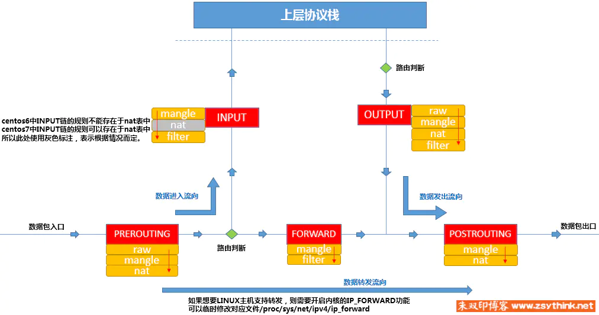
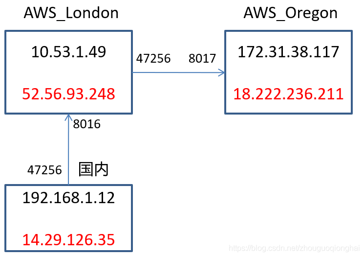
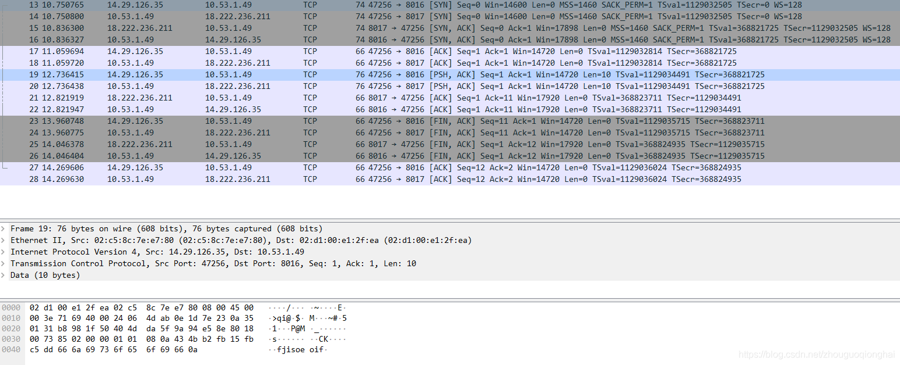
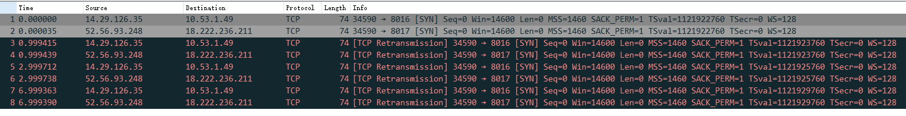

# iptables

## chain and table

### table

• filter：这里面的链条，规则，可以决定一个数据包是否可以到达目标进程端口

• mangle: 这里面的链条，规则，可以修改数据包的内容，比如 ttl

• nat：这里面的链条，规则，可以修改源和目标的 ip 地址，从而进行包路由。

• raw：这里面的链条，规则，能基于数据包的状态进行规则设定

### chain

以搬瓦工 vps 为例 centos8 为例

| prerouting |           input           |   forward    |    output    | postrouting |
| :--------: | :-----------------------: | :----------: | :----------: | :---------: |
|   mangle   |          mangle           |    mangle    |    mangle    |   mangle    |
| **`nat`**  | **`nat`**（centos7+可以） |              |  **`nat`**   |  **`nat`**  |
|            |       **`filter`**        | **`filter`** | **`filter`** |             |
|    raw     |                           |              |     raw      |             |



## 访问模式

### remote 访问本机

`prerouting`->`input`->`本机`

### 本地访问 remote

`本机`->`output`->`postrouting`

### 转发

一般被`PREROUTING`进行了 nat 转发，或者局域网

`prerouting`->`forward`->remote->`forward`->`postrouting`

## 参数

```shell

-n # 默认host names，network names，转化成数字地址 anywher=>0.0.0.0/0
-v # 冗余展示，会多出很多，流量统计等
-x # -v的情况下，把K，M，G转化成
-p # proto 协议 tcp，udp，all，icmp
-i # 匹配入站网卡(only for packets entering the INPUT, FORWARD and PREROUTING chains) -i eth0; ! -i eth0 排除这个interface；-i eth+ match eth0 eth1 等
-o # 匹配出站网卡(for packets entering the FORWARD, OUTPUT and POSTROUTING chains)
-m # 拓展其他命令

-A
-D
-E old-chain-name new-chain-name # 新替代旧的chain名
-F # This is equivalent to deleting all the rules one by one.
-I
-L # list all rules -L INPUT 列出某个chain下所有规则
-N # new a chain
-P # 修改默认build-in chain的规则 ipatables -t filter -P INPUT DROP
-R # Replace a rule in the selected chain.
-X # Delete the optional user-defined chain specified. -X MYCHAIN
-Z # chain的每个rules流量统计清零

# ACCEPT 表示让这个包通过。DROP表示将这个包丢弃。QUEUE表示把这个包传递到用户空间。RETURN表示停止这条链的匹配，到前一个链的规则重新开始。如果到达了一个内建的链(的末端)，或者遇到内建链的规则是RETURN，包的命运将由链准则指定的目标决定
# ACCEPT： 直接接受该数据包，不会再走其他链条和规则。比如filter中的input表中的某个规则命中后，动作是ACCEPT，那么该数据包将被直接送达目标进程端口
# DROP： 直接抛弃该数据包，并且没有任何返回。且不会再走其他链和规则
# REJECT: 跟DROP类似，但好歹还是会跟请求方返回一些拒绝信息，比如我们拒绝掉ICMP协议后，ping该主机，会返回“destination host unreachable”
# RETURN: 当前规则不做任何处理，返回。让给下一个规则处理
# LOG ： 同RETURN类似，但只是会将请求信息记录到系统日志中，记录路径为：/var/log/syslog or /var/log/messages
-j # This specifies the target of the rule. -j DROP;-j ACCEPT

--line-numbers # 列出rules，并且附带位置数字，可快捷删除

```

target

| 触发动作   | 功 能                                                                         |
| :--------- | :---------------------------------------------------------------------------- |
| ACCEPT     | 允许数据包通过                                                                |
| DROP       | 丢弃数据包                                                                    |
| REJECT     | 拒绝数据包通过                                                                |
| LOG        | 将数据包信息记录 syslog 曰志                                                  |
| DNAT       | 目标地址转换                                                                  |
| SNAT       | 源地址转换                                                                    |
| MASQUERADE | 地址欺骗(用于 nat，把转发到远程的包的 src 改成本机，这样远程才知道往哪里回包) |
| REDIRECT   | 重定向                                                                        |

## 实践

### 连接状态

| 连接状态    | 说明                                                                      |
| :---------- | :------------------------------------------------------------------------ |
| NEW         | 新创建的连接                                                              |
| ESTABLISHED | 已经建立的连接                                                            |
| RELATED     | 跟已经创建的连接相关的连接                                                |
| INVALID     | 非正常状态                                                                |
| DNAT        | 如果一个连接其目标地址被 nat 表 PREROUTING 链中的规则修改了，即是这个状态 |
| SNAT        | 如果一个连接其源地址被 nat 表中的规则修改了，即是这个状态                 |

```shell
iptables -A INPUT -m conntrack --ctstate RELATED,ESTABLISHED -j ACCEPT
```

有些版本的 linux，对应的 module 不是`conntrack`，而是`state`。 对应指定状态的参数不是`--ctstate` 而是`--state`

```shell
iptables -A INPUT -m state --state RELATED,ESTABLISHED -j ACCEPT
```

需要多个规则一起配合

```shell
iptables -A INPUT -m state --state RELATED,ESTABLISHED -j ACCEPT //这条规则允许已经建立的连接和相关连接
iptables -A INPUT -p tcp -m tcp --dport 22 -j ACCEPT //新建链接如果是访问22号端口，则允许访问
```

### **自定义链**

除了在现有的链中添加规则，我们也可以自定义链，自定义链可以帮助我们将一组规则收纳在一起，方便我们管理。比如：

我们可以定义一个名为`ssh-rules`的链来管理 ssh 登录的一些规则

```shell
iptables -t filter -N ssh-rules
```

在这个链中添加具体的规则

```shell
iptables -t filter -A ssh-rules -s 18.130.0.0/16 -j ACCEPT
iptables -t filter -A ssh-rules -s 18.11.0.0/16 -j ACCEPT
iptables -t filter -A ssh-rules -j DROP
```

然后将该链作为一个规则出口，挂在到 iptable 内置的链上。

```shell
iptables -A INPUT -p tcp -m tcp --dport 22 -j ssh-rules
```

以上含义就是在 Input 链中添加一个规则，所有 22 号端口的访问，都会导向 ssh-rules

### **规则的取反配置**

上述规则配置，一般都是满足某某条件，做什么动作。除此之外，我们还可以配置，如果不满足某某条件，则做某个动作。

```text
iptables -A INPUT -p tcp -m multiport ! --dports 22,80,443 -j DROP
```

这个`不满足则`的取动作，是通过感叹号来实现的。 上述命令的含义是：非 22,80,443 的端口，我们直接丢弃。

当然这条命令之前，应该要配置一条规则：

```text
iptables -A INPUT -m state --state RELATED,ESTABLISHED -j ACCEPT
```

因为通过 22 或 80 建立的连接，可能会衍生出一些 RELATED 的连接，他们的端口可能不是 22 或 80，那样也就被拒掉了。会导致通信出问题。

### 简单流量统计

```shell
# 禁止ping
iptables -A INPUT -p icmp -j DROP

# 查看所有包含filter的chain下所有rules，--line 并且带有位置数字，-n names转化成数字，-v 冗余展示很多属性
iptables -nvL -t filter --line-number
# 指定chain
iptables -nvL INUPUT -t filter --line-number
# 删除INPUT第一条规则
iptables -D INPUT 1
# 修改INPUT第一条规则，从DROP修改成了ACCEPT
optables -R INPUT 1 -j ACCEPT

# 监控443的入站和出站流量
iptables -I INPUT -p tcp -d 174.137.58.249 --dport 443 -m comment --comment "UPLOAD"
iptables -I OUTPUT -p tcp -s 174.137.58.249 --sport 443 -m comment --comment "DOWNLOAD"

# 查看filter的流量
iptables -nvL [-t filter] --line-number
```

### 转发案例

#### 本机端口代理

```shell
# 数据从端口80转发8080
iptables -t nat -I PREROUTING -p tcp --dport 80 -j REDIRECT --to-ports 8080
```

#### 内网访问外网服务（SNAT 源地址转换）

内网机器->网关服务->外网服务

网关服务需要开启 ip_forward

```shell
# 查看
cat /proc/sys/net/ipv4/ip_forward
sysctl -n net.ipv4.ip_forward

# 修改
echo '1' > /proc/sys/net/ipv4/ip_forward
sysctl -w net.ipv4.ip_forward=1
```

网关服务 recv 到内网服务的外网请求后，prerouting 转发给 forward，forward 再经过 postrouting 出站，只需要给 postrouting 加 rule 修改 src 地址为网关地址，这样外网服务才能回包（SNAT，用 MASQUERADE 替换）

```shell
iptables -t nat -A POSTROUTING -o eth1 -s 内网ip -p tcp --dport 8080 -j MASQUERADE
```

#### 外网访问内网服务（DNAT 目标地址转换）

外网机器->网关服务->内网服务

同样需要开启 ip_forward

```shell
iptables -t nat -A PREROUTING -i eth1 -d 网关的本机地址 -p tcp --sport 80 -j DANT --to-destination 内网服务ip:port
```

#### 同网络内本机端口转发到其他机器服务

其他机器->本机端口->其他机器服务

同样需要开启 ip_forward

本地 6666 转发到其他机器 7777 端口服务

```shell
iptables -t nat -A PREROUTING -p tcp --dport 6666 -j DNAT --to-destination 192.168.1.8:7777
iptables -t nat -A POSTROUTING -p tcp -d 192.168.1.8 --dport 7777 -j SNAT --to-source 192.168.1.168
```

#### 将一台公网 ip 主机的端口转发到另一台公网 ip 主机

两台 AWS 主机，一台位于伦敦，一台位于俄勒冈。红色为对应主机的公网 ip. 黑色为私网 ip. 将 London 主机的 8016 端口转发到 Oregon 的 8017 端口。



在 London 主机上操作：

```shell
iptables -t nat -A PREROUTING -p tcp --dport 8016 -j DNAT --to-destination 18.222.236.211:8017
iptables -t nat -A POSTROUTING -p tcp -d 18.222.236.211 --dport 8017 -j SNAT --to-source 10.53.1.49
```

在 London 主机上抓包： 

注意：这里关键的地方在于 SNAT 之后的 source 地址只能是内网地址，不能 London 主机的公网地址。如果配成了 London 主机的公网地址，抓包结果如下，转发不会成功。



虽然通过公网 ip 连接主机，但实际上在主机上抓包显示，数据包的目的地址都是主机的私网地址。DNAT 修改了数据包的目的地址，SNAT 修改了数据包的源地址，一旦源地址被修改为本机的公网地址，该数据包将会被丢弃。

## 修改 ip 地址

eth1 一般是对外的网卡

eth0 一般是局域网网卡

```shell
vim /etc/sysconfig/network-scripts/ifcfg-eth1
# 修改IPADDR

# 修改生效
ifdown eth1
ifup eth1
```

---

###### reference

https://www.zhihu.com/question/49600057/answer/2717348104

https://linux.die.net/man/8/iptables

https://www.cnblogs.com/paul8339/p/14688156.html
