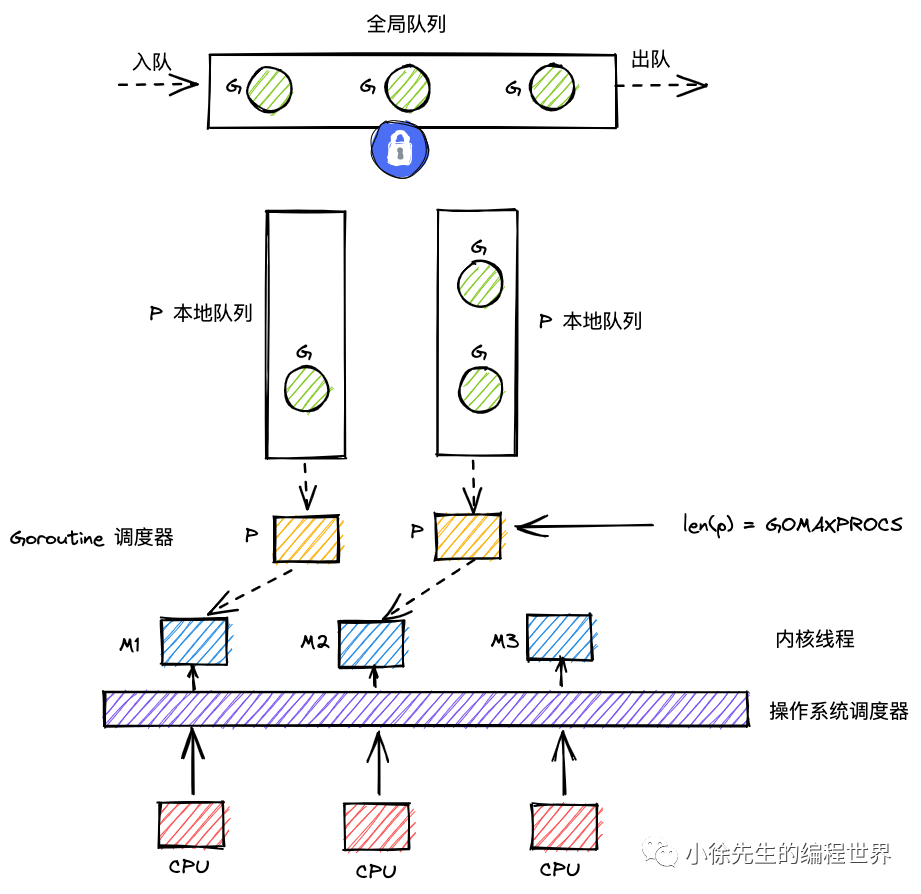
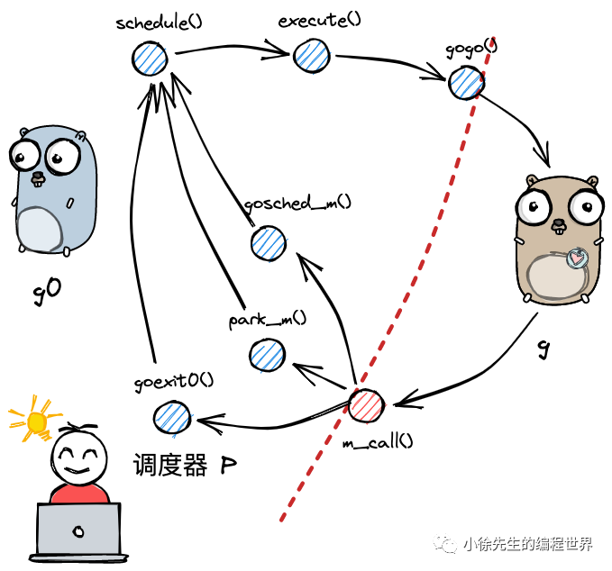
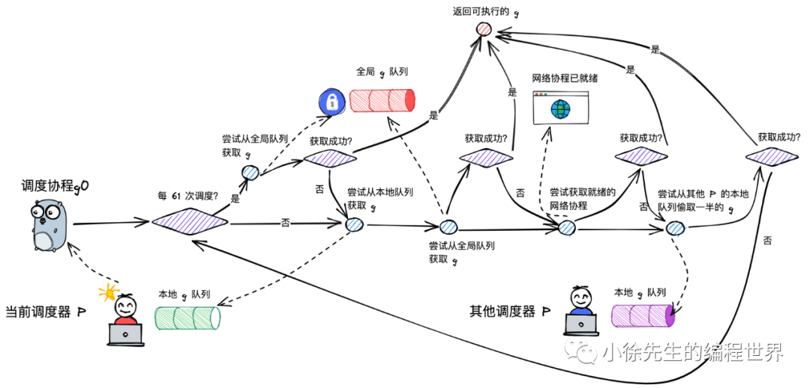
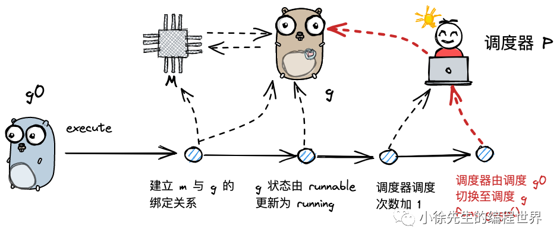

# gmp

Go 程序执行过

可执行文件（go 编译好的可执行文件）开始执行

\_rt0_amd64_windows // 不同平台执行入口不同

\_rt0_amd64_linux // 不同平台执行入口不同

...osinit... // 一系列的检测和初始化

schedinit 调度初始化，按照 GOMAXPROCS 这个环境变量决定创建多少个 p，allp 的数量

创建 main goroutine 之前 allp[0]->m0->g0

以 runtime.run 为程序入口，new main goroutine(newproc 函数调用)

创建 main goroutine 之后，main goroutine 会加入到当前 p 也就是 allp[0]的本地 runq 中

mstart(-->schedule()) 函数开启循环调度，是所有工作线程的入口，主要是调用 schedule 函数，执行调度循环

m0 开始执行关联 p 中的 main goroutine，goroutine 中执行 runtime.main

runtime.main 中会创建 sysmon，package init ...

call main.main

...

代码中使用 go 来创建协程，会被编译器转换为 newproc 函数调用，newproc 会给 goroutine 构造一个栈帧，目的让其协程运行完毕后可以返回 goexit()函数中，进行协程资源处理的工作

exit runtime.main 会调用 exit 函数结束进程

几个重要数据结构

runtime.g 协程结构

runtime.m 工作线程结构

runtime.p 调度结构 runq

runtime.schedt 调度器结构，调度相关信息结构 midle，pidle，runq

全局变量 g0 是主线程对应的 g，也就是上面的 main goroutine，并且**在主线程栈上分配**，空间大，g0 持有 m0 的指针

全局变量 m0 是主线程对应的 m，m0 持有 g0 的指针，并且最开始 m0 执行的协程就是 g0

没有全局变量 p0

全局变量 allgs 记录所有 g

全局变量 allm 记录所有 m

全局变量 allp 记录所有 p

全局变量 sched 记录所有空闲的 m，空闲的 p

最终 go 的调度模型只有 gm，导致各个 m 争抢 g，加了锁，性能很差

后面引入了 runtime.p 有个本地 runq [256]guintptr，这样只要把一个 p 关联到一个 m，m 就可以从 p 这里直接获取 g，p 有个本地 runq，但是还是存在一个全局 runq，保存在全局变量 sched 中

如果 p 的本地 runq 满了，就会放到全局 sched 的 runq 中，而 m 先从自己 p 的本地 runq 获取 g，都处理完了就从全局 runq 中获取 g 来执行，如果全局 runq 也没了那就从别的 p 的本地 runq 获取 g

allp[0] 也就是 allp 的第一个 p 于 m0 关联起来

time.Sleep 会调用 gopark 函数，把当前协程状态从\_Grunning 改为 \_Gwaiting，不会把当前协程 g 返回到本地 runq 中，而是在 timer 总等待，继而调用 schedule()进行调度，让其他 g 可以执行，等到 sleep 时间到了，timer 会把之前的 g 重新设置为 \_Grunnable，并且重新放回本地 runq 中

一个协程中，使用 go 关键字启动一个新的协程，会把这个新协程加入自己 p 的本地 runq 中，当时如果有新的空闲的 p，就会启动新的线程关联到这个空闲的 p，并且把这个新协程加入空闲 p 的本地 runq 中

## 新

## 线程

通常语义中的线程，指的是内核级线程，核心点如下：

1. 是操作系统最小调度单元
2. 创建、销毁、调度交由内核完成，cpu 需完成用户态与内核态间的切换
3. 可充分利用多核，实现并行

## 传统协程

协程是用户态，依赖内核线程，并且是 1:N 一对多的关系，一个协程阻塞会造成整个协程组阻塞

1. 与线程存在映射关系，为 M：1
2. 创建、销毁、调度在用户态完成，对内核透明，所以更轻
3. 从属同一个内核级线程，无法并行；一个协程阻塞会导致从属同一线程的所有协程无法执行

## goroutine

go 对协程做了优化成为了 goroutine，协程和线程加了一层调度，可以 N:M 多对多，可以并发执行

1. 与线程存在映射关系，为 M：N
2. 创建、销毁、调度在用户态完成，对内核透明，足够轻便
3. 可利用多个线程，实现并行
4. 通过调度器的斡旋，实现和线程间的动态绑定和灵活调度
5. 栈空间大小可动态扩缩，因地制宜

## 对比

三个模型的各项能力对比如下:

| **模型**  | **弱依赖内核** | **可并行** | **可应对阻塞** | **栈可动态扩缩** |
| :-------: | :------------: | :--------: | :------------: | :--------------: |
|   线程    |       ❎       |     ✅     |       ✅       |        ❎        |
|   协程    |       ✅       |     ❎     |       ❎       |        ❎        |
| goroutine |       ✅       |     ✅     |       ✅       |        ✅        |

## GMP

1. M 是线程的抽象；G 是 goroutine；P 是承上启下的调度器
2. M 调度 G 前，需要和 P 绑定
3. 全局有多个 M 和多个 P，但同时并行的 G 的最大数量等于 P 的数量
4. G 的存放队列有三类：P 的本地队列；全局队列；和 wait 队列（图中未展示，为 io 阻塞就绪态 goroutine 队列）
5. M 调度 G 时，优先取 P 本地队列，其次取全局队列，最后取 wait 队列；这样的好处是，取本地队列时，可以接近于无锁化，减少全局锁竞争
6. 为防止不同 P 的闲忙差异过大，设立 work-stealing 机制，本地队列为空的 P 可以尝试从其他 P 本地队列偷取一半的 G 补充到自身队列



### g

1. g 即 goroutine，是 golang 中对协程的抽象
2. g 有自己的运行栈、状态、以及执行的任务函数（用户通过 go func 指定）
3. g 需要绑定到 p 才能执行，在 g 的视角中，p 就是它的 cpu

包含`m的指针`

```go
type g struct {
	// Stack parameters.
	// stack describes the actual stack memory: [stack.lo, stack.hi).
	// stackguard0 is the stack pointer compared in the Go stack growth prologue.
	// It is stack.lo+StackGuard normally, but can be StackPreempt to trigger a preemption.
	// stackguard1 is the stack pointer compared in the C stack growth prologue.
	// It is stack.lo+StackGuard on g0 and gsignal stacks.
	// It is ~0 on other goroutine stacks, to trigger a call to morestackc (and crash).
	stack       stack   // offset known to runtime/cgo
	stackguard0 uintptr // offset known to liblink
	stackguard1 uintptr // offset known to liblink

	_panic    *_panic // innermost panic - offset known to liblink
	_defer    *_defer // innermost defer
	m         *m      // current m; offset known to arm liblink
	sched     gobuf
	syscallsp uintptr // if status==Gsyscall, syscallsp = sched.sp to use during gc
	syscallpc uintptr // if status==Gsyscall, syscallpc = sched.pc to use during gc
	stktopsp  uintptr // expected sp at top of stack, to check in traceback
	// param is a generic pointer parameter field used to pass
	// values in particular contexts where other storage for the
	// parameter would be difficult to find. It is currently used
	// in three ways:
	// 1. When a channel operation wakes up a blocked goroutine, it sets param to
	//    point to the sudog of the completed blocking operation.
	// 2. By gcAssistAlloc1 to signal back to its caller that the goroutine completed
	//    the GC cycle. It is unsafe to do so in any other way, because the goroutine's
	//    stack may have moved in the meantime.
	// 3. By debugCallWrap to pass parameters to a new goroutine because allocating a
	//    closure in the runtime is forbidden.
	param        unsafe.Pointer
	atomicstatus uint32
	stackLock    uint32 // sigprof/scang lock; TODO: fold in to atomicstatus
	goid         int64
	schedlink    guintptr
	waitsince    int64      // approx time when the g become blocked
	waitreason   waitReason // if status==Gwaiting

	preempt       bool // preemption signal, duplicates stackguard0 = stackpreempt
	preemptStop   bool // transition to _Gpreempted on preemption; otherwise, just deschedule
	preemptShrink bool // shrink stack at synchronous safe point

	// asyncSafePoint is set if g is stopped at an asynchronous
	// safe point. This means there are frames on the stack
	// without precise pointer information.
	asyncSafePoint bool

	paniconfault bool // panic (instead of crash) on unexpected fault address
	gcscandone   bool // g has scanned stack; protected by _Gscan bit in status
	throwsplit   bool // must not split stack
	// activeStackChans indicates that there are unlocked channels
	// pointing into this goroutine's stack. If true, stack
	// copying needs to acquire channel locks to protect these
	// areas of the stack.
	activeStackChans bool
	// parkingOnChan indicates that the goroutine is about to
	// park on a chansend or chanrecv. Used to signal an unsafe point
	// for stack shrinking. It's a boolean value, but is updated atomically.
	parkingOnChan uint8

	raceignore     int8     // ignore race detection events
	sysblocktraced bool     // StartTrace has emitted EvGoInSyscall about this goroutine
	tracking       bool     // whether we're tracking this G for sched latency statistics
	trackingSeq    uint8    // used to decide whether to track this G
	runnableStamp  int64    // timestamp of when the G last became runnable, only used when tracking
	runnableTime   int64    // the amount of time spent runnable, cleared when running, only used when tracking
	sysexitticks   int64    // cputicks when syscall has returned (for tracing)
	traceseq       uint64   // trace event sequencer
	tracelastp     puintptr // last P emitted an event for this goroutine
	lockedm        muintptr
	sig            uint32
	writebuf       []byte
	sigcode0       uintptr
	sigcode1       uintptr
	sigpc          uintptr
	gopc           uintptr         // pc of go statement that created this goroutine
	ancestors      *[]ancestorInfo // ancestor information goroutine(s) that created this goroutine (only used if debug.tracebackancestors)
	startpc        uintptr         // pc of goroutine function
	racectx        uintptr
	waiting        *sudog         // sudog structures this g is waiting on (that have a valid elem ptr); in lock order
	cgoCtxt        []uintptr      // cgo traceback context
	labels         unsafe.Pointer // profiler labels
	timer          *timer         // cached timer for time.Sleep
	selectDone     uint32         // are we participating in a select and did someone win the race?

	// Per-G GC state

	// gcAssistBytes is this G's GC assist credit in terms of
	// bytes allocated. If this is positive, then the G has credit
	// to allocate gcAssistBytes bytes without assisting. If this
	// is negative, then the G must correct this by performing
	// scan work. We track this in bytes to make it fast to update
	// and check for debt in the malloc hot path. The assist ratio
	// determines how this corresponds to scan work debt.
	gcAssistBytes int64
}
```

1. m：在 p 的代理，负责执行当前 g 的 m
2. sched.sp：保存 CPU 的 rsp 寄存器的值，指向函数调用栈栈顶，参考[go plan9 汇编](./asm/plan9.md)
3. sched.pc：保存 CPU 的 rip 寄存器的值，指向程序下一条执行指令的地址
4. sched.ret：保存系统调用的返回值
5. sched.bp：保存 CPU 的 rbp 寄存器的值，存储函数栈帧的起始位置

#### g 的状态

```go
const (
	// G status
	//
	// Beyond indicating the general state of a G, the G status
	// acts like a lock on the goroutine's stack (and hence its
	// ability to execute user code).
	//
	// If you add to this list, add to the list
	// of "okay during garbage collection" status
	// in mgcmark.go too.
	//
	// TODO(austin): The _Gscan bit could be much lighter-weight.
	// For example, we could choose not to run _Gscanrunnable
	// goroutines found in the run queue, rather than CAS-looping
	// until they become _Grunnable. And transitions like
	// _Gscanwaiting -> _Gscanrunnable are actually okay because
	// they don't affect stack ownership.

	// _Gidle means this goroutine was just allocated and has not
	// yet been initialized.
	_Gidle = iota // 0

	// _Grunnable means this goroutine is on a run queue. It is
	// not currently executing user code. The stack is not owned.
	_Grunnable // 1

	// _Grunning means this goroutine may execute user code. The
	// stack is owned by this goroutine. It is not on a run queue.
	// It is assigned an M and a P (g.m and g.m.p are valid).
	_Grunning // 2

	// _Gsyscall means this goroutine is executing a system call.
	// It is not executing user code. The stack is owned by this
	// goroutine. It is not on a run queue. It is assigned an M.
	_Gsyscall // 3

	// _Gwaiting means this goroutine is blocked in the runtime.
	// It is not executing user code. It is not on a run queue,
	// but should be recorded somewhere (e.g., a channel wait
	// queue) so it can be ready()d when necessary. The stack is
	// not owned *except* that a channel operation may read or
	// write parts of the stack under the appropriate channel
	// lock. Otherwise, it is not safe to access the stack after a
	// goroutine enters _Gwaiting (e.g., it may get moved).
	_Gwaiting // 4

	// _Gmoribund_unused is currently unused, but hardcoded in gdb
	// scripts.
	_Gmoribund_unused // 5

	// _Gdead means this goroutine is currently unused. It may be
	// just exited, on a free list, or just being initialized. It
	// is not executing user code. It may or may not have a stack
	// allocated. The G and its stack (if any) are owned by the M
	// that is exiting the G or that obtained the G from the free
	// list.
	_Gdead // 6

	// _Genqueue_unused is currently unused.
	_Genqueue_unused // 7

	// _Gcopystack means this goroutine's stack is being moved. It
	// is not executing user code and is not on a run queue. The
	// stack is owned by the goroutine that put it in _Gcopystack.
	_Gcopystack // 8

	// _Gpreempted means this goroutine stopped itself for a
	// suspendG preemption. It is like _Gwaiting, but nothing is
	// yet responsible for ready()ing it. Some suspendG must CAS
	// the status to _Gwaiting to take responsibility for
	// ready()ing this G.
	_Gpreempted // 9

	_Gscan          = 0x1000
	_Gscanrunnable  = _Gscan + _Grunnable  // 0x1001
	_Gscanrunning   = _Gscan + _Grunning   // 0x1002
	_Gscansyscall   = _Gscan + _Gsyscall   // 0x1003
	_Gscanwaiting   = _Gscan + _Gwaiting   // 0x1004
	_Gscanpreempted = _Gscan + _Gpreempted // 0x1009
)
```

1. \_Gidle 值为 0，为协程开始创建时的状态，此时尚未初始化完成
2. \_Grunnable 值 为 1，协程在待执行队列中，等待被执行
3. \_Grunning 值为 2，协程正在执行，同一时刻一个 p 中只有一个 g 处于此状态
4. \_Gsyscall 值为 3，协程正在执行系统调用
5. \_Gwaiting 值为 4，协程处于挂起态，需要等待被唤醒. gc、channel 通信或者锁操作时经常会进入这种状态
6. \_Gdead 值为 6，协程刚`初始化完成`或者`已经被销毁`，会处于此状态
7. \_Gcopystack 值为 8，协程正在栈扩容流程中
8. \_Greempted 值为 9，协程被抢占后的状态

### m

1. m 即 machine，是 golang 中对线程的抽象
2. m 不直接执行 g，而是先和 p 绑定，由其实现代理
3. 借由 p 的存在，m 无需和 g 绑死，也无需记录 g 的状态信息，因此 g 在全生命周期中可以实现跨 m 执行

包含`g0的指针`，g0 不是用户协程，而是负责 g 之间的切换调度

```go
type m struct {
	g0      *g     // goroutine with scheduling stack
	morebuf gobuf  // gobuf arg to morestack
	divmod  uint32 // div/mod denominator for arm - known to liblink
	_       uint32 // align next field to 8 bytes

	// Fields not known to debuggers.
	procid        uint64            // for debuggers, but offset not hard-coded
	gsignal       *g                // signal-handling g
	goSigStack    gsignalStack      // Go-allocated signal handling stack
	sigmask       sigset            // storage for saved signal mask
	tls           [tlsSlots]uintptr // thread-local storage (for x86 extern register)
	mstartfn      func()
	curg          *g       // current running goroutine
	caughtsig     guintptr // goroutine running during fatal signal
	p             puintptr // attached p for executing go code (nil if not executing go code)
	nextp         puintptr
	oldp          puintptr // the p that was attached before executing a syscall
	id            int64
	mallocing     int32
	throwing      int32
	preemptoff    string // if != "", keep curg running on this m
	locks         int32
	dying         int32
	profilehz     int32
	spinning      bool // m is out of work and is actively looking for work
	blocked       bool // m is blocked on a note
	newSigstack   bool // minit on C thread called sigaltstack
	printlock     int8
	incgo         bool   // m is executing a cgo call
	freeWait      uint32 // if == 0, safe to free g0 and delete m (atomic)
	fastrand      uint64
	needextram    bool
	traceback     uint8
	ncgocall      uint64      // number of cgo calls in total
	ncgo          int32       // number of cgo calls currently in progress
	cgoCallersUse uint32      // if non-zero, cgoCallers in use temporarily
	cgoCallers    *cgoCallers // cgo traceback if crashing in cgo call
	park          note
	alllink       *m // on allm
	schedlink     muintptr
	lockedg       guintptr
	createstack   [32]uintptr // stack that created this thread.
	lockedExt     uint32      // tracking for external LockOSThread
	lockedInt     uint32      // tracking for internal lockOSThread
	nextwaitm     muintptr    // next m waiting for lock
	waitunlockf   func(*g, unsafe.Pointer) bool
	waitlock      unsafe.Pointer
	waittraceev   byte
	waittraceskip int
	startingtrace bool
	syscalltick   uint32
	freelink      *m // on sched.freem

	// these are here because they are too large to be on the stack
	// of low-level NOSPLIT functions.
	libcall   libcall
	libcallpc uintptr // for cpu profiler
	libcallsp uintptr
	libcallg  guintptr
	syscall   libcall // stores syscall parameters on windows

	vdsoSP uintptr // SP for traceback while in VDSO call (0 if not in call)
	vdsoPC uintptr // PC for traceback while in VDSO call

	// preemptGen counts the number of completed preemption
	// signals. This is used to detect when a preemption is
	// requested, but fails. Accessed atomically.
	preemptGen uint32

	// Whether this is a pending preemption signal on this M.
	// Accessed atomically.
	signalPending uint32

	dlogPerM

	mOS

	// Up to 10 locks held by this m, maintained by the lock ranking code.
	locksHeldLen int
	locksHeld    [10]heldLockInfo
}
```

1. g0：一类特殊的调度协程，不用于执行用户函数，负责执行 g 之间的切换调度. 与 m 的关系为 1:1
2. tls：thread-local storage，线程本地存储，存储内容只对当前线程可见. 线程本地存储的是 m.tls 的地址，m.tls[0] 存储的是当前运行的 g，因此线程可以通过 g 找到当前的 m、p、g0 等信息

### p

1. p 即 processor，是 golang 中的调度器
2. p 是 gmp 的中枢，借由 p 承上启下，实现 g 和 m 之间的动态有机结合
3. 对 g 而言，p 是其 cpu，g 只有被 p 调度，才得以执行
4. 对 m 而言，p 是其执行代理，为其提供必要信息的同时（可执行的 g、内存分配情况等），并隐藏了繁杂的调度细节
5. p 的数量决定了 g 最大并行数量，可由用户通过 GOMAXPROCS 进行设定（超过 CPU 核数时无意义）

包含 runq 本队 g 的队列，头标识，尾标识，下一个执行的 p

```go
type p struct {
	id          int32
	status      uint32 // one of pidle/prunning/...
	link        puintptr
	schedtick   uint32     // incremented on every scheduler call
	syscalltick uint32     // incremented on every system call
	sysmontick  sysmontick // last tick observed by sysmon
	m           muintptr   // back-link to associated m (nil if idle)
	mcache      *mcache
	pcache      pageCache
	raceprocctx uintptr

	deferpool    []*_defer // pool of available defer structs (see panic.go)
	deferpoolbuf [32]*_defer

	// Cache of goroutine ids, amortizes accesses to runtime·sched.goidgen.
	goidcache    uint64
	goidcacheend uint64

	// Queue of runnable goroutines. Accessed without lock.
	runqhead uint32
	runqtail uint32
	runq     [256]guintptr
	// runnext, if non-nil, is a runnable G that was ready'd by
	// the current G and should be run next instead of what's in
	// runq if there's time remaining in the running G's time
	// slice. It will inherit the time left in the current time
	// slice. If a set of goroutines is locked in a
	// communicate-and-wait pattern, this schedules that set as a
	// unit and eliminates the (potentially large) scheduling
	// latency that otherwise arises from adding the ready'd
	// goroutines to the end of the run queue.
	//
	// Note that while other P's may atomically CAS this to zero,
	// only the owner P can CAS it to a valid G.
	runnext guintptr

	// Available G's (status == Gdead)
	gFree struct {
		gList
		n int32
	}

	sudogcache []*sudog
	sudogbuf   [128]*sudog

	// Cache of mspan objects from the heap.
	mspancache struct {
		// We need an explicit length here because this field is used
		// in allocation codepaths where write barriers are not allowed,
		// and eliminating the write barrier/keeping it eliminated from
		// slice updates is tricky, moreso than just managing the length
		// ourselves.
		len int
		buf [128]*mspan
	}

	tracebuf traceBufPtr

	// traceSweep indicates the sweep events should be traced.
	// This is used to defer the sweep start event until a span
	// has actually been swept.
	traceSweep bool
	// traceSwept and traceReclaimed track the number of bytes
	// swept and reclaimed by sweeping in the current sweep loop.
	traceSwept, traceReclaimed uintptr

	palloc persistentAlloc // per-P to avoid mutex

	_ uint32 // Alignment for atomic fields below

	// The when field of the first entry on the timer heap.
	// This is updated using atomic functions.
	// This is 0 if the timer heap is empty.
	timer0When uint64

	// The earliest known nextwhen field of a timer with
	// timerModifiedEarlier status. Because the timer may have been
	// modified again, there need not be any timer with this value.
	// This is updated using atomic functions.
	// This is 0 if there are no timerModifiedEarlier timers.
	timerModifiedEarliest uint64

	// Per-P GC state
	gcAssistTime         int64 // Nanoseconds in assistAlloc
	gcFractionalMarkTime int64 // Nanoseconds in fractional mark worker (atomic)

	// gcMarkWorkerMode is the mode for the next mark worker to run in.
	// That is, this is used to communicate with the worker goroutine
	// selected for immediate execution by
	// gcController.findRunnableGCWorker. When scheduling other goroutines,
	// this field must be set to gcMarkWorkerNotWorker.
	gcMarkWorkerMode gcMarkWorkerMode
	// gcMarkWorkerStartTime is the nanotime() at which the most recent
	// mark worker started.
	gcMarkWorkerStartTime int64

	// gcw is this P's GC work buffer cache. The work buffer is
	// filled by write barriers, drained by mutator assists, and
	// disposed on certain GC state transitions.
	gcw gcWork

	// wbBuf is this P's GC write barrier buffer.
	//
	// TODO: Consider caching this in the running G.
	wbBuf wbBuf

	runSafePointFn uint32 // if 1, run sched.safePointFn at next safe point

	// statsSeq is a counter indicating whether this P is currently
	// writing any stats. Its value is even when not, odd when it is.
	statsSeq uint32

	// Lock for timers. We normally access the timers while running
	// on this P, but the scheduler can also do it from a different P.
	timersLock mutex

	// Actions to take at some time. This is used to implement the
	// standard library's time package.
	// Must hold timersLock to access.
	timers []*timer

	// Number of timers in P's heap.
	// Modified using atomic instructions.
	numTimers uint32

	// Number of timerDeleted timers in P's heap.
	// Modified using atomic instructions.
	deletedTimers uint32

	// Race context used while executing timer functions.
	timerRaceCtx uintptr

	// scannableStackSizeDelta accumulates the amount of stack space held by
	// live goroutines (i.e. those eligible for stack scanning).
	// Flushed to gcController.scannableStackSize once scannableStackSizeSlack
	// or -scannableStackSizeSlack is reached.
	scannableStackSizeDelta int64

	// preempt is set to indicate that this P should be enter the
	// scheduler ASAP (regardless of what G is running on it).
	preempt bool

	// Padding is no longer needed. False sharing is now not a worry because p is large enough
	// that its size class is an integer multiple of the cache line size (for any of our architectures).
}

```

1. runq：本地 goroutine 队列，最大长度为 256
2. runqhead：队列头部
3. runqtail：队列尾部
4. runnext：下一个可执行的 goroutine

### 全局队列

sched 是全局 goroutine 队列的封装，因为 p 可以获取这里面的 g，所以包含了锁

```go
type schedt struct {
	// accessed atomically. keep at top to ensure alignment on 32-bit systems.
	goidgen   uint64
	lastpoll  uint64 // time of last network poll, 0 if currently polling
	pollUntil uint64 // time to which current poll is sleeping

	lock mutex

	// When increasing nmidle, nmidlelocked, nmsys, or nmfreed, be
	// sure to call checkdead().

	midle        muintptr // idle m's waiting for work
	nmidle       int32    // number of idle m's waiting for work
	nmidlelocked int32    // number of locked m's waiting for work
	mnext        int64    // number of m's that have been created and next M ID
	maxmcount    int32    // maximum number of m's allowed (or die)
	nmsys        int32    // number of system m's not counted for deadlock
	nmfreed      int64    // cumulative number of freed m's

	ngsys uint32 // number of system goroutines; updated atomically

	pidle      puintptr // idle p's
	npidle     uint32
	nmspinning uint32 // See "Worker thread parking/unparking" comment in proc.go.

	// Global runnable queue.
	runq     gQueue
	runqsize int32

	// disable controls selective disabling of the scheduler.
	//
	// Use schedEnableUser to control this.
	//
	// disable is protected by sched.lock.
	disable struct {
		// user disables scheduling of user goroutines.
		user     bool
		runnable gQueue // pending runnable Gs
		n        int32  // length of runnable
	}

	// Global cache of dead G's.
	gFree struct {
		lock    mutex
		stack   gList // Gs with stacks
		noStack gList // Gs without stacks
		n       int32
	}

	// Central cache of sudog structs.
	sudoglock  mutex
	sudogcache *sudog

	// Central pool of available defer structs.
	deferlock mutex
	deferpool *_defer

	// freem is the list of m's waiting to be freed when their
	// m.exited is set. Linked through m.freelink.
	freem *m

	gcwaiting  uint32 // gc is waiting to run
	stopwait   int32
	stopnote   note
	sysmonwait uint32
	sysmonnote note

	// safepointFn should be called on each P at the next GC
	// safepoint if p.runSafePointFn is set.
	safePointFn   func(*p)
	safePointWait int32
	safePointNote note

	profilehz int32 // cpu profiling rate

	procresizetime int64 // nanotime() of last change to gomaxprocs
	totaltime      int64 // ∫gomaxprocs dt up to procresizetime

	// sysmonlock protects sysmon's actions on the runtime.
	//
	// Acquire and hold this mutex to block sysmon from interacting
	// with the rest of the runtime.
	sysmonlock mutex

	// timeToRun is a distribution of scheduling latencies, defined
	// as the sum of time a G spends in the _Grunnable state before
	// it transitions to _Grunning.
	//
	// timeToRun is protected by sched.lock.
	timeToRun timeHistogram
}
```

1. lock：一把操作全局队列时使用的锁
2. runq：全局 goroutine 队列
3. runqsize：全局 goroutine 队列的容量

## 调度

有两种 g，一种 g0，一种普通 g，m 通过 p 调度执行的 goroutine 永远在普通 g 和 g0 之间进行切换

g0 通过`func gogo(buf *gobuf)`调度 g，g 需要主动让渡或被动调度时，再通过`func mcall(fn func(*g))`交还执行权

### 调度类型


g 包含 m，m 包含 g0，p 和 m 绑定或者解绑，p 包含本地 g 的队列

#### 主动调度

用户执行 runtime 下`func Gosched()`当前的 g 会主动让出 p 的执行权，从 running 状态转换成 runnable 状态，并且放到全局队列中，而且这个 g 对应的 m 的 g0 会重新寻找其他可执行的 g

#### 被动调度

典型场景，获取锁失败被阻塞；写一个满的 chan，或者读一空 chan 都会陷入阻塞；主要依赖 `func gopark()`，g 的状态变为 waiting 状态

与之对于的`func goready()`，可以唤醒 g，从 waiting 状态变成 runnable 状态，典型场景是 g1 读唤醒写的 g2（这个 g2 写一个满 chan 情况下），g3 写唤醒 g4（这个 g4 度一空 chan 情况下），唤醒的目标 g 优先被当前 g 所在的 p 放入本地队列中，参考[channel 源码解读](./../source-code/go-standard-lib/channel/chan.md)

#### 正常调度

比较简单，g 中的执行任务已完成，g0 会将当前 g 置为死亡状态，发起新一轮调度

#### 抢占调度

前三种都是用户态，并且由 m 下的 g0 完成，唯独抢占调度不同。

典型场景，比如`g陷入系统调用时间过长`，且全局的 p 资源比较紧缺，又由于`g和m是绑定的不能变`要继续执行，此时将 `p 和 g，m解绑`，抢占出来用于其他 g 的调度，等 g 完成系统调用后，会重新进入可执行队列中等待被调度。

因为发起系统调用时需要打破用户态的边界进入内核态，此时 m 也会因系统调用而陷入僵直，无法主动完成抢占调度的行为，所以需要一个全局角色，也就是全局监控者 g，这个全局监控者 g 会越过 p 直接与一个 m 进行绑定，不断轮询对所有 p 的执行状况进行监控. 倘若发现满足抢占调度的条件，则会从第三方的角度出手干预，主动发起该动作。

### 调度流程



1. 以 g0 -> g -> g0 的一轮循环为例进行串联
2. g0 执行 `schedule()` 函数，寻找到用于执行的 g
3. g0 执行 `execute()` 方法，更新当前 g、p 的状态信息，并调用 `gogo()` 方法，将执行权交给 g
4. g 因主动让渡( `gosche_m()` )、被动调度( `park_m()` )、正常结束( `goexit0()` )等原因，调用 `m_call()` 函数，执行权重新回到 g0 手中
5. g0 执行 `schedule()` 函数，开启新一轮循环

#### schedule

调度流程的主干方法是位于 runtime/proc.go 中的 schedule 函数，此时的执行权位于 g0 手中

```go
// One round of scheduler: find a runnable goroutine and execute it.
// Never returns.
func schedule() {
	_g_ := getg()

	if _g_.m.locks != 0 {
		throw("schedule: holding locks")
	}

	if _g_.m.lockedg != 0 {
		stoplockedm()
		execute(_g_.m.lockedg.ptr(), false) // Never returns.
	}

	// We should not schedule away from a g that is executing a cgo call,
	// since the cgo call is using the m's g0 stack.
	if _g_.m.incgo {
		throw("schedule: in cgo")
	}

top:
	pp := _g_.m.p.ptr()
	pp.preempt = false

	if sched.gcwaiting != 0 {
		gcstopm()
		goto top
	}
	if pp.runSafePointFn != 0 {
		runSafePointFn()
	}

	// Sanity check: if we are spinning, the run queue should be empty.
	// Check this before calling checkTimers, as that might call
	// goready to put a ready goroutine on the local run queue.
	if _g_.m.spinning && (pp.runnext != 0 || pp.runqhead != pp.runqtail) {
		throw("schedule: spinning with local work")
	}

	checkTimers(pp, 0)

	var gp *g
	var inheritTime bool

	// Normal goroutines will check for need to wakeP in ready,
	// but GCworkers and tracereaders will not, so the check must
	// be done here instead.
	tryWakeP := false
	if trace.enabled || trace.shutdown {
		gp = traceReader()
		if gp != nil {
			casgstatus(gp, _Gwaiting, _Grunnable)
			traceGoUnpark(gp, 0)
			tryWakeP = true
		}
	}
	if gp == nil && gcBlackenEnabled != 0 {
		gp = gcController.findRunnableGCWorker(_g_.m.p.ptr())
		if gp != nil {
			tryWakeP = true
		}
	}
	if gp == nil {
		// Check the global runnable queue once in a while to ensure fairness.
		// Otherwise two goroutines can completely occupy the local runqueue
		// by constantly respawning each other.
		if _g_.m.p.ptr().schedtick%61 == 0 && sched.runqsize > 0 {
			lock(&sched.lock)
			gp = globrunqget(_g_.m.p.ptr(), 1)
			unlock(&sched.lock)
		}
	}
	if gp == nil {
		gp, inheritTime = runqget(_g_.m.p.ptr())
		// We can see gp != nil here even if the M is spinning,
		// if checkTimers added a local goroutine via goready.
	}
	if gp == nil {
		gp, inheritTime = findrunnable() // blocks until work is available
	}

	// This thread is going to run a goroutine and is not spinning anymore,
	// so if it was marked as spinning we need to reset it now and potentially
	// start a new spinning M.
	if _g_.m.spinning {
		resetspinning()
	}

	if sched.disable.user && !schedEnabled(gp) {
		// Scheduling of this goroutine is disabled. Put it on
		// the list of pending runnable goroutines for when we
		// re-enable user scheduling and look again.
		lock(&sched.lock)
		if schedEnabled(gp) {
			// Something re-enabled scheduling while we
			// were acquiring the lock.
			unlock(&sched.lock)
		} else {
			sched.disable.runnable.pushBack(gp)
			sched.disable.n++
			unlock(&sched.lock)
			goto top
		}
	}

	// If about to schedule a not-normal goroutine (a GCworker or tracereader),
	// wake a P if there is one.
	if tryWakeP {
		wakep()
	}
	if gp.lockedm != 0 {
		// Hands off own p to the locked m,
		// then blocks waiting for a new p.
		startlockedm(gp)
		goto top
	}

	execute(gp, inheritTime)
}
```

1. 寻找到下一个执行的 goroutine，使用 findRunnable
2. 执行该 goroutine，使用 execute

##### findRunnable

调度流程中，一个非常核心的步骤，就是为 m 寻找到下一个执行的 g，这部分内容位于 runtime/proc.go 的 findRunnable 方法中



todo 源码解读

```go

```

##### execute

当 g0 为 m 寻找到可执行的 g 之后，接下来就开始执行 g. 这部分内容位于 runtime/proc.go 的 execute 方法中



todo 源码解读

```go
// Schedules gp to run on the current M.
// If inheritTime is true, gp inherits the remaining time in the
// current time slice. Otherwise, it starts a new time slice.
// Never returns.
//
// Write barriers are allowed because this is called immediately after
// acquiring a P in several places.
//
//go:yeswritebarrierrec
func execute(gp *g, inheritTime bool) {
	_g_ := getg()

	// Assign gp.m before entering _Grunning so running Gs have an
	// M.
	_g_.m.curg = gp
	gp.m = _g_.m
	casgstatus(gp, _Grunnable, _Grunning)
	gp.waitsince = 0
	gp.preempt = false
	gp.stackguard0 = gp.stack.lo + _StackGuard
	if !inheritTime {
		_g_.m.p.ptr().schedtick++
	}

	// Check whether the profiler needs to be turned on or off.
	hz := sched.profilehz
	if _g_.m.profilehz != hz {
		setThreadCPUProfiler(hz)
	}

	if trace.enabled {
		// GoSysExit has to happen when we have a P, but before GoStart.
		// So we emit it here.
		if gp.syscallsp != 0 && gp.sysblocktraced {
			traceGoSysExit(gp.sysexitticks)
		}
		traceGoStart()
	}

	gogo(&gp.sched)
}
```

切换 g 的状态从 runnable 到 running，最终执行`gogo()`

##### gosched_m

Gosched()方法内部调用 mcall(gosched_m)

todo 源码解读

```go

```

##### park_m

gopark()方法内部调用 mcall(park_m)

todo 源码解读

```go

```

##### goready

goready()

todo 源码解读

```go

```

##### goexit0

goexit1()内部调用 mcall(goexit0)

todo 源码解读

```go

```

##### retake

todo 源码解读

```go

```

##### reentersyscall

todo 源码解读

```go

```

##### exitsyscall

todo 源码解读

```go

```

## reference

https://mp.weixin.qq.com/s/jIWe3nMP6yiuXeBQgmePDg
