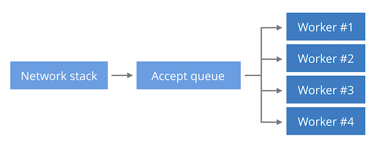
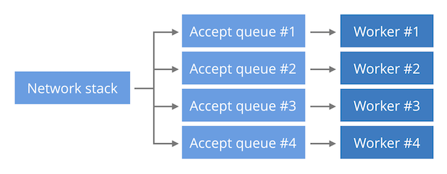

# 三种提升 tcp 服务能力方式

three ways of designing a TCP server with regard to performance

### Single listen socket, single worker process

This is the simplest model, where processing is limited to a single CPU. A single worker process is doing both accept() calls to receive the new connections and processing of the requests themselves. This model is the preferred `Lighttpd` setup.

### Single listen socket, multiple worker process

The new connections sit in a single kernel data structure (the listen socket). Multiple worker processes are doing both the accept() calls and processing of the requests. This model enables some spreading of the inbound connections across multiple CPUs. This is the standard model for `NGINX`.

新的连接到单个唯一 socket 中，各个 worker 去 accept

### Separate listen socket for each worker process

By using [the SO_REUSEPORT socket option](https://lwn.net/Articles/542629/) it's possible to create a dedicated kernel data structure (the listen socket) for each worker process. This can avoid listen socket contention, which isn't really an issue unless you run at Google scale. It can also help in better balancing the load. More on that later.

使用 reuseport 为每个 worker 进程创建一个 socket

### Spreading the accept() load

#### first model

blocking-accep

https://github.com/cloudflare/cloudflare-blog/blob/master/2017-10-accept-balancing/blocking-accept.py

The idea is to share an accept queue across processes, by calling blocking accept() from multiple workers concurrently.

负载比较均衡，轮询算法，性能有瓶颈

##### 问题：

由于各个 worker 都会 accept，当有事件来时，会有惊群问题，使用`EPOLLEXCLUSIVE(4.5内核引入)` flag 可以解决。

epoll 引起的 accept 惊群，在 4.5 内核中再次引入`EPOLLEXCLUSIVE`来解决，且需要应用层的配合，Ngnix 在 1.11.3 之后添加了`NGX_EXCLUSIVE_EVENT`来支持。

EPOLLEXCLUSIVE 可以在单个 Listen Queue 对多个 Worker Process 的时候均衡压力，不会惊群。

原理：连接从一个队列里由内核分发，不需要惊群，对 worker 是否忙也能感知（忙的 worker 就不分发连接过去）。

#### second model

epoll-and-accept

The intention is to have a dedicated epoll in each worker process. The worker will call non-blocking accept() only when epoll reports new connections. We can avoid [the usual thundering-herd issue](https://idea.popcount.org/2017-02-20-epoll-is-fundamentally-broken-12/) by using the `EPOLLEXCLUSIVE` flag.

https://github.com/cloudflare/cloudflare-blog/blob/master/2017-10-accept-balancing/epoll-and-accept.py

##### 问题:

epoll 的 accept 模型为 LIFO，倾向于唤醒最活跃的进程，导致负载不均衡，有性能问题

Linux supports a feature to work around this balancing problem - the SO_REUSEPORT socket option.

需要使用`SO_REUSEPORT`来 rescue，也就是第三种模型(本身就分开了，内核 hash 分配一个 worker，也就不存在惊群问题)

总结：负载有问题，但是延迟控制的不错

#### third model

第二种 model 基础上使用`SO_REUSEPORT`

原理：

> The new socket option allows multiple sockets on the same host to bind to the same port, and is intended to improve the performance of multithreaded network server applications running on top of multicore systems.

总结：延迟平均值控制和第二种一样，但是方差很大，长尾延迟大

开启了 SO_REUSEPORT 后，内核没法感知你的 worker 是不是特别忙，只是按 Hash 逻辑派发 accept 连接。也就是 SO_REUSEPORT 会导致 rt 偏差更大（抖动明显一些）。[这跟 MySQL Thread Pool 导致的卡顿原理类似，多个 Pool 类似这里的 SO_REUSEPORT](https://plantegg.github.io/2020/06/05/MySQL线程池导致的延时卡顿排查/)。

3.10 的内核中通过引入 SO_REUSEPORT 解决了这个 epoll accept 惊群的问题，nginx 1.9.1 使用这个特性。

在 4.5 内核中再次引入 EPOLLEXCLUSIVE 来解决，且需要应用层的配合，Ngnix 在 1.11.3 之后添加了 NGX_EXCLUSIVE_EVENT 来支持。

## reference

https://blog.cloudflare.com/the-sad-state-of-linux-socket-balancing/

https://plantegg.github.io/2019/10/31/epoll%E5%92%8C%E6%83%8A%E7%BE%A4/
