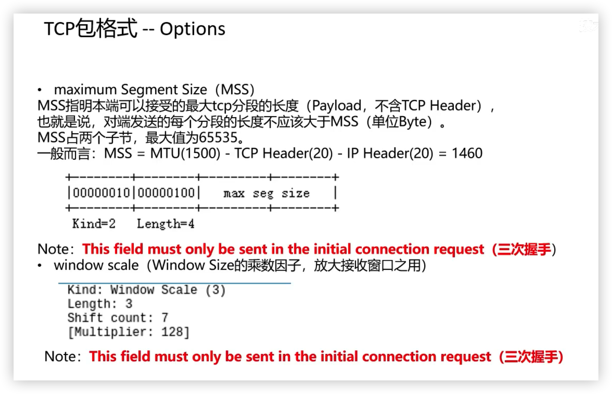
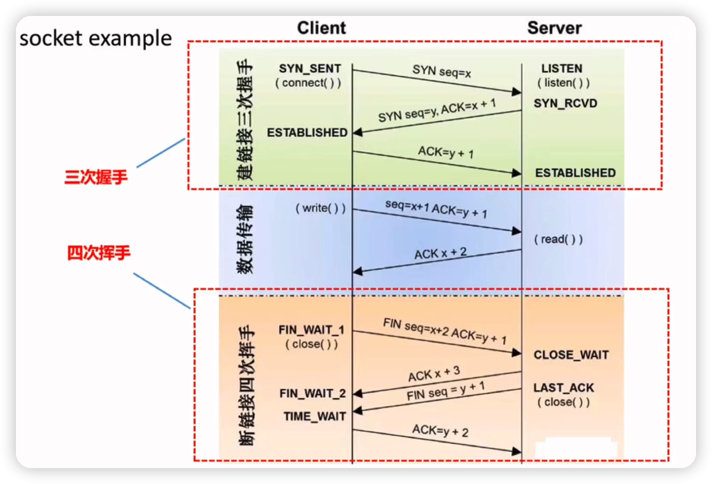
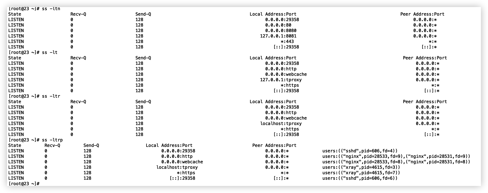

# 协议栈

## 理论模型

osi 七层模型

tcp/ip 四层模型

四层模型比较通用，每层都有自己的协议头部

## 以太网帧格式 （数据链路层）

我们常用 ethernet II (罗马数字)，Ethernet 2 格式的以太网帧最大 1518bytes，最小 64bytes。

ethernet II 帧格式：目的地址 6，源地址 6，协议 2，数据 46-1500，校验和 4。MTU: 1500

最小 6+6+2+46+4=64bytes，最大 6+6+2+1500+4=1518bytes。

区分不同帧格式，从 2type 两个自己算出的值来确认

ethernet II type > 1536

同样的两个字节在 802.3，802.2 代表 length， 都是 <= 1500。

ethernet II 的 type 指定了上层协议，如下

| 0x0800 | ip    |
| ------ | ----- |
| 0x0806 | arp   |
| 0x8137 | ipx   |
| 0x86dd | ipv6  |
| 0x8035 | rarp  |
| 0x8864 | pppoe |

## jumbo frame（巨型帧）

最多 9000 个字节

## ip 报文格式（网络层）


## tcp 报文格式（传输层）




## tcp syns queue and accept queue

client(syn_send) --->syn (syn_rcvd)server 放入 syns queue

client(established) <---sync+ack

​ --->ack established 从 syns queue 取出放入 accept queue

​ accept 从 accept queue 取出

`半连接队列`大小由内核参数 /proc/sys/net/ipv4/`tcp_max_syn_backlog` 决定

```shell
[root@23 ~]# cat /proc/sys/net/ipv4/tcp_max_syn_backlog
128
```

Linux 实现了一种称为 SYNcookie 的机制，通过 net.ipv4.tcp_syncookies 控制，设置为 1 表示开启。**简单说 SYNcookie 就是将连接信息编码在 ISN(initialsequencenumber)中返回给客户端，这时 server 不需要将半连接保存在队列中，而是利用客户端随后发来的 ACK 带回的 ISN 还原连接信息，以完成连接的建立，避免了半连接队列被攻击 SYN 包填满**。

**当这个队列满了，不开启 syncookies 的时候，Server 会丢弃新来的 SYN 包，而 Client 端在多次重发 SYN 包得不到响应而返回（`connection time out`）错误。但是，当 Server 端开启了 syncookies=1，那么 SYN 半连接队列就没有逻辑上的最大值了，并且/proc/sys/net/ipv4/tcp_max_syn_backlog 设置的值也会被忽略。**

`全连接队列`大小由 min(`backlog`, `somaxconn`)

backlog 其实就是 listen 函数的参数决定，int listen(int sockfd, int `backlog`)

somaxconn 则是内核参数 /proc/sys/net/core/`somaxconn`

```shell
[root@23 ~]# cat /proc/sys/net/core/somaxconn
128
```

可以通过

```shell
[root@23 ~]# ss -lnt 'sport = :443'
State    Recv-Q    Send-Q    Local Address:Port    Peer Address:Port
LISTEN   0         128                   *:443                *:*
```

send-q 就是 accept queue


如果 accept queue 满了，syns queue 没有满，那么有两种处理方式

取决于 /proc/sys/net/ipv4/tcp_abort_overflow

```
[root@23 ~]# cat /proc/sys/net/ipv4/tcp_abort_on_overflow
0
```

次内核参数为 0：第三次握手假定不处理，造成丢失最后一次握手 ack，那么 client 会重新发起 ack

为 1: 直接发 rst 包给客户端来终止连接，此时客户端会收到 **104 Connection reset by peer** 的错误，一般不会配置这种策略

rst 包就表示终止连接

也可以先设置 1 的处理方式，只要客户端出现 104 错误，就证明是全连接队列满的原因导致问题

也可以通过统计的命令查看 accept queue 的情况：netstat -s |egrep "listen|LISTEN"

```shell
[root@23 ~]# netstat -s |egrep "listen|LISTEN"
    4 SYNs to LISTEN sockets dropped
```



ss 命令https://cloud.tencent.com/developer/article/1721800

```shell
 -h, –help 帮助
 -V, –version 显示版本号
 -t, –tcp 显示 TCP 协议的 sockets
 -u, –udp 显示 UDP 协议的 sockets
 -x, –unix 显示 unix domain sockets，与 -f 选项相同
 -n, –numeric 不解析服务的名称，如 “22” 端口不会显示成 “ssh”
 -l, –listening 只显示处于监听状态的端口
 -p, –processes 显示监听端口的进程(Ubuntu 上需要 sudo)
 -a, –all 对 TCP 协议来说，既包含监听的端口，也包含建立的连接
 -r, –resolve 把 IP 解释为域名，把端口号解释为协议名称
```

ss -ltn 查看 listen 状态的 tcp 服务端口，端口默认为服务名称，n 就是强制显示端口号

ss -ltr r 就是把地址解释成域名

ss -ltrp 显示监听端口的进程



ss -tan state xxx 可以监听状态，其实就是指定某些 tcp 状态，过滤作用

```
[root@23 ~]# ss -tan state listening '( sport = :443 )'
Recv-Q    Send-Q    Local Address:Port    Peer Address:Port
0         128                   *:443                *:*
```

ss -tna 将显示所有 tcp 的状态


time-wait 等待 2msl，其实 last-ack 被关的一方也会等待 2msl，也解释了为啥 time-wait 要等待 2msl

msl 可以配置的，/proc/sys/net/ipv4/tcp_fin_timeout

```shell
[root@23 ~]# cat /proc/sys/net/ipv4/tcp_fin_timeout
60
```

2msl=60s，所以 msl 是 30s

## RFC

request for comments

## MSS，MTU

如果底层物理接口 MTU= 1500 byte，则 MSS = 1500- 20(IP Header) -20 (TCP Header) = 1460 byte，如果 application 有 2000 byte 发送，需要两个 segment 才可以完成发送，第一个 TCP segment = 1460，第二个 TCP segment = 540。实际场景下，TCP 包头会带有 12 字节的时间戳，于是单个 TCP 包实际传输的最大量就会缩减为 1448 字节，1448=1500-20 字节（IP 头）-32 字节（20 字节 TCP 头和 12 字节 TCP 时间戳）
