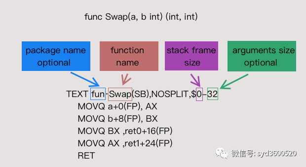

# 基础

## 汇编程序指令 assembler directives

### DATA

DATA  symbol + offset(SB)/width, value

在给定的 offset 和 width 处初始化该符号的内存为 value。 DATA 必须使用增加的偏移量来写入给定符号的指令。

```asm
DATA divtab<>+0x00(SB)/4, $0xf4f8fcff
DATA divtab<>+0x04(SB)/4, $0xe6eaedf0
...
DATA divtab<>+0x3c(SB)/4, $0x81828384
GLOBL divtab<>(SB), RODATA, $64

GLOBL runtime·tlsoffset(SB), NOPTR, $4
```

`DATA divtab<>+0x00(SB)/4, $0xf4f8fcff` 表示的是`divtab<>` 在 0 偏移处有一个 4 字节大小的值`0xf4f8fcff`

下边连续多条`DATA...`都一样，注意偏移发生了变化，以 4 递增。最终偏移是`0x3c`

然后继续看`GLOBL divtab<>(SB), RODATA, $64` ，这条给变量`divtab<>`加了一个 flag `RODATA` ，表示里边存的是只读变量，最后的`$64`表示的是这个变量占用了 64 字节的空间（容易看出来`0x3c + 4 = 0x40= 10进制的64`）

`GLOBL runtime·tlsoffset(SB), NOPTR, $4` 这条指令中，`NOPTR`这个 flag 表示这个变量中存的不是指针

#### golang的flag

```go
// Don't profile the marked routine. This flag is deprecated.
#define NOPROF	1
// It is ok for the linker to get multiple of these symbols. It will
// pick one of the duplicates to use.
#define DUPOK	2
// Don't insert stack check preamble.
#define NOSPLIT	4
// Put this data in a read-only section.
#define RODATA	8
// This data contains no pointers.
#define NOPTR	16
// This is a wrapper function and should not count as disabling 'recover'.
#define WRAPPER 32
// This function uses its incoming context register.
#define NEEDCTXT 64
// Allocate a word of thread local storage and store the offset from the
// thread local base to the thread local storage in this variable.
#define TLSBSS	256
// Do not insert instructions to allocate a stack frame for this function.
// Only valid on functions that declare a frame size of 0.
// TODO(mwhudson): only implemented for ppc64x at present.
#define NOFRAME 512
// Function can call reflect.Type.Method or reflect.Type.MethodByName.
#define REFLECTMETHOD 1024
// Function is the top of the call stack. Call stack unwinders should stop
// at this function.
#define TOPFRAME 2048
```

### TEXT

```assembly
TEXT runtime·profileloop(SB),NOSPLIT,$8
	MOVQ	$runtime·profileloop1(SB), CX
	MOVQ	CX, 0(SP)
	CALL	runtime·externalthreadhandler(SB)
	RET
```

上边整段汇编代码称为一个`TEXT block` ，`runtime.profileloop(SB)`后边有一个`NOSPLIT` flag，紧随其后的`$8`表示`frame size` 通常 `frame size` 的构成都是形如`$24-8` (中间的`-`只起到分隔的作用)，表示的是这个`TEXT block` 运行的时候需要占用 24 字节空间，参数和返回值要额外占用 8 字节空间（这 8 字节占用的是调用方栈帧里的空间）

但是如果有 NOSPLIT 这个 flag，则可以忽略参数和返回值占用的空间，就像上述这个例子，只有一个`$8` 。表示 frame size 只有 8 字节大小。这从汇编中也能看出来 `MOVQ CX, 0(SP)` ,因为 MOVQ 表示这个操作的操作对象是 8 字节的

> MOV 指令有有好几种后缀 MOVB MOVW MOVL MOVQ 分别对应的是 1 字节 、2 字节 、4 字节、8 字节

### 指令

指令有几大类，**一类是用于数据移动的**，比如 MOV 系列，MOVQ、MOVL 等等(都是 MOV，只不过 Q 和 L 的后缀表示了指令操作数的字节大小)，还有**一类是用于跳转的**，无条件跳转，有条件跳转等等。还有**一类是用于逻辑运算和算术运算**的。

还有一些类似于指令，但是其实是指令的 prefix，比如 `LOCK`

### 运行时协调

为保证垃圾回收正确运行，在大多数栈帧中，运行时必须知道所有全局数据的指针。 Go 编译器会将这部分信息耦合到 Go 源码文件中，但汇编程序必须进行显式定义。

被标记为 `NOPTR` 标志的数据符号会视为不包含指向运行时分配数据的指针。 带有 `R0DATA` 标志的数据符号在只读存储器中分配，因此被隐式标记为 `NOPTR`。 总大小小于指针的数据符号也被视为隐式标记 `NOPTR`。 在一份汇编源文件中是无法定义包含指针的符号的，因此这种符号必须定义在 Go 源文件中。 一个良好的经验法则是 `R0DATA` 在 Go 中定义所有非符号而不是在汇编中定义。

。。。


### 寄存器

### 通用寄存器

Plan 9 中的通用寄存器包括：

AX BX CX DX DI SI BP SP R8 R9 R10 R11 R12 R13 R14 PC

### 伪寄存器

伪寄存器不是真正的寄存器，而是由工具链维护的虚拟寄存器，例如帧指针。

FP, Frame Pointer：帧指针，参数和本地 PC, Program Counter: 程序计数器，跳转和分支 SB, Static Base: 静态基指针, 全局符号 SP, Stack Pointer: 当前栈帧开始的地方

所有用户定义的符号都作为偏移量写入伪寄存器 FP 和 SB。

汇编代码中需要表示用户定义的符号(变量)时，可以通过 SP 与偏移还有变量名的组合，比如`x-8(SP)` ，因为 SP 指向的是栈顶，所以偏移值都是负的，`x`则表示变量名


#### 栈扩大、缩小

plan9中栈操作并没有`push` `pop`，而是采用`sub`和`add SP`

```assembly
SUBQ $0x18, SP //对SP做减法 为函数分配函数栈帧
ADDQ $0x18, SP //对SP做加法 清除函数栈帧
```

#### 数据copy

```asm
MOVB $1, DI // 1 byte
MOVW $0x10, BX // 2bytes
MOVD $1, DX // 4 bytes
MOVQ $-10, AX // 8 bytes
```

#### 计算指令

```asm
ADDQ AX, BX // BX += AX
SUBQ AX, BX // BX -= AX
IMULQ AX, BX // BX *= AX
```

#### 跳转

```asm
//无条件跳转
JMP addr // 跳转到地址，地址可为代码中的地址 不过实际上手写不会出现这种东西
JMP label // 跳转到标签 可以跳转到同一函数内的标签位置
JMP 2(PC) // 以当前置顶为基础，向前/后跳转x行
JMP -2(PC) //同上
//有条件跳转
JNZ target // 如果zero flag被set过，则跳转
```

#### 变量声明

```asm
DATA symbol+offset(SB)/width,value


GLOBL runtime·tlsoffset(SB), NOPTR, $4
// 声明一个全局变量tlsoffset，4byte，没有DATA部分，因其值为0。
// NOPTR 表示这个变量数据中不存在指针，GC不需要扫描。
```



#### 寄存器

Go汇编引入了4个伪寄存器，这4个寄存器是编译器用来维护上下文、特殊标识等作用的:

```asm
FP(Frame pointer):arguments and locals
PC(Program counter): jumps and branches
SB(Static base pointer):global symbols
SP(Stack pointer):top of stack
```

所有用户空间的数据都可以通过FP/SP(局部数据、输入参数、返回值)和SB(全局数据)访问。通常情况下，不会对SB/FP寄存器进行运算操作，通常情况会以SB/FP/SP作为基准地址，进行偏移、解引用等操作。

其中

SP是栈指针，用来指向局部变量和函数调用的参数，SP指向local stack frame的栈顶，所以使用时需要使用负偏移量，取之范围为[-framesize,0)。foo-8(SP)表示foo的栈第8byte。SP有伪SP和硬件SP的区分，如果硬件支持SP寄存器，那么不加name的时候就是访问硬件寄存器，因此x-8(SP)和-8(SP)访问的会是不同的内存空间。对SP和PC的访问都应该带上name，若要访问对应的硬件寄存器可以使用RSP。

伪SP：本地变量最高起始地址

硬件SP：函数栈真实栈顶地址

他们的关系为：

若没有本地变量: 伪SP=硬件SP+8

若有本地变量:伪SP=硬件SP+16+本地变量空间大小


在plan9汇编里还可以直接使用amd64的通用寄存器，应用代码层面会用到的通用寄存器主要是:

rax,rbx,rcx,rdx,rdi,rsi,r8~r15这14个寄存器。plan9中使用寄存器不需要带r或e的前缀，例如rax，只要写AX即可:

```asm
MOVQ $101, AX
```
