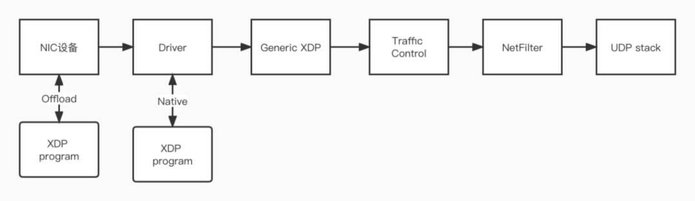

# af_xdp

## 说明

bpf bsd packet filter，能以安全的方式在不同的钩点执行用户注入到内核的字节码。2013年Alexei Starovoitov对BPF进行了改造，有了eBPF

## XDP

eBFP有很多钩子，而XDP就是linux 网络数据处理的一个hook点。XDP全称eXPress Data Path，快速数据路径，能够在数据到达网卡驱动时对其进行处理。

三种运行模式：generic，native，offload。

offload 是直接在网卡中对xdp程序进行处理，挂载点最靠前，性能最佳，但是需要硬件特别支持

native 是最传统的xdp模式，需要驱动支持，目前主流网卡驱动都实现了native xdp，挂载在驱动接受路径上

generic 是内核模拟出的一种通用模式，不需要驱动支持，但是xdp挂载最靠后，性能不如native

## 工作流程

af_xdp 分为两个部分：socket 和 UMEM

### socket

类似传统socket，通过socket()创建一个xsk，每个xsk包含一个RX ring和TX ring，收包在RX ring进行，发包在TX ring进行

### UMEM

存放大小相等的内存块地址，包含两个FILL ring 和 COMPLETION ring。

收包前，将包地址写到FILL ring，内核消费这些数据收包，完成收包后地址放到xsk的RX ring中，用户程序消费ring得到数据帧

发包时，用户向UMEM的地址中写数据帧，写到TX ring，内核消费开始执行发包，完成后写到COMPLETION ring。

为了让xsk成功收包从网卡中，需要将xsk绑定到网卡和队列。