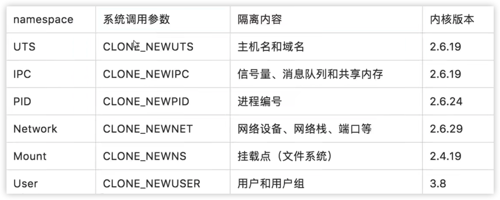

# linux namespace

namespace 主要特性就是资源隔离

docker run -it ubuntu:18.04 /bin/bash

一般使用docker会新增上面的五种做到资源隔离 uts，ips，pid，network，mount

### docker 网络模式

docker run 创建Docker容器时，可以用--net指定网络模式，有四种

docker run -it ubuntu:18.04 /bin/bash --net=...

#### host模式

--net=host 和宿主机共用一个network namespace

#### none模式

关闭网络功能

#### bridge模式（默认模式）

容器使用独立network namespace，并且连接到docker0虚拟网桥，通过iptables nat表配置和宿主机进行通信

#### container模式

指定新创建的容器和已经存在的一个容器共享他的network namespace