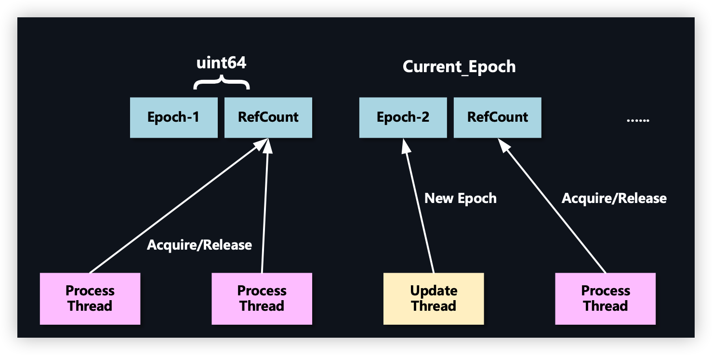

# b站kv搜索分享

### 场景

Data intensity ：亿级稿件选top-N

latency sensitive：500ms

OLAP：列式存储，搜推场景

OLTP：行式存储，主站场景

### kv分类

embedded in memory kv: 语言提供的map存储

in memory kv srever: memcached, redis

embedded kv database: leveldb, rocksdb(基于lsmtree)

distributed kv database: taishan, TiKV

complicated data-model: BigTable,  MongoDB, Cassandra, Dynamo

data structure: B-tree, LSM-tree, hash-map

### Embedded in memory KV

业务场景：每秒查询20亿个key，20 kps，随机点读，random point read，10-20G，10w kps update

高频访问，存储不大，增量远远小于存量

选型是内存数据库kv，数据结构hashmap

对于高频，随机，点查场景有很多数据结构可以选择，skin-list，sorted-array，hash-map，btree，rbtree

hash-map多种实现（核心问题是解决key冲突）：open-addressing，separate chaining，perfect-hash，cuckoo-hash（google 布谷鸟hash，理论复杂度最坏是O(1)，实际生成环境不理想，建立hash表无限循环，建立索引失败，依赖两个hash函数解决冲突；另外查询冲突的key离的比较远，效率就低了，cache 命中率比较低，不友好）

影响hash的几个因素：hash函数，更少的指令计算更加均匀的hash；计算hash 分桶的过程（取模太慢），小的数据规模可以使用位操作，大的数据规模可以采用高32位*bucket再去取高32位作为bucket的index

#### 几种现在比较高效的hash结构

##### robin-hood hash

##### flatmap

##### flat hash map（f14）

并不适合当前业务场景，90%命中率，value是指针int64地址

##### neighbor hash

采用open-address，冲突放在最近，提高cache命中率

x64架构下，64bit地址只是使用了48位，用剩下的16bit来存放冲突的下个节点

##### epoch protection framework

一次批量操作，只原子操作一次

### KFC

remote kv store

参考 google mesa，apache doris

batch update 吞吐大

##### nvme backend

key存放在内存，value存放nvme；复用48bit value，1bit作为标识是否是cache还是nvme

### KV in parameter Server

 