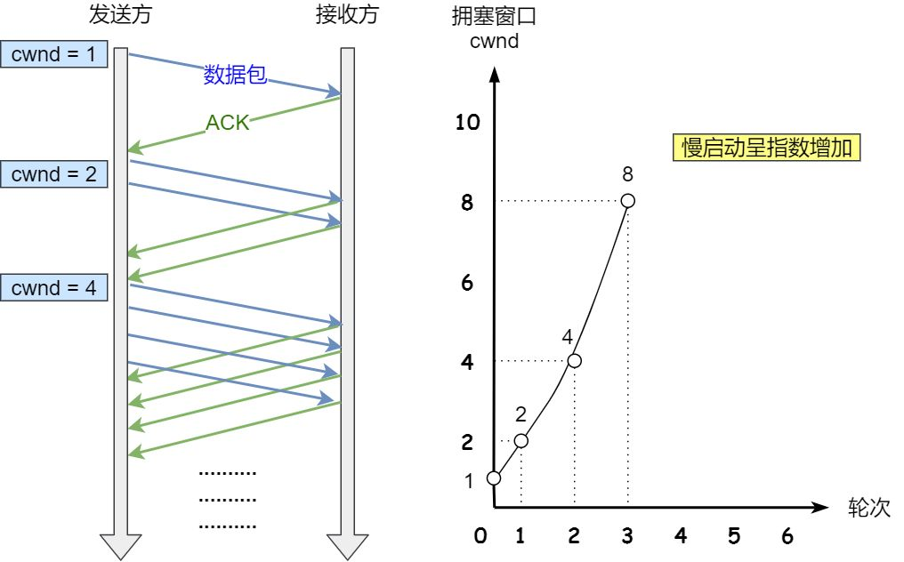
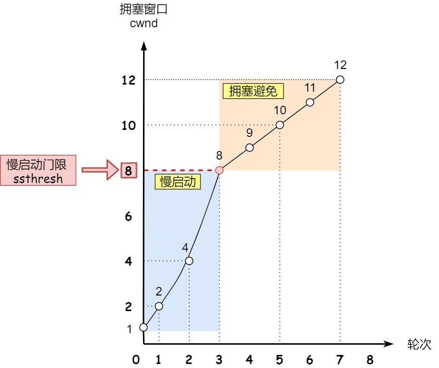
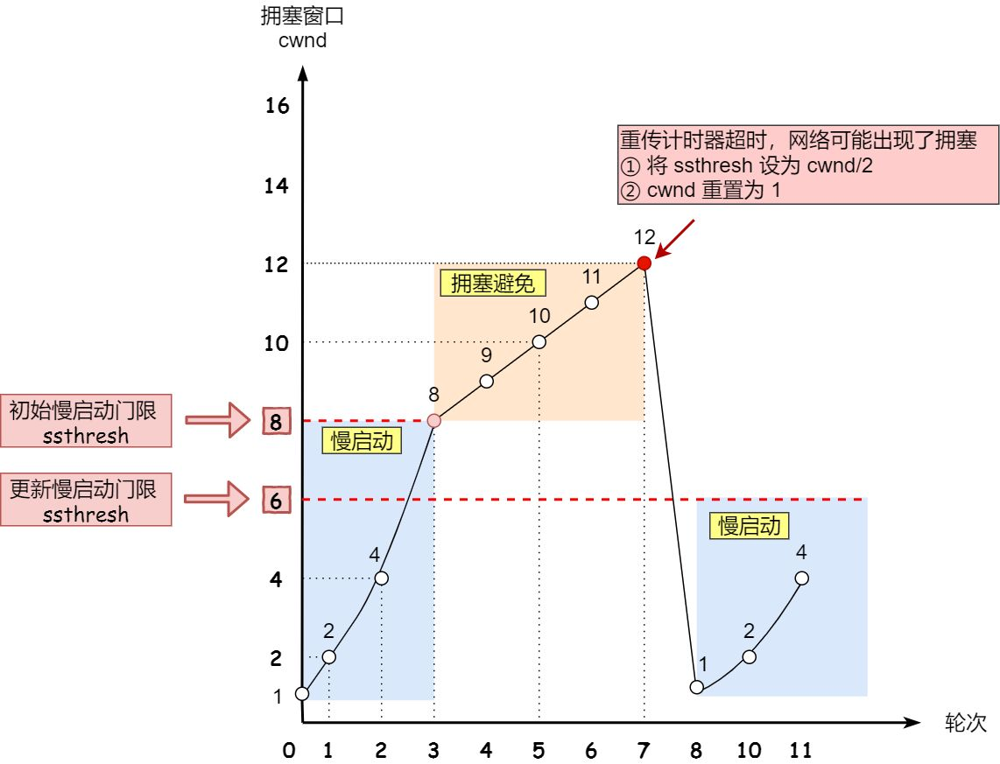

# tcp协议滑动窗口

#### 发送方

SND.WND

SND.UNA

SND.NXT

可用窗口= SND.WND-(SND.NXT-SND.UNA)

#### 接收方

rcv.wnd

rcv.nxt

操作系统缓冲区和滑动窗口

 接收方，缓冲区有t1数据没读那么滑动窗口就有减去t1

糊涂窗口综合症

#### 接收方

窗口小于min(mss,缓存空间1/2)，就会发送窗口为0，等处理一些数据后，使得窗口>=mss，或者缓存空间有一般可用

#### 发送方

Negle算法

原则就是延迟处理

(窗口>=mss || 数据大小>=mss) || ack

### 拥塞控制

网络环境差的时候，发送发不能无休止的重发数据包，需有有一定控制，所以有了`拥塞控制`

#### 拥塞窗口

为了调节发送方发送数据，就有了拥塞窗口，也就是具体实现拥塞控制的实现，所以发送窗口是综合后的一个窗口

发送方维护一个拥塞窗口swnd=min(cwnd,rwnd)，`发送窗口`为拥塞窗口和接受窗口的最小值

如何知道当前是否拥塞：没有在规定时间接受方没有ack

拥塞控制主要有四个算法，本质就是控制拥塞窗口的值

##### 慢启动

原则：发送方没收到一个ack，拥塞窗口就+1

每次可以发送原有基础上指数增长，有个上限 ssthresh （slow start threshold），一般65535字节

小于ssthresh就是慢启动，大于等于就会使用下一个拥塞避免算法

##### 拥塞避免

原则：没收到一个ack，cwnd增加1/cwnd，本质就是从慢启动的指数增长变成线性增长，虽然还是增长，但是速度变缓了

当8个ack，增加了1/8*8=1，所以swnd是9，从而变成了线性增长

如果一直这么增长上去，会慢慢进入拥塞状态，出现丢包，会发生重传？为啥

当触发了重传，就进入下一个拥塞发生算法了

##### 拥塞发生

重传有两种：超时重传和快速重传

###### 超时重传

当出现丢包时，发送方接受不到ack是，ssthresh设置为cwnd/2

cwnd重设为1

并且重新进入慢启动了，这种方式太激进

###### 快速重传

比超时重传更好的方式，当接受方发现丢了一个中间包，就发送三次前一个包的ack给发送方，发送方就会重新快速重传

此时这种情况不严重，只是小部分数据包收到影响，所以

cwnd=cwnd/2

ssthresh=cwnd

并且进入下一个快速恢复

##### 快速恢复

一般和拥塞发生的快速重传一起使用

cwnd=ssthresh+3

重新传丢失的包

​	如果再受到重复的ack，cwnd+1

​	如果收到新数据ack，那么说明恢复正常了，cwnd就恢复到拥塞避免的水平

