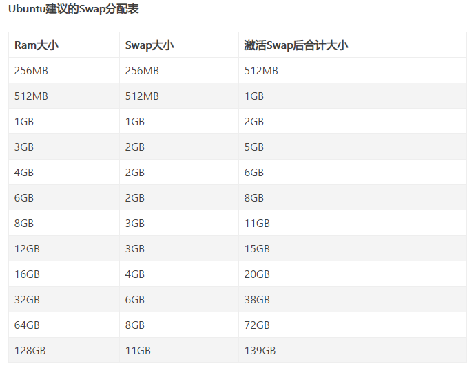

# SWAP

## 常用命令

```shell
free -m

swap --show（swap -s）

grep SwapTotal /proc/meminfo

// Swappiness is a property of the Linux kernel that changes the balance between swapping out runtime memory, as opposed to dropping pages from the system page cache. Swappiness can be set to values between 0 and 100 inclusive. A low value means the kernel will try to avoid swapping as much as possible where a higher value instead will make the kernel aggressively try to use swap space. The default value is 60, and for most desktop systems, setting it to 100 may affect the overall performance, whereas setting it lower (even 0) may improve interactivity (by decreasing response latency.
cat /proc/sys/vm/swappiness
// 临时修改
echo 60 > /proc/sys/vm/swappiness
// 或者
sysctl vm.swappiness=60
// 永久修改，需要重启，本质就是每次开启加载下这个新配置
echo 'vm.swappiness=60' >> /etc/sysctl.conf

// 利用dd来划分空间
dd if=/dev/zero of=swapfile bs=1M count=980
chmod 600 swapfile
// 转换成swap类型文件
mkswap swapfile

swapon swapfile
// 卸载
swapoff swapfile


// 永久生效
vim /etc/fstab
// 添加
swapfile-path none swap defaults 0 0


```

## 推荐swap大小



## reference

[https://qiyuan-z.github.io/2020/08/24/Ubuntu增加swap交换空间/](https://qiyuan-z.github.io/2020/08/24/Ubuntu增加swap交换空间/)

https://www.cnblogs.com/kerrycode/p/5246383.html

https://opensource.com/article/19/2/swap-space-poll