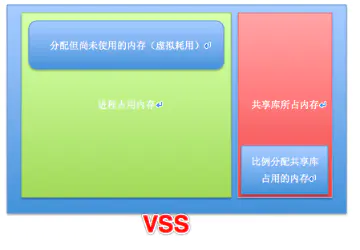
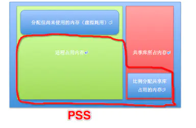
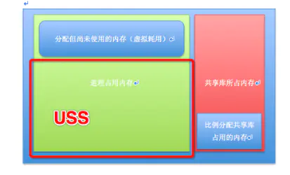

# 内存耗用

## VSS - Virtual Set Size （用处不大）

虚拟耗用内存（包含共享库占用的全部内存，以及分配但未使用内存）。其大小还包括了可能不在RAM中的内存（比如虽然malloc分配了空间，但尚未写入）。VSS 很少被用于判断一个进程的真实内存使用量。

## RSS - Resident Set Size （用处不大）

实际使用物理内存（包含共享库占用的全部内存）。但是RSS还是可能会造成误导，因为它仅仅表示该进程所使用的所有共享库的大小，它不管有多少个进程使用该共享库，该共享库仅被加载到内存一次。所以RSS并不能准确反映单进程的内存占用情况

## PSS - Proportional Set Size （仅供参考）

实际使用的物理内存（比例分配共享库占用的内存，按照进程数等比例划分）。例如：如果有三个进程都使用了一个共享库，共占用了30页内存。那么PSS将认为每个进程分别占用该共享库10页的大小。 PSS是非常有用的数据，因为系统中所有进程的PSS都相加的话，就刚好反映了系统中的 总共占用的内存。 而当一个进程被销毁之后， 其占用的共享库那部分比例的PSS，将会再次按比例分配给余下使用该库的进程。这样PSS可能会造成一点的误导，因为当一个进程被销毁后， PSS不能准确地表示返回给全局系统的内存。

## USS - Unique Set Size （非常有用）

进程独自占用的物理内存（不包含共享库占用的内存）。USS是非常非常有用的数据，因为它反映了运行一个特定进程真实的边际成本（增量成本）。当一个进程被销毁后，USS是真实返回给系统的内存。当进程中存在一个可疑的内存泄露时，USS是最佳观察数据。

一般来说内存占用大小有如下规律：VSS >= RSS >= PSS >= USS

pmap -XX pid 命令分析进程内存，可以看内存地址是否被标记为LazyFree等

## 参考资料：

[https://www.jianshu.com/p/3bab26d25d2e](https://www.jianshu.com/p/3bab26d25d2e)

[http://myeyeofjava.iteye.com/blog/1837860](http://myeyeofjava.iteye.com/blog/1837860)

[http://blog.csdn.net/panda1234lee/article/details/52291588](http://blog.csdn.net/panda1234lee/article/details/52291588)

