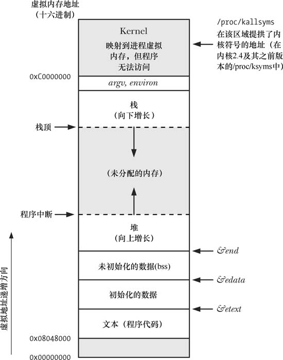
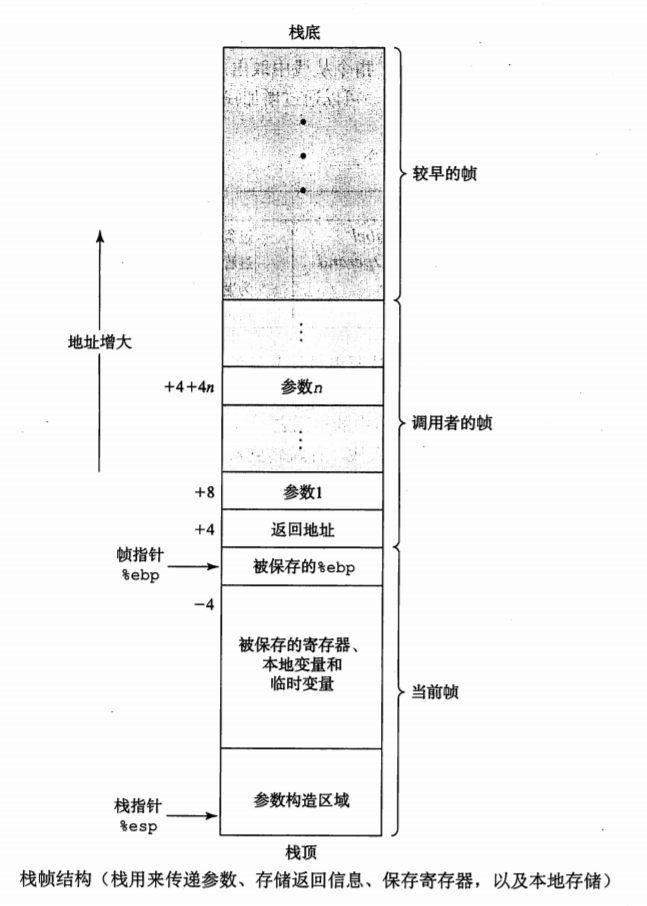

# go 基础

slice，map，channel都是引用类型

array 是值类型，区分slice

slice触发扩容，新的赋值的slice的data会指向新的底层数组


## 闭包

闭包是为了减少全局变量，所以闭包引用全局变量不是好的编程方式。

闭包这种隐秘的共享变量的方式带来的坏处是不够直接，不够清晰，除非是非常有价值的地方，一般不建议使用闭包。


## go函数的内部实现

go函数使用的是caller-save的模式，即由调用者负责保存寄存器。

SB static base pointer 静态基址寄存器，它和全局符号一起表示全局变量的地址。

FP frame pointer 栈帧寄存器，该寄存器指向当前函数调用栈帧的**栈底**位置

PC program counter 程序计数器，存放下一条指令的执行地址，很少直接操作该寄存器，一般是call，ret等指令隐式的操作

SP stack pointer **栈顶**寄存器，一般在函数调用前由主函数设置SP的值对栈空间进行分配或回收

Go 语言的汇编代码中栈寄存器解释的非常模糊，我们大概只要知道两个寄存器 BP 和 SP 的作用就可以了

BP:  栈底指针，**基准指针寄存器**，维护当前栈帧的基准地址，以便用来索引变量和参数，就像一个锚点一样，在其它架构中它等价于帧指针`FP`，只是在x86架构下，变量和参数都可以通过SP来索引

SP：栈顶指针，**栈指针寄存器**，总是指向栈顶

**栈的增长方向永远是从底到顶，所以栈顶和栈底不是上下决定，而是有入栈方向决定**



https://zhuanlan.zhihu.com/p/447224382

```shell
// -S 产生汇编代码
// -N 禁用优化
// -l 禁用内联
GOOS=liunx GOARCH=amd64 go tool compile -l -N -S main.go > main.s


// go:noinline 无所谓，但是一定要有 -l
```

基本指令

```
SUBQ $0x18, SP // 对SP做减法，为函数分配函数栈帧
ADDQ $0x18, SP // 对SP做加法，清楚函数栈帧

MOVB $1,DI
MOVW $0x10,BX
MOVD $1,DX
MOVQ $-10,AX
```




## Go类型系统

### 命名类型

#### 1.自定义型 User-defined type

type Person struct{...}

type myint int

```go
type MyInt int// 使用type

func (m MyInt) Str() string {
	return strconv.Itoa(int(m))
}
```


#### 2.预声明类型（20个）pre-declared types

基本类型中的20个预声明简单类型都是命名类型

bool,1

int,int8,int16,int32,int64,uint,uint8,uint16,uint32,uint64,10

uintptr,1

float32,float64,2

complex64,complex128,2

byte(int8别名),1

rune(int32别名),1

string,1

error,1(唯一的接口)

#### 例子

使用`type关键`字和`预声明的20个`

```go
命名类型
type Myint int
type MyByte byte
type Myxxx bool,int,rune,string,uintptr,error
type Person struct{
	name string
	age int
}
type new_type old_type
```


### 未命名类型  type literals

#### 未命名类型别称类型字面量，而且复合类型，类型字面量，未命名类型是同一个概念 

`由预声明类型，关键字和操作符组合而成`

基本类型中的复合类型：**array,slice,map,channel,pointer,function,struct,interface**

还有这种 a:= struct{...} 以struct**字面量**声明的未命名类型，以及[]int,[]T1都是type interals

```go
a:=struct{
  name string
  age int
}
a:=map[string]string
var b []int
```

#### 例子

```go
p := struct{
	name string
	age int
}
a := map[string]string
b := []int
c := [2]int64
d := function(){}

```


### 底层类型

`预声明类型`和`未命名类型`底层类型是他们自身，两者是终点

`自定义类型`的底层类型是逐层递归向下查找，直到查到是预声明类型或者未命名类型

```go
type T1 string
type T2 T1

type T3 []string
type T4 T3

type T5 []T1
type T6 T5

// T1,T2 底层类型都是string
// T3,T4 底层类型都是[]string
// T5,T6 底层类型是[]T1,
```

#### 类型相同

1.命名类型相同，就是要类型声明完全相同

```go
type T1 string
type T2 string
// T1 和 T2 不同, type后名字不一样
```

2.命名类型和未命名类型总是不相同

3.两个未命名类型相同的条件是它们的类型声明宇面量的结构相同，并且内部元素的类
型相同

```go
var m1 map[string]string
m1 = make(map[string]string)
var m2 map[string]string = m2
```

4.通过类型别名语句声明的两个类型相同

```go
type T1 = T2
// 注意和1的区别
```


### 类型赋值

```go
// a 是 T1类型
var b T2 = a
```

必须满足如下一个条件

1.T1和T2 类型相同

2.T1 和T2 有相同底层类型，并且T1和T2至少有一个未命名类型

```go
type Map1 map[int]string
type Map2 Map1

m3 := make(map[int]string)
var m1 Map1 = m3
// var m1 Map1 = m1 不行，没有一个未命名类型，需要强转

type T1 <-chan string
type T2 <-chan string
t1 := make(T1)
var t2 <-chan string = t1
// var t2 T2 = t1 不行，同上
```


### 方法调用

#### 一般调用

var t=&T{}

t.Get()

#### 方法值

带有闭包的函数变量

t.Set = f

f(t)

#### 方法表达式

T.Set()

(*T).Get

第一个参数是接受者

#### 方法集

接收者为值类型T的方法集合记录为S，接收者为指针类型*T的方法集合记录为 *S

T类型的方法集是S

*T类型的方法集是S和 *S（ *S 本质是自动生成的方法，并且是 ( *d).S，操作的非指针而是值）

**对于是否实现接口类型判断起作用**

### 值调用和方法集调用的方法集合

通过类型变量（类型实例）进行值调用，编译器会自动转

使用表达式调用，编译器不会自动转

```go
package main

type Data struct {
}

func (d Data) TestValue()    {}
func (d *Data) TestPointer() {}

type Dd interface {
	TestValue()
	TestPointer()
}

func main() {
	// 显示调用
	(*Data)(&struct{}{}).TestValue()
	(*Data)(&struct{}{}).TestPointer()
	(Data)(struct{}{}).TestValue()
	// (Data)(struct{}{}).Test2() // 编译不过,Cannot call a pointer method on '(Data)(struct{}{})'

	// 一般调用，值调用，类型变量调用，类型实例调用 会自动转换
	var a Data // 方法集包含 valuefunc
	a.TestValue()
	a.TestPointer()
	var b *Data = &Data{} // 方法集包含 valuefunc pointerfunc(自动生成，严格显示调用通过)
	b.TestValue()
	b.TestPointer()

	// 表达式调用
	(*Data).TestValue(b)
	(*Data).TestPointer(b)
	Data.TestValue(a)
	// Data.TestPointer(a) // 编译不过,cannot call pointer method TestPointer on Data

	// var _ Dd = a // 编译不过,Cannot use 'a' (type Data) as the type Dd Type does not implement 'Dd' as the 'TestPointer' method has a pointer receiver
	var _ Dd = b // 说明
}
```

