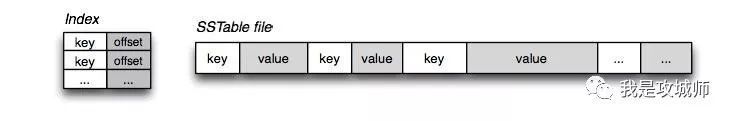

# log-structured merge-tree

lsm-tree中核心数据结构就是sstable（sorted string table）

> An SSTable provides a persistent, ordered immutable map from keys to values, where both keys and values are arbitrary byte strings. Operations are provided to look up the value associated with a specified key, and to iterate over all key/value pairs in a specified key range. Internally, each SSTable contains a sequence of blocks (typically each block is 64KB in size, but this is configurable). A block index (stored at the end of the SSTable) is used to locate blocks; the index is loaded into memory when the SSTable is opened. A lookup can be performed with a single disk seek: we first find the appropriate block by performing a binary search in the in-memory index, and then reading the appropriate block from disk. Optionally, an SSTable can be completely mapped into memory, which allows us to perform lookups and scans without touching disk.

完整lsm-tree图

