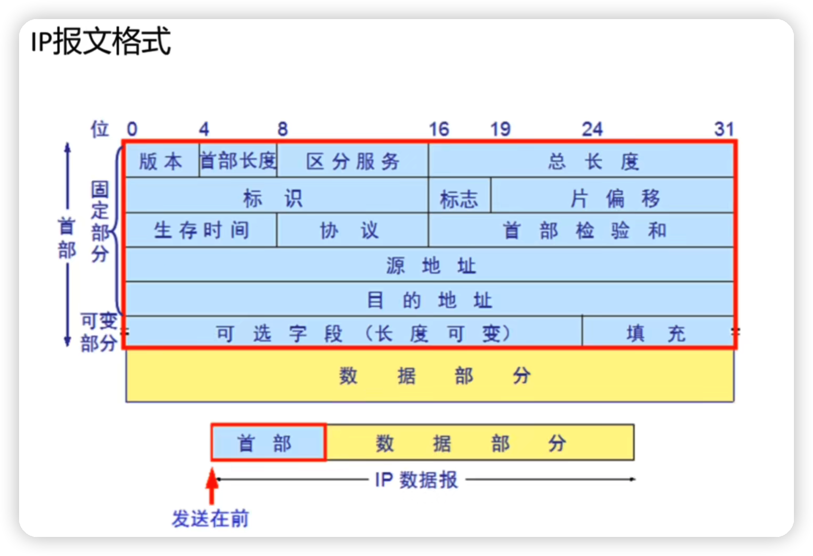
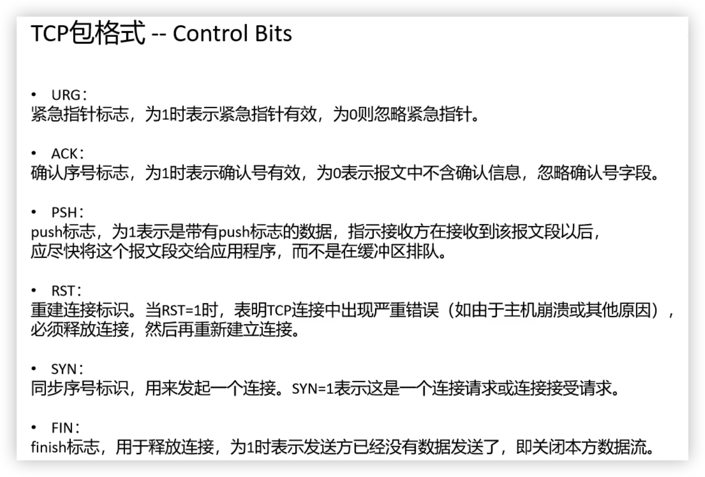
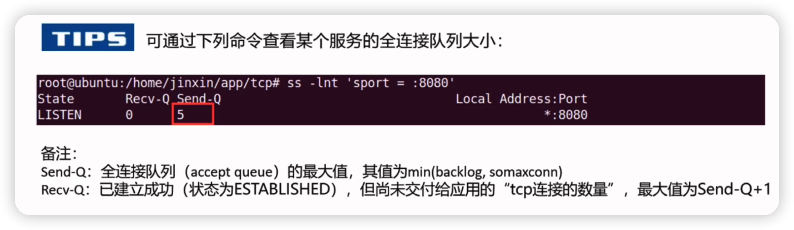
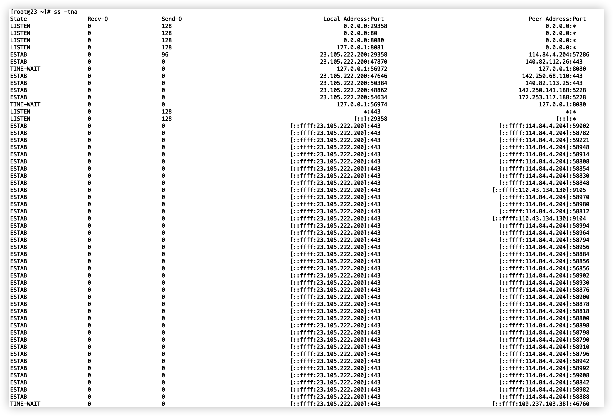

# 协议栈

## 理论模型

osi七层模型

tcp/ip 四层模型

四层模型比较通用，每层都有自己的协议头部

## 以太网帧格式 （数据链路层）

我们常用 ethernet II (罗马数字)，Ethernet 2 格式的以太网帧最大1518bytes，最小64bytes。

ethernet II 帧格式：目的地址6，源地址6，协议2，数据46-1500，校验和4。MTU: 1500

最小 6+6+2+46+4=64bytes，最大 6+6+2+1500+4=1518bytes。

区分不同帧格式，从2type两个自己算出的值来确认

ethernet II type > 1536

同样的两个字节在802.3，802.2 代表length， 都是 <= 1500。

ethernet II 的type 指定了上层协议，如下

| 0x0800 | ip    |
| ------ | ----- |
| 0x0806 | arp   |
| 0x8137 | ipx   |
| 0x86dd | ipv6  |
| 0x8035 | rarp  |
| 0x8864 | pppoe |


## jumbo frame（巨型帧）

最多9000个字节

## ip报文格式（网络层）



## tcp报文格式（传输层）





## tcp syns queue and accept queue

client(syn_send)       --->syn             (syn_rcvd)server  放入syns queue

client(established)   <---sync+ack    

​	                               --->ack             established           从syns queue 取出放入accept queue

​											accept                                           从accept queue 取出


`半连接队列`大小由内核参数 /proc/sys/net/ipv4/`tcp_max_syn_backlog` 决定

```shell
[root@23 ~]# cat /proc/sys/net/ipv4/tcp_max_syn_backlog 
128
```

Linux实现了一种称为SYNcookie的机制，通过net.ipv4.tcp_syncookies控制，设置为1表示开启。**简单说SYNcookie就是将连接信息编码在ISN(initialsequencenumber)中返回给客户端，这时server不需要将半连接保存在队列中，而是利用客户端随后发来的ACK带回的ISN还原连接信息，以完成连接的建立，避免了半连接队列被攻击SYN包填满**。

**当这个队列满了，不开启syncookies的时候，Server会丢弃新来的SYN包，而Client端在多次重发SYN包得不到响应而返回（`connection time out`）错误。但是，当Server端开启了syncookies=1，那么SYN半连接队列就没有逻辑上的最大值了，并且/proc/sys/net/ipv4/tcp_max_syn_backlog设置的值也会被忽略。**


`全连接队列`大小由min(`backlog`, `somaxconn`)

backlog 其实就是listen函数的参数决定，int listen(int sockfd, int `backlog`)

somaxconn 则是内核参数 /proc/sys/net/core/`somaxconn`

```shell
[root@23 ~]# cat /proc/sys/net/core/somaxconn 
128
```

可以通过

```shell
[root@23 ~]# ss -lnt 'sport = :443'
State    Recv-Q    Send-Q    Local Address:Port    Peer Address:Port                   
LISTEN   0         128                   *:443                *:*                      
```

send-q 就是accept queue



如果 accept queue 满了，syns queue没有满，那么有两种处理方式

取决于 /proc/sys/net/ipv4/tcp_abort_overflow

```
[root@23 ~]# cat /proc/sys/net/ipv4/tcp_abort_on_overflow 
0
```

次内核参数为0：第三次握手假定不处理，造成丢失最后一次握手ack，那么client会重新发起ack

为1: 直接发rst包给客户端来终止连接，此时客户端会收到 **104 Connection reset by peer** 的错误，一般不会配置这种策略

rst包就表示终止连接

也可以先设置1的处理方式，只要客户端出现 104错误，就证明是全连接队列满的原因导致问题

也可以通过统计的命令查看accept queue的情况：netstat -s |egrep "listen|LISTEN"

```shell
[root@23 ~]# netstat -s |egrep "listen|LISTEN"
    4 SYNs to LISTEN sockets dropped
```


ss 命令https://cloud.tencent.com/developer/article/1721800

```shell
 -h, –help 帮助
 -V, –version 显示版本号
 -t, –tcp 显示 TCP 协议的 sockets
 -u, –udp 显示 UDP 协议的 sockets
 -x, –unix 显示 unix domain sockets，与 -f 选项相同
 -n, –numeric 不解析服务的名称，如 “22” 端口不会显示成 “ssh”
 -l, –listening 只显示处于监听状态的端口
 -p, –processes 显示监听端口的进程(Ubuntu 上需要 sudo)
 -a, –all 对 TCP 协议来说，既包含监听的端口，也包含建立的连接
 -r, –resolve 把 IP 解释为域名，把端口号解释为协议名称
```

ss -ltn 查看listen 状态的tcp 服务端口，端口默认为服务名称，n就是强制显示端口号

ss -ltr r就是把地址解释成域名

ss -ltrp 显示监听端口的进程


ss -tan state xxx 可以监听状态，其实就是指定某些tcp状态，过滤作用

```
[root@23 ~]# ss -tan state listening '( sport = :443 )'
Recv-Q    Send-Q    Local Address:Port    Peer Address:Port                       
0         128                   *:443                *:* 
```

ss -tna 将显示所有tcp的状态




time-wait 等待2msl，其实last-ack 被关的一方也会等待2msl，也解释了为啥time-wait要等待2msl

msl可以配置的，/proc/sys/net/ipv4/tcp_fin_timeout

```shell
[root@23 ~]# cat /proc/sys/net/ipv4/tcp_fin_timeout 
60
```

2msl=60s，所以msl是30s

## RFC

request for comments

## MSS，MTU

如果底层物理接口MTU= 1500 byte，则 MSS = 1500- 20(IP Header) -20 (TCP Header) = 1460 byte，如果application 有2000 byte发送，需要两个segment才可以完成发送，第一个TCP segment = 1460，第二个TCP segment = 540。实际场景下，TCP包头会带有12字节的时间戳，于是单个TCP包实际传输的最大量就会缩减为1448字节，1448=1500-20字节（IP头）-32字节（20字节TCP头和12字节TCP时间戳）