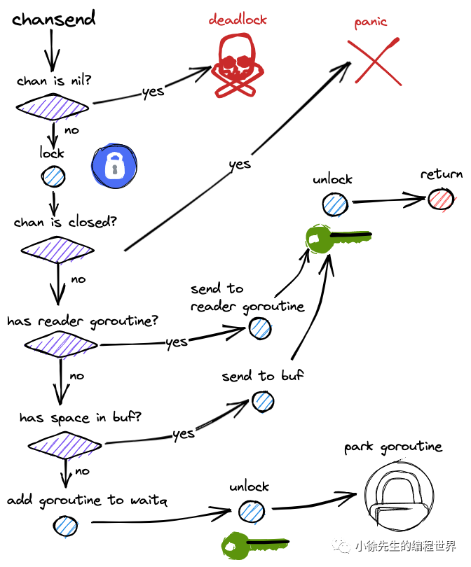
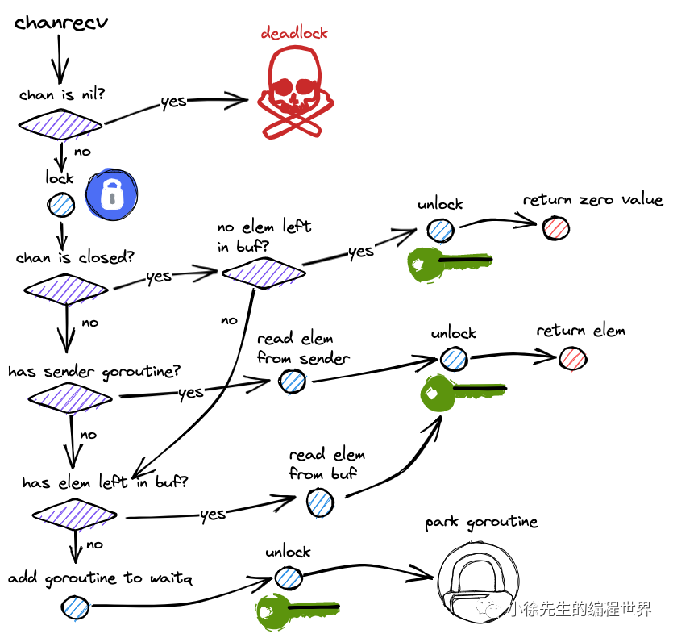
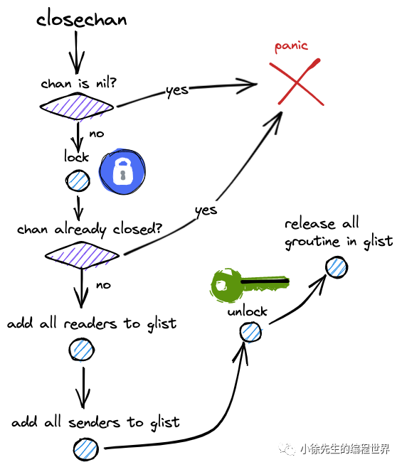

# channel

## 概念

golang channel 主要用来做不同 goroutine 通信

### 定义

注意 maxAlign 是 8，那么 maxAlign-1 的二进制就是 111，然后和 int(unsafe.Sizeof(hchan{}))取与就是取它的低三位，hchanSize 就得到的是 8 的整数倍，做对齐使用

包含 缓冲区数定义，实时统计缓冲区数，缓冲区 buf，chan 元素类型，chan 元素单位大小，接送 goroutine 队列 for 读，发送 goroutine 队列 for 写，以及两个对应的队列的 index，锁（存在并发行为）

- qcount：当前 channel 中存在多少个元素；
- dataqsize: 当前 channel 能存放的元素容量；
- buf：channel 中用于存放元素的环形缓冲区；
- elemsize：channel 元素类型的大小；
- closed：标识 channel 是否关闭；
- elemtype：channel 元素类型；
- sendx：发送元素进入环形缓冲区的 index；
- recvx：接收元素所处的环形缓冲区的 index；
- recvq：因接收而陷入阻塞的协程队列；
- sendq：因发送而陷入阻塞的协程队列；

```go
const (
	maxAlign  = 8
	hchanSize = unsafe.Sizeof(hchan{}) + uintptr(-int(unsafe.Sizeof(hchan{}))&(maxAlign-1))
	debugChan = false
)

type hchan struct {
	qcount   uint           // total data in the queue
	dataqsiz uint           // size of the circular queue
	buf      unsafe.Pointer // points to an array of dataqsiz elements
	elemsize uint16
	closed   uint32
	elemtype *_type // element type
	sendx    uint   // send index
	recvx    uint   // receive index
	recvq    waitq  // list of recv waiters
	sendq    waitq  // list of send waiters

	// lock protects all fields in hchan, as well as several
	// fields in sudogs blocked on this channel.
	//
	// Do not change another G's status while holding this lock
	// (in particular, do not ready a G), as this can deadlock
	// with stack shrinking.
	lock mutex
}
```

### 创建

无缓冲和 struct{}的 mem 都是 0

mallocgc 分配内存

```go
func makechan(t *chantype, size int) *hchan {
	elem := t.elem

	// compiler checks this but be safe.
	if elem.size >= 1<<16 {
		throw("makechan: invalid channel element type")
	}
	if hchanSize%maxAlign != 0 || elem.align > maxAlign {
		throw("makechan: bad alignment")
	}

	mem, overflow := math.MulUintptr(elem.size, uintptr(size))
	if overflow || mem > maxAlloc-hchanSize || size < 0 {
		panic(plainError("makechan: size out of range"))
	}

	// Hchan does not contain pointers interesting for GC when elements stored in buf do not contain pointers.
	// buf points into the same allocation, elemtype is persistent.
	// SudoG's are referenced from their owning thread so they can't be collected.
	// TODO(dvyukov,rlh): Rethink when collector can move allocated objects.
	var c *hchan
	switch {
	case mem == 0:
		// Queue or element size is zero.
		c = (*hchan)(mallocgc(hchanSize, nil, true))
		// Race detector uses this location for synchronization.
		c.buf = c.raceaddr()
	case elem.ptrdata == 0:
		// Elements do not contain pointers.
		// Allocate hchan and buf in one call.
		c = (*hchan)(mallocgc(hchanSize+mem, nil, true))
		c.buf = add(unsafe.Pointer(c), hchanSize)
	default:
		// Elements contain pointers.
		c = new(hchan)
		c.buf = mallocgc(mem, elem, true)
	}

	c.elemsize = uint16(elem.size)
	c.elemtype = elem
	c.dataqsiz = uint(size)
	lockInit(&c.lock, lockRankHchan)

	if debugChan {
		print("makechan: chan=", c, "; elemsize=", elem.size, "; dataqsiz=", size, "\n")
	}
	return c
}
```

### 发送

写流程

```go
func chansend(c *hchan, ep unsafe.Pointer, block bool, callerpc uintptr) bool {
	if c == nil {
		if !block {
			return false
		}
		gopark(nil, nil, waitReasonChanSendNilChan, traceEvGoStop, 2)
		throw("unreachable")
	}

	if debugChan {
		print("chansend: chan=", c, "\n")
	}

	if raceenabled {
		racereadpc(c.raceaddr(), callerpc, abi.FuncPCABIInternal(chansend))
	}

	if !block && c.closed == 0 && full(c) {
		return false
	}

	var t0 int64
	if blockprofilerate > 0 {
		t0 = cputicks()
	}

	lock(&c.lock)

	if c.closed != 0 {
		unlock(&c.lock)
		panic(plainError("send on closed channel"))
	}

	if sg := c.recvq.dequeue(); sg != nil {
		// Found a waiting receiver. We pass the value we want to send
		// directly to the receiver, bypassing the channel buffer (if any).
		send(c, sg, ep, func() { unlock(&c.lock) }, 3)
		return true
	}

	if c.qcount < c.dataqsiz {
		// Space is available in the channel buffer. Enqueue the element to send.
		qp := chanbuf(c, c.sendx)
		if raceenabled {
			racenotify(c, c.sendx, nil)
		}
		typedmemmove(c.elemtype, qp, ep)
		c.sendx++
		if c.sendx == c.dataqsiz {
			c.sendx = 0
		}
		c.qcount++
		unlock(&c.lock)
		return true
	}

	if !block {
		unlock(&c.lock)
		return false
	}

	// Block on the channel. Some receiver will complete our operation for us.
	gp := getg()
	mysg := acquireSudog()
	mysg.releasetime = 0
	if t0 != 0 {
		mysg.releasetime = -1
	}
	// No stack splits between assigning elem and enqueuing mysg
	// on gp.waiting where copystack can find it.
	mysg.elem = ep
	mysg.waitlink = nil
	mysg.g = gp
	mysg.isSelect = false
	mysg.c = c
	gp.waiting = mysg
	gp.param = nil
	c.sendq.enqueue(mysg)
	// Signal to anyone trying to shrink our stack that we're about
	// to park on a channel. The window between when this G's status
	// changes and when we set gp.activeStackChans is not safe for
	// stack shrinking.
	atomic.Store8(&gp.parkingOnChan, 1)
	gopark(chanparkcommit, unsafe.Pointer(&c.lock), waitReasonChanSend, traceEvGoBlockSend, 2)
	// Ensure the value being sent is kept alive until the
	// receiver copies it out. The sudog has a pointer to the
	// stack object, but sudogs aren't considered as roots of the
	// stack tracer.
	KeepAlive(ep)

	// someone woke us up.
	if mysg != gp.waiting {
		throw("G waiting list is corrupted")
	}
	gp.waiting = nil
	gp.activeStackChans = false
	closed := !mysg.success
	gp.param = nil
	if mysg.releasetime > 0 {
		blockevent(mysg.releasetime-t0, 2)
	}
	mysg.c = nil
	releaseSudog(mysg)
	if closed {
		if c.closed == 0 {
			throw("chansend: spurious wakeup")
		}
		panic(plainError("send on closed channel"))
	}
	return true
}
```



### 接收

读流程

```go
func chanrecv(c *hchan, ep unsafe.Pointer, block bool) (selected, received bool) {
	// raceenabled: don't need to check ep, as it is always on the stack
	// or is new memory allocated by reflect.

	if debugChan {
		print("chanrecv: chan=", c, "\n")
	}

	if c == nil {
		if !block {
			return
		}
		gopark(nil, nil, waitReasonChanReceiveNilChan, traceEvGoStop, 2)
		throw("unreachable")
	}

	// Fast path: check for failed non-blocking operation without acquiring the lock.
	if !block && empty(c) {
		if atomic.Load(&c.closed) == 0 {
			return
		}
		if empty(c) {
			// The channel is irreversibly closed and empty.
			if raceenabled {
				raceacquire(c.raceaddr())
			}
			if ep != nil {
				typedmemclr(c.elemtype, ep)
			}
			return true, false
		}
	}

	var t0 int64
	if blockprofilerate > 0 {
		t0 = cputicks()
	}

	lock(&c.lock)

	if c.closed != 0 && c.qcount == 0 {
		if raceenabled {
			raceacquire(c.raceaddr())
		}
		unlock(&c.lock)
		if ep != nil {
			typedmemclr(c.elemtype, ep)
		}
		return true, false
	}

	if sg := c.sendq.dequeue(); sg != nil {
		// Found a waiting sender. If buffer is size 0, receive value
		// directly from sender. Otherwise, receive from head of queue
		// and add sender's value to the tail of the queue (both map to
		// the same buffer slot because the queue is full).
		recv(c, sg, ep, func() { unlock(&c.lock) }, 3)
		return true, true
	}

	if c.qcount > 0 {
		// Receive directly from queue
		qp := chanbuf(c, c.recvx)
		if raceenabled {
			racenotify(c, c.recvx, nil)
		}
		if ep != nil {
			typedmemmove(c.elemtype, ep, qp)
		}
		typedmemclr(c.elemtype, qp)
		c.recvx++
		if c.recvx == c.dataqsiz {
			c.recvx = 0
		}
		c.qcount--
		unlock(&c.lock)
		return true, true
	}

	if !block {
		unlock(&c.lock)
		return false, false
	}

	// no sender available: block on this channel.
	gp := getg()
	mysg := acquireSudog()
	mysg.releasetime = 0
	if t0 != 0 {
		mysg.releasetime = -1
	}
	// No stack splits between assigning elem and enqueuing mysg
	// on gp.waiting where copystack can find it.
	mysg.elem = ep
	mysg.waitlink = nil
	gp.waiting = mysg
	mysg.g = gp
	mysg.isSelect = false
	mysg.c = c
	gp.param = nil
	c.recvq.enqueue(mysg)
	// Signal to anyone trying to shrink our stack that we're about
	// to park on a channel. The window between when this G's status
	// changes and when we set gp.activeStackChans is not safe for
	// stack shrinking.
	atomic.Store8(&gp.parkingOnChan, 1)
	gopark(chanparkcommit, unsafe.Pointer(&c.lock), waitReasonChanReceive, traceEvGoBlockRecv, 2)

	// someone woke us up
	if mysg != gp.waiting {
		throw("G waiting list is corrupted")
	}
	gp.waiting = nil
	gp.activeStackChans = false
	if mysg.releasetime > 0 {
		blockevent(mysg.releasetime-t0, 2)
	}
	success := mysg.success
	gp.param = nil
	mysg.c = nil
	releaseSudog(mysg)
	return true, success
}
```



### 关闭

```go
func closechan(c *hchan) {
	if c == nil {
		panic(plainError("close of nil channel"))
	}

	lock(&c.lock)
	if c.closed != 0 {
		unlock(&c.lock)
		panic(plainError("close of closed channel"))
	}

	if raceenabled {
		callerpc := getcallerpc()
		racewritepc(c.raceaddr(), callerpc, abi.FuncPCABIInternal(closechan))
		racerelease(c.raceaddr())
	}

	c.closed = 1

	var glist gList

	// release all readers
	for {
		sg := c.recvq.dequeue()
		if sg == nil {
			break
		}
		if sg.elem != nil {
			typedmemclr(c.elemtype, sg.elem)
			sg.elem = nil
		}
		if sg.releasetime != 0 {
			sg.releasetime = cputicks()
		}
		gp := sg.g
		gp.param = unsafe.Pointer(sg)
		sg.success = false
		if raceenabled {
			raceacquireg(gp, c.raceaddr())
		}
		glist.push(gp)
	}

	// release all writers (they will panic)
	for {
		sg := c.sendq.dequeue()
		if sg == nil {
			break
		}
		sg.elem = nil
		if sg.releasetime != 0 {
			sg.releasetime = cputicks()
		}
		gp := sg.g
		gp.param = unsafe.Pointer(sg)
		sg.success = false
		if raceenabled {
			raceacquireg(gp, c.raceaddr())
		}
		glist.push(gp)
	}
	unlock(&c.lock)

	// Ready all Gs now that we've dropped the channel lock.
	for !glist.empty() {
		gp := glist.pop()
		gp.schedlink = 0
		goready(gp, 3)
	}
}
```



## reference

https://mp.weixin.qq.com/s/QgNndPgN1kqxWh-ijSofkw
