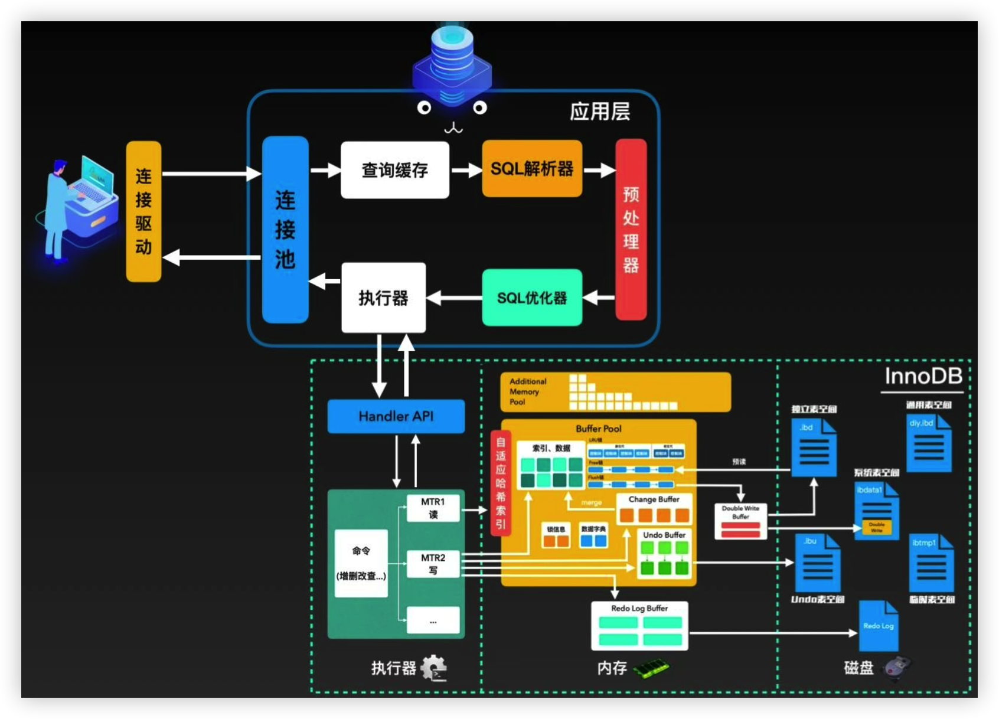
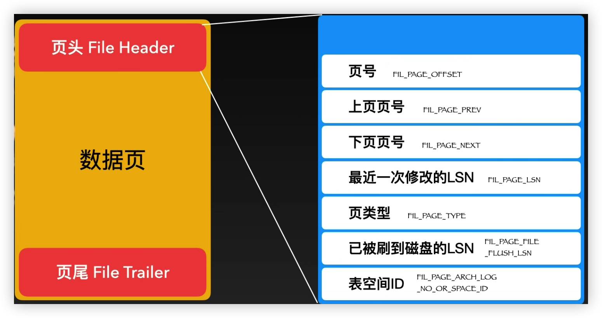
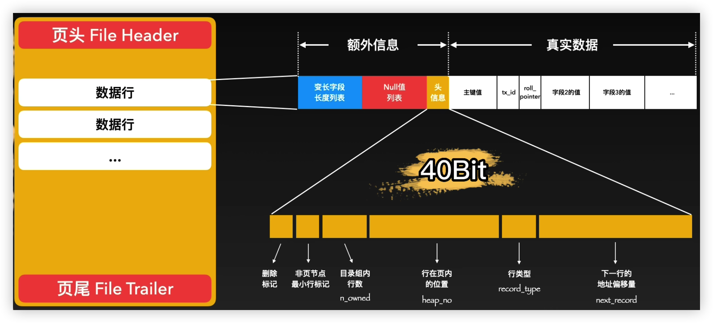
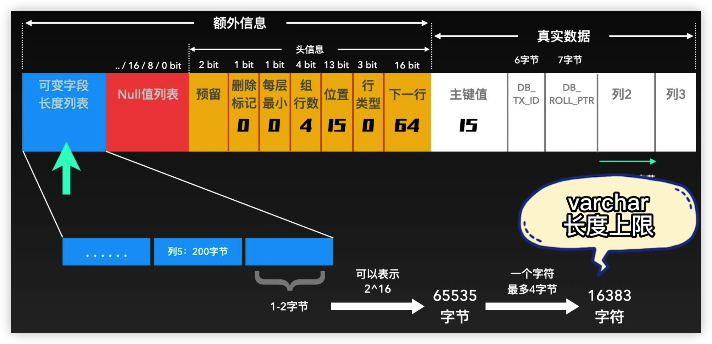
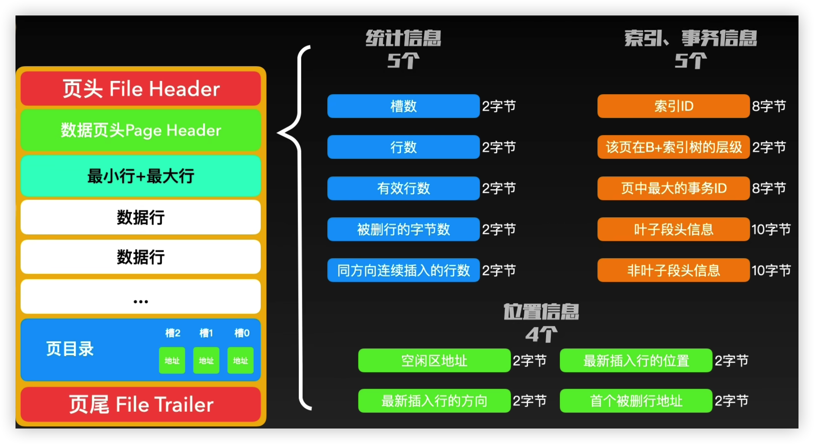
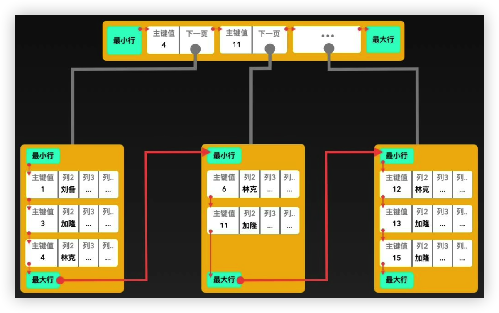

# mysql

## 运行原理



## 连接池

mysql 服务和客户端的通信，mysql 服务侧有连接池，有自我保护

```shell
最大连接数
show variables like 'max_connections';
set global max_connections=1000;
单次最大数据报文
show variables like 'max_allowed_packet';
set global max_allowed_packet=83888608;
```

sql 解析器将 sql 优化成 sql`执行计划`，并且由`存储引擎`来负责执行（实际是执行器通过存储引擎的 handler api 获取结果）

## 数据写入

由于内存速度比磁盘快太多，所以`存储引擎（innodb）`所有逻辑读取和写入操作都是先在内存进行，此内存缓存区就是 buffer pool

具体步骤：

1. 执行器写磁盘负责事务的 undo log
2. 写 buffer pool，同时需要记录到磁盘，看 3 和 4，防止断电数据丢失
3. 同时写入 redo log buffer
4. 需要把 3 的内存数据刷入磁盘，此时有三种策略刷盘
   1. 通过`innodb_flush_log_at_trx_commit`设置，值为 0，1，2
      - 1，实时刷盘
      - 0，只写 redo log buffer，per 1s 刷盘
      - 2，写 redo log buffer 和操作系统内存（page cache），per 1s 在写入磁盘
   2. 断电了，优先从 redo log 磁盘文件恢复
5. 写 redo log 的同时，开始写 binlog 磁盘文件，可用于数据历史查询，数据备份，数据恢复，主从复制等
6. 5 写 binlog 成功后会告诉 redo log 事务已提交，redo log 会打入 commit 标记
7. buffer pool 刷盘 ibd 文件，调用系统函数 open，write，并且使用 O_DIRECT 跳过内核提供的 page cache，innodb 自己实现了一套高效缓存

## 存储结构


innodb 主要两个文件，frm 文件存表结构信息，ibd 文件存数据和索引（也叫独立表空间，5.7 后每个表独立一个 ibd）

`innodb_file_per_table` 来关闭或者开启，5.7 默认为 on

```shell
set @@global.innodb_file_per_table = on
```

表空间一共有 5 类，系统表空间 ibdata1，独立表空间 ibd（可压缩，可传输对比前者），undo 表空间 innodb_undo.ibu，通用表空间 diy.ibd，临时表空间 ibtmp1

### ibd 文件

#### 页

`ibd`最小单元是页，所以每次数据读取的最小单位是页，每个页内部内存地址是连续的，这样减少磁盘的随机读写，降低耗时，页的大小默认是`16KB`

页的种类是 12 种之多，所有页都有页头 file header 和页尾 file trailer

#### 索引页

页头 file header 和页尾 file trailer，中间是数据行，也就是常见的表数据

##### 数据行

```shell
查看表的行类型
select t.space,t.name,t.row_format from information_schema.INNODB_SYS_TABLESPACES t WHERE name='dbname'

show variables like 'innodb_default_row_format';
set innodb_default_row_format='DYNAMIC';
```

> The row format of a table determines how its rows are physically stored, which in turn can affect the performance of queries and DML operations. As more rows fit into a single disk page, queries and index lookups can work faster, less cache memory is required in the buffer pool, and less I/O is required to write out updated values.
> The InnoDB storage engine supports four row formats: REDUNDANT, COMPACT, DYNAMIC, and COMPRESSED.
>
> 5.7 默认 DYNAMIC

大小不固定，最大为`8KB`

#### 区

业务数据越来越多，跨页读比较多，所以尽可能连续，否则磁头物理移动非常耗时（机械硬盘，ssd 应该没这个问题）

所以引入区，每个区固定 1MB，存放 64 页，这样范围查找的数据大概率在一个区内，只需要把这个区一起加载到内存

一开始创建表，本着不浪费，只会创建 6 个页（16\*6=96KB ），而不是一个区

> We create a new generic empty tablespace.
> We initially let it be 4 pages:
> page 0 is the fsp header and an extent descriptor page,
> page 1 is an ibuf bitmap page,
> page 2 is the first inode page,
> page 3 will contain the root of the clustered index of the
> first table we create here.

数据逐渐多了后，32 页后就直接申请区了

### 组

区越来越多，引入了组结构，一个组是 256 个区，`256MB`

### 段

和页，区，组不同，不是`物理区域`，而是`逻辑概念`

non-leaf node segment 非叶子节点段，存储和管理索引树

leaf node segment 叶子节点段，存储和管理实际数据

逻辑上来说，由以上两种段构成了表空间的 ibd 文件

## sql 执行原理

sql 执行过程

1. 客户端通过连接驱动连接到 mysql 的连接池

2. 先通过查询缓存，查到直接返回（5.7 默认关闭了，8.0 直接删除这个功能了）

   1. ```shell
      show variables like 'query_cache_type';
      set query_cache_type = 0;
      ```

   2. 实际用处不大，hit 概率太小，每次都查就显得耗费性能了

3. 通过 sql 解析器来解析 sql

   1. 词法分析
   2. 语法分析

4. 预处理器处理请求，也会进行语法验证，比如表，列是否存在，别名歧义等

   1. 先提交 sql 模板
   2. 提交参数（使用同一个模板只要提交模板一次，多次提交参数执行即可）

5. sql 优化器，对 sql 进行优化，通过 CBO（costbased optimization）选择成本最小的执行计划（io 成本和 cpu 成本消耗值），最终会输出一个可执行的执行计划

   1. 查看任意语句的优化细节

      ```shell
      show variables like 'OPTIMIZER_TRACE';
      SET OPTIMIZER_TRACE="enabled=on",END_MARKERS_IN_JSON=on;
      SET optimizer_trace_offset=-30, optimizer_trace_limit=30;
      执行业务sql
      查看
      SELECT * FROM INFORMATION_SCHEMA.OPTIMIZER_TRACE;
      查完记得关闭
      SET OPTIMIZER_TRACE="enabled=off"
      ```

   2. 也可以查询当前 session 会话中执行 sql 语句的查询成本

      ```shell
      执行业务sql
      show status like 'last_query_cost';
      ```

6. 变成执行计划后，交给执行器来处理

7. 执行器按照执行计划的需求通过`存储引擎`的`handler api`去获取这些结果，7 之前都是在应用层

   1. 命令增删改查
   2. 读，从 buffer pool，磁盘文件 ibd 加载内存读取数据
   3. 写，先写入负责事务回滚 undo buffer 刷盘 undo log，再写 redo buffer，刷盘 redo log，再写入 buffer pool，再写入 double write buffer，刷盘到 ibdata1 系统表空间中，最终刷入磁盘 ibd 文件，参见上面的数据写入

8. 返回结果给客户端

## 页

包含页头，页尾，数据页

### 页头 file header

占用`38字节`



页号，4 个字节，32 个 bit，大约可以存储 2^32^大约 42 亿个页

上下页号，组成双向链表

### 页尾 file trailer

占用`8字节`

包含校验和，最近一次修改的 LSN

操作系统传输单元数据库通常是 4KB，正好一页是 4 个数据块，断电情况可能就会`缺页`，就需要通过校验和来验证，默认使用 crc32 算法，通过`innodb_checksum_algorithm`查看

### 数据行



包含额外信息，真实数据



varchar 实际存储在溢出页，用 2 个字节来表示这个字段的长度，16 个 bit 可以表示最大 65536 个字节，本身消耗最多两个字节来记录长度，65534 个字节，最大按照 4 个字节一个字符算，65534/4=16383 个字符

### 页目录

提升数据行的二分查找，将所有页进行分组，每个组 8 个数据行，每个组放入一个槽位

查找流程：先定位某个槽，再从最多 8 个行中遍历

### 数据页头 page header

56 个字节构成了 page header，主要放入统计和通用信息



## 索引

B 树范围查找不行，查询效率不稳定，离 root 节点近就快，远就慢，树的高度不够低

B+树去处每个非叶子节点的真实数据，用来存放更多的子节点，查询效率和树的高度高的问题就解决来，叶子节点存储所有上层父节点的真实数据，

一个 16KB 页可以存储三四百个"key+下一页地址"的行

log(400)20000000=2.69 大约 3 层树高



> 聚簇索引/主键索引
>
> Each InnoDB table has a special index called the clustered index that stores row data. Typically, the clustered index is synonymous with the primary key.To get the best performance from queries, inserts, and other database operations, it is important to understand how InnoDB uses the clustered index to optimize the common lookup and DML.
>
> When you define a PRIMARY KEY on a table, InnoDB uses it as the clustered index. A primary key should be defined for each table. If there is no logical unique and non-null column or set of columns to use a the primary key, add an auto-increment column. Auto-increment column values are unique and are added automatically as new rows are inserted.
>
> If you do not define a PRIMARY KEY for a table, InnoDB uses the first UNIQUE index with all key columns defined as NOT NULL as the clustered index.
>
> If a table has no PRIMARY KEY or suitable UNIQUE index, InnoDB generates a hidden
> clustered index named GEN_CLUST_INDEX on a synthetic column that contains row ID values.The rows are ordered by the row ID that InnoDB assigns. The row ID is a 6-byte field that increases monotonically as new rows are inserted. Thus, the rows ordered by the row ID are physically in order of insertion.

> 每个页中至少有两行
> The maximum row size, excluding any variable-length columns that are stored off-page, is slightly less than half of a page for 4KB, 8KB, 16KB, and 32KB page sizes. For example, the maximum row size for the default innodb_page_size of 16KB is about 8000 bytes.

> 行长度限制
> The internal representation of a MySQL table has a maximum row size limit of 65,535 bytes, even if the storage engine is capable of supporting larger rows.BLOB and TEXT columns only contribute 9 to 12 bytes toward the row size limit because their contents are stored separately from the rest of the row.
